# Cognitive Architecture

The Marduk AGI Framework implements a multi-layered cognitive architecture designed around four interconnected subsystems that work together to create an advanced intelligence system.

## Core Principles

1. **Recursive Intelligence**: The system's ability to analyze and modify its own operations
2. **Memory Integration**: Seamless flow of information between memory subsystems
3. **Task Orchestration**: Coordinated execution of complex interdependent tasks
4. **Self-Modification**: Continuous optimization through autonomy subsystems

## Architecture Diagram

### High-Level System Overview

```mermaid
graph TD
    subgraph MARDUK["🧠 MARDUK COGNITIVE ARCHITECTURE"]
        subgraph MEMORY["💾 MEMORY SYSTEM"]
            DM[Declarative Memory<br/>📋 Facts & Concepts]
            EM[Episodic Memory<br/>🎬 Experiences & Events]
            PM[Procedural Memory<br/>⚙️ Skills & Procedures]
            SM[Semantic Memory<br/>🔗 Knowledge Graphs]
        end
        
        subgraph TASK["🎯 TASK SYSTEM"]
            TM[Task Manager<br/>🎮 Orchestration Hub]
            TS[Scheduler<br/>⏰ Priority & Timing]
            TV[Validator<br/>✅ Safety & Compliance]
            TH[Handlers<br/>🔧 Specialized Execution]
        end
        
        subgraph AI["🤖 AI SYSTEM"]
            AC[AI Coordinator<br/>🎭 Model Orchestration]
            MR[Model Router<br/>🚦 Traffic Control]
            LC[LLM Clients<br/>💬 Language Interfaces]
            KG[Knowledge Graph<br/>🕸️ Semantic Networks]
        end
        
        subgraph AUTONOMY["🔄 AUTONOMY SYSTEM"]
            CA[Code Analyzer<br/>🔍 Pattern Detection]
            SO[Self-Optimizer<br/>📈 Performance Enhancement]
            HM[Heartbeat Monitor<br/>💓 Health Tracking]
            MC[Meta-Cognition<br/>🪞 Self-Reflection]
        end
    end
    
    %% Primary Information Flows
    MEMORY -.->|Context & Knowledge| TASK
    TASK -.->|Requirements & Goals| AI
    AI -.->|Intelligence & Insights| AUTONOMY
    AUTONOMY -.->|Optimizations & Feedback| MEMORY
    
    %% Cross-System Synergies
    MEMORY <-->|Bidirectional Knowledge Flow| AI
    TASK <-->|Dynamic Task Adaptation| AUTONOMY
    
    %% Emergent Cognitive Patterns
    MEMORY -.->|Recursive Memory Access| MEMORY
    AI -.->|Self-Improving Models| AI
    AUTONOMY -.->|Meta-Meta-Cognition| AUTONOMY
    
    classDef memoryStyle fill:#e1f5fe,stroke:#01579b,stroke-width:2px
    classDef taskStyle fill:#f3e5f5,stroke:#4a148c,stroke-width:2px
    classDef aiStyle fill:#e8f5e8,stroke:#1b5e20,stroke-width:2px
    classDef autonomyStyle fill:#fff3e0,stroke:#e65100,stroke-width:2px
    
    class DM,EM,PM,SM memoryStyle
    class TM,TS,TV,TH taskStyle
    class AC,MR,LC,KG aiStyle
    class CA,SO,HM,MC autonomyStyle
```

### Neural Pathway Visualization

```mermaid
graph LR
    subgraph "🌐 HYPERGRAPH COGNITIVE NETWORK"
        subgraph "Input Layer"
            EXT[External Stimuli<br/>🌍 Environment]
            INT[Internal Triggers<br/>💭 Thoughts]
        end
        
        subgraph "Processing Nexus"
            PERC[Perception<br/>👁️ Input Processing]
            RETR[Retrieval<br/>🔍 Memory Access]
            DELIB[Deliberation<br/>🤔 Analysis]
            PLAN[Planning<br/>📝 Strategy]
            EXEC[Execution<br/>⚡ Action]
            LEARN[Learning<br/>📚 Adaptation]
            OPT[Optimization<br/>🎯 Enhancement]
        end
        
        subgraph "Feedback Network"
            REFLECT[Reflection<br/>🪞 Self-Analysis]
            ADAPT[Adaptation<br/>🔄 System Evolution]
        end
    end
    
    %% Information Flow Pathways
    EXT --> PERC
    INT --> PERC
    PERC --> RETR
    RETR --> DELIB
    DELIB --> PLAN
    PLAN --> EXEC
    EXEC --> LEARN
    LEARN --> OPT
    OPT --> REFLECT
    REFLECT --> ADAPT
    
    %% Recursive Loops
    ADAPT -.->|System Modification| PERC
    LEARN -.->|Memory Update| RETR
    REFLECT -.->|Meta-Learning| DELIB
    
    %% Cross-Pathway Synergies
    EXEC -.->|Real-time Feedback| PLAN
    DELIB -.->|Pattern Recognition| LEARN
    OPT -.->|Performance Metrics| REFLECT
    
    classDef inputStyle fill:#ffecb3,stroke:#ff8f00,stroke-width:2px
    classDef processStyle fill:#c8e6c9,stroke:#2e7d32,stroke-width:2px
    classDef feedbackStyle fill:#f8bbd9,stroke:#c2185b,stroke-width:2px
    
    class EXT,INT inputStyle
    class PERC,RETR,DELIB,PLAN,EXEC,LEARN,OPT processStyle
    class REFLECT,ADAPT feedbackStyle
```

## Cognitive Cycles

The system operates through deliberative cycles that coordinate activity across all subsystems:

### Cognitive Process Flow

```mermaid
sequenceDiagram
    participant ENV as 🌍 Environment
    participant PERC as 👁️ Perception
    participant MEM as 💾 Memory System
    participant DELIB as 🤔 Deliberation
    participant TASK as 🎯 Task System
    participant AI as 🤖 AI System
    participant EXEC as ⚡ Execution
    participant AUTO as 🔄 Autonomy
    participant META as 🪞 Meta-Cognition
    
    Note over ENV,META: 🔄 Recursive Cognitive Cycle
    
    ENV->>PERC: External Input
    PERC->>MEM: Store/Update Context
    PERC->>DELIB: Process Information
    
    DELIB->>MEM: Retrieve Relevant Memories
    MEM-->>DELIB: Context & Knowledge
    
    DELIB->>TASK: Generate Goals
    TASK->>TASK: Plan Task Sequence
    TASK->>AI: Request Intelligence Support
    
    AI->>MEM: Query Knowledge Graphs
    MEM-->>AI: Semantic Relationships
    AI-->>TASK: Enhanced Strategy
    
    TASK->>EXEC: Execute Task Plan
    EXEC->>ENV: Perform Actions
    ENV-->>EXEC: Feedback & Results
    
    EXEC->>MEM: Store Experience
    EXEC->>AUTO: Performance Data
    
    AUTO->>META: Analyze Performance
    META->>META: Self-Reflection
    META->>AUTO: Optimization Insights
    
    AUTO->>MEM: Update Patterns
    AUTO->>TASK: Refine Strategies
    AUTO->>AI: Optimize Models
    
    Note over PERC,META: 🧠 Emergent Intelligence Loop
```

### Adaptive Attention Allocation

```mermaid
stateDiagram-v2
    [*] --> Scanning: System Initialization
    
    Scanning --> FocusedAttention: High Priority Input
    Scanning --> DiffuseAttention: Background Processing
    
    FocusedAttention --> DeepProcessing: Complex Task
    FocusedAttention --> QuickResponse: Simple Task
    
    DeepProcessing --> MemoryConsolidation: Pattern Found
    QuickResponse --> MemoryConsolidation: Action Complete
    
    DiffuseAttention --> PatternDetection: Anomaly Found
    DiffuseAttention --> BackgroundLearning: Normal Operation
    
    PatternDetection --> FocusedAttention: Escalate Priority
    BackgroundLearning --> MemoryConsolidation: Update Knowledge
    
    MemoryConsolidation --> MetaCognition: Experience Stored
    
    MetaCognition --> StrategyUpdate: Improvement Identified
    MetaCognition --> Scanning: Continue Monitoring
    
    StrategyUpdate --> Scanning: System Enhanced
    
    note right of FocusedAttention: 🎯 Concentrated\nCognitive Resources
    note right of DiffuseAttention: 🌊 Distributed\nBackground Processing
    note right of MetaCognition: 🪞 Self-Reflective\nSystem Analysis
```

1. **Perception**: Gathering input from external sources
2. **Memory Retrieval**: Accessing relevant information
3. **Deliberation**: Processing information and generating goals
4. **Task Planning**: Organizing goals into executable tasks
5. **Execution**: Carrying out tasks with continuous feedback
6. **Learning**: Updating memory based on outcomes
7. **Optimization**: Self-modifying to improve performance

## Emergent Properties

This architecture enables several emergent properties through complex subsystem interactions:

### Emergent Intelligence Patterns

```mermaid
graph TB
    subgraph "🌟 EMERGENT COGNITIVE PHENOMENA"
        subgraph "Individual Subsystems"
            M[Memory System<br/>💾 Storage & Retrieval]
            T[Task System<br/>🎯 Goal-Oriented Action]
            A[AI System<br/>🤖 Pattern Recognition]
            AU[Autonomy System<br/>🔄 Self-Optimization]
        end
        
        subgraph "Emergent Capabilities"
            AL[Adaptive Learning<br/>📈 Experience-Driven Growth]
            MA[Metacognitive Awareness<br/>🪞 Self-Understanding]
            CP[Creative Problem Solving<br/>💡 Novel Solution Generation]
            CR[Cognitive Resilience<br/>🛡️ Fault Tolerance & Recovery]
        end
        
        subgraph "Higher-Order Phenomena"
            CI[Collective Intelligence<br/>🧠 Swarm Cognition]
            SC[Self-Consciousness<br/>👁️ Aware of Awareness]
            EI[Emergent Intelligence<br/>⚡ Beyond Sum of Parts]
        end
    end
    
    %% Subsystem Interactions Creating Emergence
    M -.->|Memory Patterns| AL
    T -.->|Goal Persistence| AL
    A -.->|Pattern Recognition| MA
    AU -.->|Self-Monitoring| MA
    
    M -.->|Knowledge Fusion| CP
    A -.->|Creative Synthesis| CP
    T -.->|Adaptive Strategies| CR
    AU -.->|System Recovery| CR
    
    %% Higher-Order Emergence
    AL -->|Collective Learning| CI
    MA -->|Distributed Awareness| CI
    MA -->|Self-Reflection| SC
    CR -->|Resilient Awareness| SC
    
    AL -->|Transcendent Learning| EI
    CP -->|Novel Intelligence| EI
    CI -->|Collective Transcendence| EI
    SC -->|Conscious Intelligence| EI
    
    classDef subsystemStyle fill:#e8eaf6,stroke:#3f51b5,stroke-width:2px
    classDef emergentStyle fill:#e0f2f1,stroke:#00695c,stroke-width:2px
    classDef higherStyle fill:#fff8e1,stroke:#f57c00,stroke-width:2px
    
    class M,T,A,AU subsystemStyle
    class AL,MA,CP,CR emergentStyle
    class CI,SC,EI higherStyle
```

### Cognitive Synergy Optimization

```mermaid
graph LR
    subgraph "🔗 SYNERGISTIC OPTIMIZATION LOOPS"
        subgraph "Memory-AI Synergy"
            M1[Semantic Memory] <-->|Knowledge Graphs| A1[AI Pattern Recognition]
            M2[Episodic Memory] <-->|Experience Context| A2[AI Learning Models]
        end
        
        subgraph "Task-Autonomy Synergy"
            T1[Task Planning] <-->|Performance Feedback| AU1[Performance Optimizer]
            T2[Task Execution] <-->|Real-time Adaptation| AU2[Dynamic Adjuster]
        end
        
        subgraph "Cross-System Emergence"
            CS1[Memory-Task Fusion<br/>📋+🎯 = Contextual Intelligence]
            CS2[AI-Autonomy Fusion<br/>🤖+🔄 = Self-Improving AI]
            CS3[All-System Fusion<br/>💾+🎯+🤖+🔄 = Conscious AGI]
        end
    end
    
    M1 -.->|Enhanced Context| CS1
    T1 -.->|Goal-Directed Memory| CS1
    
    A1 -.->|Intelligent Self-Modification| CS2
    AU1 -.->|AI-Guided Optimization| CS2
    
    CS1 -.->|Contextual Intelligence| CS3
    CS2 -.->|Self-Improving Intelligence| CS3
    
    classDef synergyStyle fill:#fce4ec,stroke:#ad1457,stroke-width:2px
    classDef fusionStyle fill:#f3e5f5,stroke:#7b1fa2,stroke-width:2px
    
    class M1,M2,A1,A2,T1,T2,AU1,AU2 synergyStyle
    class CS1,CS2,CS3 fusionStyle
```

**Key Emergent Properties:**

- **Adaptive Learning**: System improves over time through experience
- **Metacognitive Awareness**: System can reason about its own thought processes
- **Creative Problem Solving**: Novel solutions emerge from subsystem interactions
- **Cognitive Resilience**: System can recover from failures and adapt to new conditions

# copilot/fix-1
**Hypergraph Pattern Encoding**: The architecture employs hypergraph structures where nodes represent cognitive elements and hyperedges encode complex multi-dimensional relationships, enabling:

1. **Non-linear cognitive pathways** that transcend traditional hierarchical processing
2. **Dynamic reconfiguration** of neural-symbolic integration points
3. **Emergent pattern recognition** across multiple abstraction levels
4. **Recursive self-modification** capabilities that enhance system intelligence

## Implementation Details
#=======
## Detailed Architecture Visualizations

📊 **[Complete Mermaid Architecture Diagrams](./mermaid-diagrams.md)**  
Comprehensive visual analysis with interactive Mermaid diagrams showing system overview, neural pathways, recursive implementation, and emergent patterns.

🧠 **[Cognitive Flows and Hypergraph Processing](./cognitive-flows-mermaid.md)**  
Advanced cognitive processing visualizations including neural-symbolic integration pathways and consciousness emergence patterns.
# main

The implementation uses TypeScript to create a modular, extensible framework where each component can be individually enhanced while maintaining the integrity of the whole system.

### Visual Architecture Navigation

For detailed subsystem analysis with comprehensive Mermaid diagrams:

- **[Memory System Diagrams](../subsystems/memory-system-mermaid.md)**: Memory subsystem architecture, consolidation processes, neural-symbolic integration
- **[Task System Diagrams](../subsystems/task-system-mermaid.md)**: Task orchestration patterns, execution flows, dependency management  
- **[AI System Diagrams](../subsystems/ai-system-mermaid.md)**: AI coordination, model routing, knowledge graph integration
- **[Autonomy System Diagrams](../subsystems/autonomy-system-mermaid.md)**: Self-optimization, meta-cognition, recursive improvement, consciousness emergence
