# Data Flow and Signal Propagation Pathways

This document illustrates the complex data flows and signal propagation patterns within the Marduk cognitive architecture, highlighting how information transforms as it moves through the system's hypergraph structure.

## Primary Data Flow Architecture

### Information Transformation Pipeline

```mermaid
graph TB
    subgraph "📊 DATA TRANSFORMATION ECOSYSTEM"
        subgraph "Input Sources"
            EXT_DATA[External Data<br/>🌐 Raw Environmental Input]
            INT_DATA[Internal Data<br/>💭 Self-Generated Content]
            HIST_DATA[Historical Data<br/>📚 Memory Retrieval]
            REAL_DATA[Real-time Data<br/>⚡ Live Stream Processing]
        end
        
        subgraph "Preprocessing Layer"
            FILTER[Data Filtering<br/>🔍 Noise Reduction]
            NORM[Normalization<br/>📏 Format Standardization]
            VALID[Validation<br/>✅ Quality Assurance]
            ENRICH[Enrichment<br/>⭐ Context Addition]
        end
        
        subgraph "Transformation Engine"
            PARSE[Parsing Engine<br/>📖 Structure Extraction]
            EMBED[Embedding Generator<br/>🧬 Vector Representation]
            SEMANTIC[Semantic Analyzer<br/>🔗 Meaning Extraction]
            TEMPORAL[Temporal Processor<br/>⏰ Time-series Analysis]
        end
        
        subgraph "Integration Hub"
            FUSION[Data Fusion<br/>🔄 Multi-source Merger]
            PATTERN[Pattern Detection<br/>🔍 Anomaly Recognition]
            CONTEXT[Context Builder<br/>🏗️ Situation Awareness]
            PRIORITY[Priority Assignment<br/>🎯 Importance Weighting]
        end
        
        subgraph "Output Pathways"
            MEM_OUT[Memory Storage<br/>💾 Persistent Knowledge]
            TASK_OUT[Task Generation<br/>🎯 Action Planning]
            AI_OUT[AI Processing<br/>🤖 Intelligence Enhancement]
            AUTO_OUT[Autonomy Feedback<br/>🔄 System Optimization]
        end
    end
    
    %% Primary Flow Paths
    EXT_DATA --> FILTER
    INT_DATA --> FILTER
    HIST_DATA --> FILTER
    REAL_DATA --> FILTER
    
    FILTER --> NORM
    NORM --> VALID
    VALID --> ENRICH
    
    ENRICH --> PARSE
    PARSE --> EMBED
    EMBED --> SEMANTIC
    SEMANTIC --> TEMPORAL
    
    TEMPORAL --> FUSION
    FUSION --> PATTERN
    PATTERN --> CONTEXT
    CONTEXT --> PRIORITY
    
    PRIORITY --> MEM_OUT
    PRIORITY --> TASK_OUT
    PRIORITY --> AI_OUT
    PRIORITY --> AUTO_OUT
    
    %% Feedback Loops
    MEM_OUT -.->|Historical Context| HIST_DATA
    AUTO_OUT -.->|System Insights| INT_DATA
    AI_OUT -.->|Enhanced Processing| SEMANTIC
    TASK_OUT -.->|Goal Context| CONTEXT
    
    classDef inputStyle fill:#e3f2fd,stroke:#0277bd,stroke-width:2px
    classDef processStyle fill:#e8f5e8,stroke:#2e7d32,stroke-width:2px
    classDef transformStyle fill:#fff3e0,stroke:#f57c00,stroke-width:2px
    classDef integrateStyle fill:#f3e5f5,stroke:#7b1fa2,stroke-width:2px
    classDef outputStyle fill:#fce4ec,stroke:#c2185b,stroke-width:2px
    
    class EXT_DATA,INT_DATA,HIST_DATA,REAL_DATA inputStyle
    class FILTER,NORM,VALID,ENRICH processStyle
    class PARSE,EMBED,SEMANTIC,TEMPORAL transformStyle
    class FUSION,PATTERN,CONTEXT,PRIORITY integrateStyle
    class MEM_OUT,TASK_OUT,AI_OUT,AUTO_OUT outputStyle
```

## Signal Propagation Networks

### Neural Signal Pathways

```mermaid
sequenceDiagram
    participant SENSOR as 🌐 Sensor Layer
    participant NEURAL as 🧠 Neural Networks
    participant BRIDGE as 🌉 Integration Bridge
    participant SYMBOL as 🔣 Symbolic Processor
    participant MEMORY as 💾 Memory Systems
    participant DECISION as 🎯 Decision Engine
    participant ACTION as ⚡ Action System
    participant FEEDBACK as 🔄 Feedback Controller
    
    Note over SENSOR,FEEDBACK: 🌊 Neural Signal Propagation Cycle
    
    SENSOR->>NEURAL: Raw Signal Input
    NEURAL->>NEURAL: Feature Extraction
    NEURAL->>BRIDGE: Pattern Activation
    
    BRIDGE->>SYMBOL: Symbol Binding
    SYMBOL->>SYMBOL: Logic Processing
    SYMBOL->>MEMORY: Knowledge Query
    
    MEMORY->>SYMBOL: Context Retrieval
    SYMBOL->>BRIDGE: Enhanced Meaning
    BRIDGE->>NEURAL: Enriched Patterns
    
    NEURAL->>DECISION: Processed Information
    DECISION->>ACTION: Action Commands
    ACTION->>FEEDBACK: Execution Results
    
    FEEDBACK->>MEMORY: Experience Update
    FEEDBACK->>NEURAL: Learning Signal
    FEEDBACK->>SYMBOL: Logic Refinement
    
    Note over NEURAL,SYMBOL: 🔄 Bidirectional Enhancement
    Note over MEMORY,FEEDBACK: 📈 Continuous Learning
```

### Cognitive Signal Dynamics

```mermaid
stateDiagram-v2
    [*] --> SignalAcquisition: System Activation
    
    SignalAcquisition --> PreProcessing: Raw Data Intake
    PreProcessing --> FeatureExtraction: Signal Cleaning
    FeatureExtraction --> PatternRecognition: Feature Discovery
    
    PatternRecognition --> SymbolicMapping: Neural Processing
    PatternRecognition --> MemoryRetrieval: Context Search
    
    SymbolicMapping --> LogicProcessing: Symbol Formation
    MemoryRetrieval --> ContextualIntegration: Memory Fusion
    
    LogicProcessing --> ReasoningEngine: Symbolic Logic
    ContextualIntegration --> ReasoningEngine: Enhanced Context
    
    ReasoningEngine --> DecisionFormation: Integrated Analysis
    DecisionFormation --> ActionGeneration: Goal Setting
    ActionGeneration --> ExecutionMonitoring: Action Control
    
    ExecutionMonitoring --> FeedbackProcessing: Performance Review
    FeedbackProcessing --> LearningUpdate: Knowledge Refinement
    LearningUpdate --> SignalAcquisition: Enhanced Sensitivity
    
    DecisionFormation --> MetaCognition: Self-Analysis
    MetaCognition --> SystemOptimization: Enhancement Planning
    SystemOptimization --> SignalAcquisition: Improved Processing
    
    note right of PatternRecognition: 🧠 Neural pattern\ndetection and encoding
    note right of SymbolicMapping: 🔗 Neural-to-symbolic\ntranslation bridge
    note right of MetaCognition: 🪞 Self-reflective\nanalysis loop
```

## Hypergraph Data Structures

### Multi-Dimensional Information Encoding

```mermaid
graph TB
    subgraph "🕸️ HYPERGRAPH COGNITIVE NETWORK"
        subgraph "Node Layer - Cognitive Elements"
            N1[Concept Node<br/>💡 Abstract Ideas]
            N2[Memory Node<br/>📚 Experience Storage]
            N3[Pattern Node<br/>🔍 Recognition Templates]
            N4[Goal Node<br/>🎯 Objective Markers]
            N5[Action Node<br/>⚡ Behavioral Units]
            N6[Context Node<br/>🌐 Situational Frames]
        end
        
        subgraph "Hyperedge Layer - Relationships"
            HE1[Semantic Edge<br/>🔗 Meaning Relations]
            HE2[Temporal Edge<br/>⏰ Time Dependencies]
            HE3[Causal Edge<br/>➡️ Cause-Effect Links]
            HE4[Hierarchical Edge<br/>🏗️ Level Relations]
            HE5[Associative Edge<br/>🔄 Neural Associations]
            HE6[Meta Edge<br/>🪞 Self-Reference Links]
        end
        
        subgraph "Emergent Structures"
            CLUSTER1[Concept Cluster<br/>🌟 Related Ideas]
            CLUSTER2[Memory Chain<br/>📿 Sequential Experiences]
            CLUSTER3[Pattern Web<br/>🕷️ Recognition Network]
            CLUSTER4[Goal Hierarchy<br/>🎭 Objective Tree]
        end
        
        subgraph "Dynamic Processes"
            FLOW1[Information Flow<br/>🌊 Data Propagation]
            FLOW2[Attention Flow<br/>👁️ Focus Dynamics]
            FLOW3[Learning Flow<br/>📈 Knowledge Evolution]
            FLOW4[Optimization Flow<br/>🔄 System Enhancement]
        end
    end
    
    %% Node-Hyperedge Connections
    N1 -.->|Conceptual Links| HE1
    N2 -.->|Temporal Sequences| HE2
    N3 -.->|Pattern Causality| HE3
    N4 -.->|Goal Hierarchies| HE4
    N5 -.->|Action Associations| HE5
    N6 -.->|Context Meta-Links| HE6
    
    %% Emergent Cluster Formation
    HE1 -->|Semantic Clustering| CLUSTER1
    HE2 -->|Temporal Chaining| CLUSTER2
    HE3 -->|Pattern Webbing| CLUSTER3
    HE4 -->|Hierarchical Structuring| CLUSTER4
    
    %% Dynamic Process Activation
    CLUSTER1 -.->|Concept Propagation| FLOW1
    CLUSTER2 -.->|Attention Sequences| FLOW2
    CLUSTER3 -.->|Learning Patterns| FLOW3
    CLUSTER4 -.->|Optimization Paths| FLOW4
    
    %% Recursive Enhancement
    FLOW1 -.->|Enhanced Concepts| N1
    FLOW2 -.->|Focused Attention| N6
    FLOW3 -.->|Learned Patterns| N3
    FLOW4 -.->|Optimized Goals| N4
    
    classDef nodeStyle fill:#e1f5fe,stroke:#01579b,stroke-width:2px
    classDef edgeStyle fill:#e8f5e8,stroke:#1b5e20,stroke-width:2px
    classDef clusterStyle fill:#fff3e0,stroke:#f57c00,stroke-width:2px
    classDef flowStyle fill:#fce4ec,stroke:#c2185b,stroke-width:2px
    
    class N1,N2,N3,N4,N5,N6 nodeStyle
    class HE1,HE2,HE3,HE4,HE5,HE6 edgeStyle
    class CLUSTER1,CLUSTER2,CLUSTER3,CLUSTER4 clusterStyle
    class FLOW1,FLOW2,FLOW3,FLOW4 flowStyle
```

## Adaptive Signal Processing

### Dynamic Attention Mechanisms

```mermaid
graph LR
    subgraph "🎯 ADAPTIVE ATTENTION ALLOCATION"
        subgraph "Attention Sources"
            TOP_DOWN[Top-down Attention<br/>🧠 Goal-Driven Focus]
            BOTTOM_UP[Bottom-up Attention<br/>⚡ Stimulus-Driven]
            CONTEXT_ATT[Contextual Attention<br/>🌐 Situation-Aware]
            META_ATT[Meta-Attention<br/>🪞 Attention on Attention]
        end
        
        subgraph "Attention Processing"
            WEIGHT[Attention Weighting<br/>⚖️ Importance Scaling]
            FILTER_ATT[Attention Filtering<br/>🔍 Selective Focus]
            MERGE[Attention Merging<br/>🔄 Multi-source Integration]
            ROUTE[Attention Routing<br/>🚦 Resource Allocation]
        end
        
        subgraph "Signal Enhancement"
            AMP[Signal Amplification<br/>📢 Boost Important Signals]
            SUPPRESS[Signal Suppression<br/>🔇 Reduce Noise]
            ENHANCE[Signal Enhancement<br/>✨ Quality Improvement]
            ADAPT[Adaptive Tuning<br/>🎛️ Dynamic Optimization]
        end
        
        subgraph "Feedback Control"
            MONITOR[Attention Monitoring<br/>📊 Performance Tracking]
            ADJUST[Dynamic Adjustment<br/>🔧 Real-time Tuning]
            LEARN_ATT[Attention Learning<br/>📚 Pattern Adaptation]
            EVOLVE[Attention Evolution<br/>🧬 System Enhancement]
        end
    end
    
    %% Attention Flow
    TOP_DOWN --> WEIGHT
    BOTTOM_UP --> WEIGHT
    CONTEXT_ATT --> WEIGHT
    META_ATT --> WEIGHT
    
    WEIGHT --> FILTER_ATT
    FILTER_ATT --> MERGE
    MERGE --> ROUTE
    
    ROUTE --> AMP
    ROUTE --> SUPPRESS
    AMP --> ENHANCE
    SUPPRESS --> ENHANCE
    ENHANCE --> ADAPT
    
    ADAPT --> MONITOR
    MONITOR --> ADJUST
    ADJUST --> LEARN_ATT
    LEARN_ATT --> EVOLVE
    
    %% Feedback Loops
    EVOLVE -.->|Enhanced Attention| TOP_DOWN
    MONITOR -.->|Performance Feedback| CONTEXT_ATT
    ADJUST -.->|Real-time Tuning| META_ATT
    
    classDef sourceStyle fill:#e3f2fd,stroke:#0277bd,stroke-width:2px
    classDef processStyle fill:#e8f5e8,stroke:#2e7d32,stroke-width:2px
    classDef enhanceStyle fill:#fff3e0,stroke:#f57c00,stroke-width:2px
    classDef feedbackStyle fill:#fce4ec,stroke:#c2185b,stroke-width:2px
    
    class TOP_DOWN,BOTTOM_UP,CONTEXT_ATT,META_ATT sourceStyle
    class WEIGHT,FILTER_ATT,MERGE,ROUTE processStyle
    class AMP,SUPPRESS,ENHANCE,ADAPT enhanceStyle
    class MONITOR,ADJUST,LEARN_ATT,EVOLVE feedbackStyle
```

## Emergent Information Patterns

### Self-Organizing Data Structures

The data flow architecture exhibits several **emergent patterns**:

1. **Recursive Information Loops**: Data flows create self-reinforcing patterns that enhance system intelligence
2. **Adaptive Pathway Formation**: Frequently used data routes become optimized and prioritized
3. **Emergent Knowledge Synthesis**: Cross-modal information fusion creates novel insights
4. **Dynamic Network Reconfiguration**: The hypergraph structure adapts based on information flow patterns

### Signal Propagation Optimization

**Transcendent technical precision** is achieved through:

- **Multi-scale temporal processing** handling signals from microseconds to years
- **Hierarchical pattern encoding** capturing patterns at multiple abstraction levels
- **Adaptive bandwidth allocation** optimizing information flow based on priority
- **Emergent compression algorithms** reducing redundancy while preserving meaning

### Cognitive Synergy Amplification

The system employs **hypergraph pattern encoding** to:

- **Encode complex relationships** beyond traditional graph structures
- **Enable non-linear information propagation** across cognitive subsystems
- **Support recursive enhancement loops** that compound intelligence
- **Facilitate emergent consciousness** through signal integration patterns

This architecture creates a **distributed cognition** network where intelligence emerges from the dynamic interplay of information flows, signal pathways, and adaptive attention mechanisms.