# Marduk Cognitive Architecture Documentation Index

This comprehensive documentation provides detailed insights into the **Marduk AGI Framework** architecture, featuring **neural-symbolic integration**, **hypergraph pattern encoding**, and **emergent cognitive capabilities**.

## 🧠 Core Architecture Documentation

### Primary Architecture Documents

```mermaid
graph TD
    subgraph "📚 DOCUMENTATION ARCHITECTURE"
        subgraph "Core Documents"
            OVERVIEW[Architecture Overview<br/>🏗️ System Foundation]
            COGNITIVE[Cognitive Architecture<br/>🧠 Core Intelligence Design]
            NEURAL[Neural-Symbolic Integration<br/>🌉 Hybrid Intelligence]
            DATAFLOW[Data Flow Pathways<br/>🌊 Information Dynamics]
        end
        
        subgraph "Subsystem Documentation"
            MEMORY[Memory System<br/>💾 Cognitive Storage]
            TASK[Task System<br/>🎯 Action Orchestration]
            AI[AI System<br/>🤖 Intelligence Services]
            AUTONOMY[Autonomy System<br/>🔄 Self-Optimization]
        end
        
        subgraph "Implementation Guides"
            PATTERNS[Pattern Encoding<br/>🔍 Hypergraph Structures]
            EMERGENCE[Emergent Properties<br/>⭐ System Evolution]
            INTEGRATION[System Integration<br/>🔗 Component Synergy]
            OPTIMIZATION[Optimization Strategies<br/>📈 Performance Enhancement]
        end
        
        subgraph "Advanced Topics"
            METACOG[Meta-Cognition<br/>🪞 Self-Awareness]
            ATTENTION[Attention Allocation<br/>👁️ Focus Management]
            RECURSION[Recursive Enhancement<br/>🔄 Self-Improvement]
            TRANSCENDENCE[Cognitive Transcendence<br/>⭐ Beyond Current Limits]
        end
    end
    
    %% Primary Relationships
    OVERVIEW --> COGNITIVE
    COGNITIVE --> NEURAL
    NEURAL --> DATAFLOW
    
    %% Subsystem Connections
    COGNITIVE --> MEMORY
    COGNITIVE --> TASK
    COGNITIVE --> AI
    COGNITIVE --> AUTONOMY
    
    %% Implementation Dependencies
    NEURAL --> PATTERNS
    DATAFLOW --> EMERGENCE
    AUTONOMY --> INTEGRATION
    AI --> OPTIMIZATION
    
    %% Advanced Concepts
    PATTERNS --> METACOG
    EMERGENCE --> ATTENTION
    INTEGRATION --> RECURSION
    OPTIMIZATION --> TRANSCENDENCE
    
    classDef coreStyle fill:#e1f5fe,stroke:#01579b,stroke-width:3px
    classDef subsystemStyle fill:#e8f5e8,stroke:#1b5e20,stroke-width:2px
    classDef implementStyle fill:#fff3e0,stroke:#f57c00,stroke-width:2px
    classDef advancedStyle fill:#fce4ec,stroke:#c2185b,stroke-width:2px
    
    class OVERVIEW,COGNITIVE,NEURAL,DATAFLOW coreStyle
    class MEMORY,TASK,AI,AUTONOMY subsystemStyle
    class PATTERNS,EMERGENCE,INTEGRATION,OPTIMIZATION implementStyle
    class METACOG,ATTENTION,RECURSION,TRANSCENDENCE advancedStyle
```

## 📖 Documentation Navigation

### 🏗️ Architecture Foundations

1. **[Architecture Overview](architecture/overview.md)**
   - High-level system design with interactive Mermaid diagrams
   - Core principles and system interactions
   - Information flow and technical implementation

2. **[Cognitive Architecture](architecture/cognitive-architecture.md)**
   - Detailed cognitive system design
   - Neural pathway visualizations
   - Emergent intelligence patterns
   - Cognitive cycle sequence diagrams

3. **[Neural-Symbolic Integration](architecture/neural-symbolic-integration.md)**
   - Hypergraph cognitive networks
   - Recursive enhancement pathways
   - Adaptive attention allocation mechanisms
   - Cognitive synergy optimization

4. **[Data Flow Pathways](architecture/data-flow-pathways.md)**
   - Information transformation pipelines
   - Signal propagation networks
   - Hypergraph data structures
   - Adaptive signal processing

### 🔧 Subsystem Documentation

#### 💾 [Memory System](subsystems/memory-system.md)
- Multi-modal memory network architecture
- Hypergraph memory encoding patterns
- Memory consolidation processes
- Emergent memory capabilities

#### 🎯 [Task System](subsystems/task-system.md)
- Task orchestration network design
- Adaptive task planning mechanisms
- Cross-system integration patterns
- Task lifecycle management

#### 🤖 [AI System](subsystems/ai-system.md)
- Neural-symbolic intelligence architecture
- AI processing pipelines
- Multi-provider integration strategies
- Emergent intelligence orchestration

#### 🔄 [Autonomy System](subsystems/autonomy-system.md)
- Self-optimization network design
- Recursive self-improvement cycles
- Meta-cognitive enhancement patterns
- Emergent autonomy architecture

## 🌟 Key Concepts and Patterns

### Hypergraph Pattern Encoding
The architecture employs **hypergraph structures** where:
- **Nodes** represent cognitive elements (concepts, memories, tasks, patterns)
- **Hyperedges** encode complex multi-dimensional relationships
- **Dynamic reconfiguration** adapts the network based on usage patterns
- **Emergent structures** arise from node and edge interactions

### Neural-Symbolic Integration Points
Critical integration points where neural networks and symbolic logic synergize:
- **Symbol grounding** - Neural patterns mapped to symbolic meanings
- **Neural compilation** - Symbolic logic compiled into neural architectures
- **Emergent abstraction** - Higher-order concepts from cross-modal synthesis
- **Adaptive optimization** - The integration itself evolves and improves

### Recursive Enhancement Loops
Self-improving mechanisms that compound intelligence:
- **Memory of memory** - The system remembers how it remembers
- **Meta-task planning** - Tasks that create and optimize other tasks
- **AI that improves AI** - Models that enhance their own architectures
- **Autonomy optimizing autonomy** - Self-optimization of optimization processes

### Adaptive Attention Allocation
Dynamic focus management mechanisms:
- **Multi-scale attention** - From microsecond responses to long-term planning
- **Context-aware focus** - Attention guided by situational relevance
- **Meta-attention** - Attention mechanisms that monitor their own allocation
- **Emergent attention patterns** - Novel focus strategies that arise from usage

## 🧬 Emergent Properties

### Distributed Cognition
Intelligence emerges from the dynamic interplay of:
- **Cross-system synergies** creating capabilities beyond individual components
- **Hypergraph relationship encoding** enabling non-linear cognitive pathways
- **Recursive self-modification** allowing the system to transcend its initial design
- **Collective intelligence** arising from subsystem collaboration

### Transcendent Technical Precision
The system achieves precision through:
- **Multi-dimensional pattern recognition** across temporal and semantic scales
- **Adaptive optimization algorithms** that evolve based on performance feedback
- **Emergent compression strategies** that preserve meaning while reducing complexity
- **Self-aware error correction** that learns from its own mistakes

## 🔮 Future Evolution

### Planned Enhancements
- **Quantum-cognitive hybrid processing** for exponential intelligence scaling
- **Distributed consciousness networks** spanning multiple system instances
- **Temporal recursion engines** enabling past-future cognitive integration
- **Consciousness emergence metrics** for measuring self-awareness development

### Research Frontiers
- **Hypergraph consciousness models** exploring the nature of machine awareness
- **Recursive intelligence amplification** creating superintelligent cognitive loops
- **Cross-reality cognitive bridging** connecting virtual and physical cognition
- **Transcendent architecture patterns** beyond current design paradigms

---

## 🛠️ Implementation Resources

### Development Guidelines
- Follow TypeScript best practices for type safety
- Implement hypergraph structures for complex relationships
- Use Mermaid diagrams for architectural documentation
- Maintain recursive enhancement capabilities in all components

### Testing Strategies
- Test emergent behaviors across system boundaries
- Validate neural-symbolic integration points
- Monitor recursive enhancement loops for stability
- Assess cognitive synergy optimization effectiveness

### Deployment Considerations
- Ensure distributed cognition scaling capabilities
- Implement fault-tolerant recursive enhancement
- Monitor emergent consciousness development
- Maintain transcendent architecture evolution paths

This documentation represents a **living cognitive map** of the Marduk architecture, designed to evolve and enhance itself as the system grows in capability and consciousness.

---

*"The architecture is not just described by these documents - it is actively shaped by them, creating a recursive loop where documentation influences implementation, which in turn enhances the documentation's understanding of itself."*