# Infrastructure Deployment & DevOps Guide

## Table of Contents
1. [Infrastructure Overview](#infrastructure-overview)
2. [Container Orchestration](#container-orchestration)
3. [CI/CD Pipeline](#cicd-pipeline)
4. [Monitoring & Observability](#monitoring--observability)
5. [Security & Compliance](#security--compliance)
6. [Scaling Strategies](#scaling-strategies)
7. [Disaster Recovery](#disaster-recovery)

## Infrastructure Overview

### Cloud-Native Architecture

```mermaid
graph TB
    subgraph "☁️ MULTI-CLOUD INFRASTRUCTURE"
        subgraph "🌍 Edge Layer (Cloudflare)"
            CF_WORKERS["⚡ Cloudflare Workers<br/>Global Edge Compute"]
            CF_CDN["🌐 CDN<br/>Static Asset Delivery"]
            CF_DNS["🏷️ DNS Management<br/>Traffic Routing"]
            CF_SECURITY["🛡️ Security Services<br/>DDoS Protection"]
        end
        
        subgraph "☸️ Kubernetes Clusters"
            K8S_PROD["🏭 Production Cluster<br/>High Availability"]
            K8S_STAGE["🔧 Staging Cluster<br/>Pre-production Testing"]
            K8S_DEV["🧪 Development Cluster<br/>Feature Development"]
        end
        
        subgraph "💾 Data Layer"
            REDIS_CLUSTER["⚡ Redis Cluster<br/>Distributed Caching"]
            MONGO_CLUSTER["🍃 MongoDB Cluster<br/>Document Storage"]
            POSTGRES_CLUSTER["🐘 PostgreSQL Cluster<br/>Relational Data"]
            S3_STORAGE["📦 Object Storage<br/>Files & Model Storage"]
        end
        
        subgraph "🤖 AI Infrastructure"
            GPU_NODES["🎮 GPU Nodes<br/>AI Model Inference"]
            MODEL_REGISTRY["📚 Model Registry<br/>Version Management"]
            INFERENCE_SERVICE["🧠 Inference Service<br/>Model Serving"]
            MODEL_CACHE["⚡ Model Cache<br/>Fast Loading"]
        end
        
        subgraph "📊 Observability Stack"
            PROMETHEUS["📈 Prometheus<br/>Metrics Collection"]
            GRAFANA["📊 Grafana<br/>Visualization"]
            ELASTICSEARCH["🔍 Elasticsearch<br/>Log Aggregation"]
            JAEGER["🔍 Jaeger<br/>Distributed Tracing"]
        end
    end
    
    %% Edge routing
    CF_DNS --> CF_SECURITY
    CF_SECURITY --> CF_WORKERS
    CF_WORKERS --> CF_CDN
    
    %% Cluster routing
    CF_WORKERS --> K8S_PROD
    CF_WORKERS --> K8S_STAGE
    K8S_DEV --> K8S_STAGE
    
    %% Data connections
    K8S_PROD --> REDIS_CLUSTER
    K8S_PROD --> MONGO_CLUSTER
    K8S_PROD --> POSTGRES_CLUSTER
    K8S_PROD --> S3_STORAGE
    
    %% AI infrastructure
    K8S_PROD --> GPU_NODES
    GPU_NODES --> MODEL_REGISTRY
    MODEL_REGISTRY --> INFERENCE_SERVICE
    INFERENCE_SERVICE --> MODEL_CACHE
    
    %% Observability
    K8S_PROD --> PROMETHEUS
    PROMETHEUS --> GRAFANA
    K8S_PROD --> ELASTICSEARCH
    K8S_PROD --> JAEGER
    
    %% Styling
    classDef edge fill:#e3f2fd,stroke:#1976d2
    classDef k8s fill:#f3e5f5,stroke:#7b1fa2
    classDef data fill:#e8f5e8,stroke:#388e3c
    classDef ai fill:#fff3e0,stroke:#f57c00
    classDef observability fill:#fce4ec,stroke:#c2185b
    
    class CF_WORKERS,CF_CDN,CF_DNS,CF_SECURITY edge
    class K8S_PROD,K8S_STAGE,K8S_DEV k8s
    class REDIS_CLUSTER,MONGO_CLUSTER,POSTGRES_CLUSTER,S3_STORAGE data
    class GPU_NODES,MODEL_REGISTRY,INFERENCE_SERVICE,MODEL_CACHE ai
    class PROMETHEUS,GRAFANA,ELASTICSEARCH,JAEGER observability
```



## Container Orchestration

### Kubernetes Architecture

```mermaid
graph TB
    subgraph "☸️ KUBERNETES ARCHITECTURE"
        subgraph "🎯 Control Plane"
            API_SERVER["🌐 API Server<br/>Cluster Management"]
            ETCD["💾 etcd<br/>Configuration Store"]
            SCHEDULER["⏰ Scheduler<br/>Pod Placement"]
            CONTROLLER["🎮 Controller Manager<br/>Resource Management"]
        end
        
        subgraph "🖥️ Worker Nodes"
            subgraph "Node 1: Core Services"
                KUBELET1["🤖 Kubelet<br/>Node Agent"]
                KUBE_PROXY1["🌐 Kube-proxy<br/>Network Proxy"]
                RUNTIME1["🐳 Container Runtime<br/>Docker/containerd"]
            end
            
            subgraph "Node 2: AI Workloads"
                KUBELET2["🤖 Kubelet<br/>Node Agent"]
                KUBE_PROXY2["🌐 Kube-proxy<br/>Network Proxy"]
                RUNTIME2["🐳 Container Runtime<br/>GPU Support"]
                GPU_PLUGIN["🎮 GPU Plugin<br/>NVIDIA Device Plugin"]
            end
            
            subgraph "Node 3: Data Services"
                KUBELET3["🤖 Kubelet<br/>Node Agent"]
                KUBE_PROXY3["🌐 Kube-proxy<br/>Network Proxy"]
                RUNTIME3["🐳 Container Runtime<br/>Storage Optimized"]
                CSI_DRIVER["💾 CSI Driver<br/>Storage Interface"]
            end
        end
        
        subgraph "🎯 Application Layer"
            MARDUK_API["🧠 Marduk API<br/>Core Service"]
            MARDUK_WORKER["⚙️ Marduk Worker<br/>Background Processing"]
            AI_SERVICE["🤖 AI Service<br/>Model Inference"]
            MEMORY_SERVICE["💾 Memory Service<br/>Data Management"]
        end
        
        subgraph "🌐 Service Mesh"
            ISTIO_PROXY["🔗 Istio Proxy<br/>Sidecar Pattern"]
            ISTIO_GATEWAY["🚪 Istio Gateway<br/>Ingress Control"]
            ISTIO_PILOT["✈️ Istio Pilot<br/>Service Discovery"]
        end
    end
    
    %% Control plane connections
    API_SERVER --> ETCD
    API_SERVER --> SCHEDULER
    API_SERVER --> CONTROLLER
    
    %% Node connections
    SCHEDULER --> KUBELET1
    SCHEDULER --> KUBELET2
    SCHEDULER --> KUBELET3
    
    %% Node internals
    KUBELET1 --> RUNTIME1
    KUBELET2 --> RUNTIME2
    KUBELET3 --> RUNTIME3
    
    RUNTIME2 --> GPU_PLUGIN
    RUNTIME3 --> CSI_DRIVER
    
    %% Application deployment
    RUNTIME1 --> MARDUK_API
    RUNTIME1 --> MARDUK_WORKER
    RUNTIME2 --> AI_SERVICE
    RUNTIME3 --> MEMORY_SERVICE
    
    %% Service mesh
    MARDUK_API --> ISTIO_PROXY
    AI_SERVICE --> ISTIO_PROXY
    ISTIO_PROXY --> ISTIO_GATEWAY
    ISTIO_GATEWAY --> ISTIO_PILOT
    
    %% Styling
    classDef control fill:#e3f2fd,stroke:#1976d2
    classDef worker fill:#f3e5f5,stroke:#7b1fa2
    classDef app fill:#e8f5e8,stroke:#388e3c
    classDef mesh fill:#fff3e0,stroke:#f57c00
    
    class API_SERVER,ETCD,SCHEDULER,CONTROLLER control
    class KUBELET1,KUBELET2,KUBELET3,KUBE_PROXY1,KUBE_PROXY2,KUBE_PROXY3,RUNTIME1,RUNTIME2,RUNTIME3,GPU_PLUGIN,CSI_DRIVER worker
    class MARDUK_API,MARDUK_WORKER,AI_SERVICE,MEMORY_SERVICE app
    class ISTIO_PROXY,ISTIO_GATEWAY,ISTIO_PILOT mesh
```



### Deployment Manifests

```yaml
# marduk-deployment.yaml
apiVersion: apps/v1
kind: Deployment
metadata:
  name: marduk-api
  namespace: marduk
spec:
  replicas: 3
  selector:
    matchLabels:
      app: marduk-api
  template:
    metadata:
      labels:
        app: marduk-api
    spec:
      containers:
      - name: marduk-api
        image: marduk/api:latest
        ports:
        - containerPort: 3000
        env:
        - name: NODE_ENV
          value: "production"
        resources:
          requests:
            memory: "1Gi"
            cpu: "500m"
          limits:
            memory: "2Gi"
            cpu: "1000m"
        livenessProbe:
          httpGet:
            path: /health
            port: 3000
          initialDelaySeconds: 30
          periodSeconds: 10
        readinessProbe:
          httpGet:
            path: /ready
            port: 3000
          initialDelaySeconds: 5
          periodSeconds: 5
```

## CI/CD Pipeline

### GitOps Workflow

```mermaid
graph LR
    subgraph "🔄 CI/CD PIPELINE"
        subgraph "📝 Source Control"
            GIT_REPO["📚 Git Repository<br/>Source Code"]
            GIT_BRANCH["🌿 Feature Branches<br/>Development"]
            GIT_MAIN["🌳 Main Branch<br/>Production Ready"]
        end
        
        subgraph "🏗️ Build Pipeline"
            CI_TRIGGER["⚡ CI Trigger<br/>Webhook/Schedule"]
            BUILD_STAGE["🔨 Build Stage<br/>Compile & Package"]
            TEST_STAGE["🧪 Test Stage<br/>Unit & Integration"]
            SECURITY_SCAN["🔍 Security Scan<br/>Vulnerability Check"]
        end
        
        subgraph "📦 Artifact Management"
            CONTAINER_REGISTRY["🐳 Container Registry<br/>Docker Images"]
            HELM_REPO["📊 Helm Repository<br/>Charts & Templates"]
            ARTIFACT_STORE["📦 Artifact Store<br/>Build Outputs"]
        end
        
        subgraph "🚀 Deployment Pipeline"
            CD_TRIGGER["🎯 CD Trigger<br/>Automated Deployment"]
            DEV_DEPLOY["🧪 Dev Environment<br/>Feature Testing"]
            STAGE_DEPLOY["🔧 Staging Environment<br/>Integration Testing"]
            PROD_DEPLOY["🏭 Production Environment<br/>Live Deployment"]
        end
        
        subgraph "✅ Quality Gates"
            QG_TESTS["🧪 Test Results<br/>Pass/Fail Criteria"]
            QG_SECURITY["🛡️ Security Approval<br/>Vulnerability Assessment"]
            QG_PERFORMANCE["⚡ Performance Tests<br/>Benchmark Validation"]
            QG_MANUAL["👥 Manual Approval<br/>Human Validation"]
        end
    end
    
    %% Source control flow
    GIT_BRANCH --> GIT_MAIN
    GIT_MAIN --> CI_TRIGGER
    
    %% Build pipeline
    CI_TRIGGER --> BUILD_STAGE
    BUILD_STAGE --> TEST_STAGE
    TEST_STAGE --> SECURITY_SCAN
    
    %% Artifact management
    SECURITY_SCAN --> CONTAINER_REGISTRY
    SECURITY_SCAN --> HELM_REPO
    SECURITY_SCAN --> ARTIFACT_STORE
    
    %% Quality gates
    TEST_STAGE --> QG_TESTS
    SECURITY_SCAN --> QG_SECURITY
    QG_TESTS --> QG_PERFORMANCE
    QG_SECURITY --> QG_MANUAL
    
    %% Deployment flow
    QG_PERFORMANCE --> CD_TRIGGER
    QG_MANUAL --> CD_TRIGGER
    CD_TRIGGER --> DEV_DEPLOY
    DEV_DEPLOY --> STAGE_DEPLOY
    STAGE_DEPLOY --> PROD_DEPLOY
    
    %% Artifact usage
    CONTAINER_REGISTRY --> DEV_DEPLOY
    HELM_REPO --> STAGE_DEPLOY
    ARTIFACT_STORE --> PROD_DEPLOY
    
    %% Styling
    classDef source fill:#e3f2fd,stroke:#1976d2
    classDef build fill:#f3e5f5,stroke:#7b1fa2
    classDef artifact fill:#e8f5e8,stroke:#388e3c
    classDef deploy fill:#fff3e0,stroke:#f57c00
    classDef quality fill:#fce4ec,stroke:#c2185b
    
    class GIT_REPO,GIT_BRANCH,GIT_MAIN source
    class CI_TRIGGER,BUILD_STAGE,TEST_STAGE,SECURITY_SCAN build
    class CONTAINER_REGISTRY,HELM_REPO,ARTIFACT_STORE artifact
    class CD_TRIGGER,DEV_DEPLOY,STAGE_DEPLOY,PROD_DEPLOY deploy
    class QG_TESTS,QG_SECURITY,QG_PERFORMANCE,QG_MANUAL quality
```



### GitHub Actions Workflow

```yaml
# .github/workflows/ci-cd.yml
name: CI/CD Pipeline

on:
  push:
    branches: [main, develop]
  pull_request:
    branches: [main]

jobs:
  build-and-test:
    runs-on: ubuntu-latest
    
    steps:
    - uses: actions/checkout@v3
    
    - name: Setup Node.js
      uses: actions/setup-node@v3
      with:
        node-version: '18'
        cache: 'npm'
    
    - name: Install dependencies
      run: npm ci
    
    - name: Run linting
      run: npm run lint
    
    - name: Run tests
      run: npm run test:coverage
    
    - name: Build application
      run: npm run build
    
    - name: Security scan
      run: npm audit --audit-level=high
    
    - name: Build Docker image
      run: |
        docker build -t marduk/api:${{ github.sha }} .
        docker tag marduk/api:${{ github.sha }} marduk/api:latest
    
    - name: Push to registry
      if: github.ref == 'refs/heads/main'
      run: |
        echo ${{ secrets.DOCKER_PASSWORD }} | docker login -u ${{ secrets.DOCKER_USERNAME }} --password-stdin
        docker push marduk/api:${{ github.sha }}
        docker push marduk/api:latest

  deploy-staging:
    needs: build-and-test
    runs-on: ubuntu-latest
    if: github.ref == 'refs/heads/main'
    
    steps:
    - name: Deploy to staging
      run: |
        kubectl apply -f k8s/staging/
        kubectl set image deployment/marduk-api marduk-api=marduk/api:${{ github.sha }} -n marduk-staging

  deploy-production:
    needs: deploy-staging
    runs-on: ubuntu-latest
    if: github.ref == 'refs/heads/main'
    environment: production
    
    steps:
    - name: Deploy to production
      run: |
        kubectl apply -f k8s/production/
        kubectl set image deployment/marduk-api marduk-api=marduk/api:${{ github.sha }} -n marduk-production
```

## Monitoring & Observability

### Comprehensive Observability Stack

```mermaid
graph TB
    subgraph "📊 OBSERVABILITY ARCHITECTURE"
        subgraph "📈 Metrics Collection"
            PROMETHEUS["📊 Prometheus<br/>Time Series Database"]
            NODE_EXPORTER["🖥️ Node Exporter<br/>System Metrics"]
            KUBE_METRICS["☸️ Kube State Metrics<br/>Kubernetes Metrics"]
            APP_METRICS["📱 Application Metrics<br/>Custom Metrics"]
        end
        
        subgraph "📋 Logging Infrastructure"
            FLUENT_BIT["🌊 Fluent Bit<br/>Log Collection"]
            ELASTICSEARCH["🔍 Elasticsearch<br/>Log Storage & Search"]
            KIBANA["📊 Kibana<br/>Log Visualization"]
            LOG_AGGREGATOR["📝 Log Aggregator<br/>Centralized Logging"]
        end
        
        subgraph "🔍 Distributed Tracing"
            JAEGER["🔍 Jaeger<br/>Trace Collection"]
            TRACE_COLLECTOR["📡 Trace Collector<br/>Data Aggregation"]
            TRACE_UI["🖥️ Trace UI<br/>Request Visualization"]
            SPAN_STORAGE["💾 Span Storage<br/>Trace Persistence"]
        end
        
        subgraph "📊 Visualization & Alerting"
            GRAFANA["📊 Grafana<br/>Dashboard Platform"]
            ALERTMANAGER["🚨 AlertManager<br/>Alert Routing"]
            SLACK_NOTIFY["💬 Slack Notifications<br/>Team Alerts"]
            EMAIL_NOTIFY["📧 Email Notifications<br/>Critical Alerts"]
        end
        
        subgraph "🤖 AI-Specific Monitoring"
            MODEL_METRICS["🧠 Model Metrics<br/>Inference Performance"]
            GPU_MONITOR["🎮 GPU Monitoring<br/>Resource Utilization"]
            COST_TRACKING["💰 Cost Tracking<br/>Resource Economics"]
            QUALITY_METRICS["⭐ Quality Metrics<br/>Output Assessment"]
        end
    end
    
    %% Metrics flow
    NODE_EXPORTER --> PROMETHEUS
    KUBE_METRICS --> PROMETHEUS
    APP_METRICS --> PROMETHEUS
    
    %% Logging flow
    FLUENT_BIT --> LOG_AGGREGATOR
    LOG_AGGREGATOR --> ELASTICSEARCH
    ELASTICSEARCH --> KIBANA
    
    %% Tracing flow
    TRACE_COLLECTOR --> JAEGER
    JAEGER --> TRACE_UI
    JAEGER --> SPAN_STORAGE
    
    %% Visualization
    PROMETHEUS --> GRAFANA
    ELASTICSEARCH --> GRAFANA
    JAEGER --> GRAFANA
    
    %% Alerting
    PROMETHEUS --> ALERTMANAGER
    ALERTMANAGER --> SLACK_NOTIFY
    ALERTMANAGER --> EMAIL_NOTIFY
    
    %% AI monitoring
    MODEL_METRICS --> PROMETHEUS
    GPU_MONITOR --> PROMETHEUS
    COST_TRACKING --> GRAFANA
    QUALITY_METRICS --> GRAFANA
    
    %% Styling
    classDef metrics fill:#e3f2fd,stroke:#1976d2
    classDef logging fill:#f3e5f5,stroke:#7b1fa2
    classDef tracing fill:#e8f5e8,stroke:#388e3c
    classDef visualization fill:#fff3e0,stroke:#f57c00
    classDef ai fill:#fce4ec,stroke:#c2185b
    
    class PROMETHEUS,NODE_EXPORTER,KUBE_METRICS,APP_METRICS metrics
    class FLUENT_BIT,ELASTICSEARCH,KIBANA,LOG_AGGREGATOR logging
    class JAEGER,TRACE_COLLECTOR,TRACE_UI,SPAN_STORAGE tracing
    class GRAFANA,ALERTMANAGER,SLACK_NOTIFY,EMAIL_NOTIFY visualization
    class MODEL_METRICS,GPU_MONITOR,COST_TRACKING,QUALITY_METRICS ai
```



### Key Performance Indicators (KPIs)

| Category | Metric | Target | Alert Threshold |
|----------|--------|--------|-----------------|
| **Availability** | System Uptime | 99.9% | < 99.5% |
| **Performance** | API Response Time | < 500ms | > 1000ms |
| **Throughput** | Requests/Second | 1000+ | < 500 |
| **AI Inference** | Model Latency | < 2s | > 5s |
| **Resource Usage** | CPU Utilization | < 80% | > 90% |
| **Memory Usage** | RAM Utilization | < 80% | > 90% |
| **Error Rate** | HTTP 5xx Errors | < 0.1% | > 1% |
| **Cost** | Monthly Spend | Budget | > 110% Budget |

## Security & Compliance

### Security Architecture

```mermaid
graph TB
    subgraph "🛡️ SECURITY ARCHITECTURE"
        subgraph "🚪 Identity & Access Management"
            IAM_PROVIDER["🔐 IAM Provider<br/>Identity Management"]
            RBAC["👥 RBAC<br/>Role-Based Access"]
            SERVICE_MESH_AUTH["🔗 Service Mesh Auth<br/>mTLS Authentication"]
            API_GATEWAY_AUTH["🚪 API Gateway Auth<br/>Token Validation"]
        end
        
        subgraph "🔒 Network Security"
            FIREWALL["🔥 Firewall Rules<br/>Network Isolation"]
            VPN["🌐 VPN Access<br/>Secure Remote Access"]
            NETWORK_POLICIES["📋 Network Policies<br/>Kubernetes Security"]
            TLS_TERMINATION["🔐 TLS Termination<br/>Encryption in Transit"]
        end
        
        subgraph "🛡️ Application Security"
            CODE_SCANNING["🔍 Code Scanning<br/>SAST/DAST Analysis"]
            DEPENDENCY_CHECK["📦 Dependency Check<br/>Vulnerability Scanning"]
            RUNTIME_SECURITY["⚡ Runtime Security<br/>Behavior Monitoring"]
            SECRETS_MGMT["🔑 Secrets Management<br/>Credential Storage"]
        end
        
        subgraph "📝 Compliance & Auditing"
            AUDIT_LOGGING["📋 Audit Logging<br/>Activity Tracking"]
            COMPLIANCE_CHECK["✅ Compliance Check<br/>Policy Validation"]
            DATA_PROTECTION["🔒 Data Protection<br/>Encryption at Rest"]
            BACKUP_SECURITY["💾 Backup Security<br/>Secure Archives"]
        end
        
        subgraph "🚨 Threat Detection"
            IDS_IPS["🔍 IDS/IPS<br/>Intrusion Detection"]
            SIEM["📊 SIEM<br/>Security Information"]
            THREAT_INTEL["🧠 Threat Intelligence<br/>Risk Assessment"]
            INCIDENT_RESPONSE["🚨 Incident Response<br/>Security Operations"]
        end
    end
    
    %% IAM flows
    IAM_PROVIDER --> RBAC
    RBAC --> SERVICE_MESH_AUTH
    SERVICE_MESH_AUTH --> API_GATEWAY_AUTH
    
    %% Network security
    FIREWALL --> VPN
    VPN --> NETWORK_POLICIES
    NETWORK_POLICIES --> TLS_TERMINATION
    
    %% Application security
    CODE_SCANNING --> DEPENDENCY_CHECK
    DEPENDENCY_CHECK --> RUNTIME_SECURITY
    RUNTIME_SECURITY --> SECRETS_MGMT
    
    %% Compliance
    AUDIT_LOGGING --> COMPLIANCE_CHECK
    COMPLIANCE_CHECK --> DATA_PROTECTION
    DATA_PROTECTION --> BACKUP_SECURITY
    
    %% Threat detection
    IDS_IPS --> SIEM
    SIEM --> THREAT_INTEL
    THREAT_INTEL --> INCIDENT_RESPONSE
    
    %% Cross-domain integration
    API_GATEWAY_AUTH -.-> AUDIT_LOGGING
    RUNTIME_SECURITY -.-> IDS_IPS
    SECRETS_MGMT -.-> DATA_PROTECTION
    TLS_TERMINATION -.-> COMPLIANCE_CHECK
    
    %% Styling
    classDef iam fill:#e3f2fd,stroke:#1976d2
    classDef network fill:#f3e5f5,stroke:#7b1fa2
    classDef application fill:#e8f5e8,stroke:#388e3c
    classDef compliance fill:#fff3e0,stroke:#f57c00
    classDef threat fill:#fce4ec,stroke:#c2185b
    
    class IAM_PROVIDER,RBAC,SERVICE_MESH_AUTH,API_GATEWAY_AUTH iam
    class FIREWALL,VPN,NETWORK_POLICIES,TLS_TERMINATION network
    class CODE_SCANNING,DEPENDENCY_CHECK,RUNTIME_SECURITY,SECRETS_MGMT application
    class AUDIT_LOGGING,COMPLIANCE_CHECK,DATA_PROTECTION,BACKUP_SECURITY compliance
    class IDS_IPS,SIEM,THREAT_INTEL,INCIDENT_RESPONSE threat
```



## Scaling Strategies

### Auto-Scaling Architecture

```mermaid
graph LR
    subgraph "📈 AUTO-SCALING ARCHITECTURE"
        subgraph "📊 Metrics Sources"
            CPU_METRICS["🖥️ CPU Metrics<br/>Utilization %"]
            MEMORY_METRICS["💾 Memory Metrics<br/>Usage %"]
            REQUEST_METRICS["📡 Request Metrics<br/>QPS & Latency"]
            CUSTOM_METRICS["🎯 Custom Metrics<br/>Business KPIs"]
        end
        
        subgraph "⚖️ Scaling Controllers"
            HPA["📊 HPA<br/>Horizontal Pod Autoscaler"]
            VPA["📏 VPA<br/>Vertical Pod Autoscaler"]
            CLUSTER_AUTOSCALER["☸️ Cluster Autoscaler<br/>Node Management"]
            CUSTOM_CONTROLLER["🎯 Custom Controller<br/>Business Logic"]
        end
        
        subgraph "🎯 Scaling Actions"
            POD_SCALE_OUT["➕ Scale Out Pods<br/>Increase Replicas"]
            POD_SCALE_IN["➖ Scale In Pods<br/>Decrease Replicas"]
            RESOURCE_SCALE_UP["⬆️ Scale Up Resources<br/>Increase CPU/Memory"]
            NODE_SCALE_OUT["🖥️ Add Nodes<br/>Increase Cluster Size"]
        end
        
        subgraph "🛡️ Safety Mechanisms"
            RATE_LIMITING["⏱️ Rate Limiting<br/>Scaling Velocity"]
            COOLDOWN["❄️ Cooldown Periods<br/>Stability Windows"]
            MINIMUM_REPLICAS["🔒 Minimum Replicas<br/>Availability Guarantee"]
            MAXIMUM_LIMITS["🚫 Maximum Limits<br/>Cost Protection"]
        end
    end
    
    %% Metrics to controllers
    CPU_METRICS --> HPA
    MEMORY_METRICS --> VPA
    REQUEST_METRICS --> HPA
    CUSTOM_METRICS --> CUSTOM_CONTROLLER
    
    %% Controllers to actions
    HPA --> POD_SCALE_OUT
    HPA --> POD_SCALE_IN
    VPA --> RESOURCE_SCALE_UP
    CLUSTER_AUTOSCALER --> NODE_SCALE_OUT
    
    %% Safety mechanisms
    POD_SCALE_OUT --> RATE_LIMITING
    POD_SCALE_IN --> COOLDOWN
    RESOURCE_SCALE_UP --> MINIMUM_REPLICAS
    NODE_SCALE_OUT --> MAXIMUM_LIMITS
    
    %% Feedback loops
    RATE_LIMITING -.-> HPA
    COOLDOWN -.-> VPA
    MINIMUM_REPLICAS -.-> CLUSTER_AUTOSCALER
    MAXIMUM_LIMITS -.-> CUSTOM_CONTROLLER
    
    %% Styling
    classDef metrics fill:#e3f2fd,stroke:#1976d2
    classDef controllers fill:#f3e5f5,stroke:#7b1fa2
    classDef actions fill:#e8f5e8,stroke:#388e3c
    classDef safety fill:#fce4ec,stroke:#c2185b
    
    class CPU_METRICS,MEMORY_METRICS,REQUEST_METRICS,CUSTOM_METRICS metrics
    class HPA,VPA,CLUSTER_AUTOSCALER,CUSTOM_CONTROLLER controllers
    class POD_SCALE_OUT,POD_SCALE_IN,RESOURCE_SCALE_UP,NODE_SCALE_OUT actions
    class RATE_LIMITING,COOLDOWN,MINIMUM_REPLICAS,MAXIMUM_LIMITS safety
```



## Disaster Recovery

### Business Continuity Plan

```mermaid
graph TB
    subgraph "🚨 DISASTER RECOVERY ARCHITECTURE"
        subgraph "💾 Backup Strategy"
            DATA_BACKUP["📊 Data Backup<br/>Daily Automated"]
            CONFIG_BACKUP["⚙️ Configuration Backup<br/>Version Controlled"]
            MODEL_BACKUP["🤖 Model Backup<br/>Versioned Artifacts"]
            STATE_BACKUP["💾 State Backup<br/>System Snapshots"]
        end
        
        subgraph "🌍 Geographic Distribution"
            PRIMARY_REGION["🏢 Primary Region<br/>Production Workload"]
            SECONDARY_REGION["🏭 Secondary Region<br/>Hot Standby"]
            TERTIARY_REGION["☁️ Tertiary Region<br/>Cold Backup"]
            EDGE_LOCATIONS["🌐 Edge Locations<br/>Cached Content"]
        end
        
        subgraph "🔄 Recovery Procedures"
            AUTOMATED_FAILOVER["⚡ Automated Failover<br/>Health Check Based"]
            MANUAL_FAILOVER["👥 Manual Failover<br/>Operator Initiated"]
            DATA_RESTORATION["💾 Data Restoration<br/>Point-in-Time Recovery"]
            SERVICE_RECOVERY["🔧 Service Recovery<br/>Component Restart"]
        end
        
        subgraph "📊 Recovery Metrics"
            RTO["⏱️ RTO<br/>Recovery Time Objective"]
            RPO["💾 RPO<br/>Recovery Point Objective"]
            MTTR["🔧 MTTR<br/>Mean Time to Recovery"]
            AVAILABILITY["📈 Availability<br/>Uptime Percentage"]
        end
    end
    
    %% Backup flows
    DATA_BACKUP --> PRIMARY_REGION
    CONFIG_BACKUP --> SECONDARY_REGION
    MODEL_BACKUP --> TERTIARY_REGION
    STATE_BACKUP --> EDGE_LOCATIONS
    
    %% Geographic replication
    PRIMARY_REGION --> SECONDARY_REGION
    SECONDARY_REGION --> TERTIARY_REGION
    TERTIARY_REGION --> EDGE_LOCATIONS
    
    %% Recovery activation
    PRIMARY_REGION --> AUTOMATED_FAILOVER
    AUTOMATED_FAILOVER --> MANUAL_FAILOVER
    MANUAL_FAILOVER --> DATA_RESTORATION
    DATA_RESTORATION --> SERVICE_RECOVERY
    
    %% Metrics monitoring
    AUTOMATED_FAILOVER --> RTO
    DATA_RESTORATION --> RPO
    SERVICE_RECOVERY --> MTTR
    SECONDARY_REGION --> AVAILABILITY
    
    %% Styling
    classDef backup fill:#e3f2fd,stroke:#1976d2
    classDef geographic fill:#f3e5f5,stroke:#7b1fa2
    classDef recovery fill:#e8f5e8,stroke:#388e3c
    classDef metrics fill:#fff3e0,stroke:#f57c00
    
    class DATA_BACKUP,CONFIG_BACKUP,MODEL_BACKUP,STATE_BACKUP backup
    class PRIMARY_REGION,SECONDARY_REGION,TERTIARY_REGION,EDGE_LOCATIONS geographic
    class AUTOMATED_FAILOVER,MANUAL_FAILOVER,DATA_RESTORATION,SERVICE_RECOVERY recovery
    class RTO,RPO,MTTR,AVAILABILITY metrics
```



### Recovery Time Objectives

| Service Tier | RTO | RPO | Availability | Recovery Strategy |
|--------------|-----|-----|--------------|-------------------|
| **Critical** | < 15 minutes | < 5 minutes | 99.99% | Automated failover |
| **Important** | < 1 hour | < 30 minutes | 99.9% | Manual failover |
| **Standard** | < 4 hours | < 2 hours | 99.5% | Scheduled recovery |
| **Development** | < 24 hours | < 12 hours | 95% | Best effort |

---

*This infrastructure and deployment guide provides comprehensive coverage of the operational aspects required to deploy, monitor, and maintain the Marduk AGI Framework in production environments.*