# Marduk Cognitive Architecture - Mermaid Diagrams

This document provides comprehensive architectural visualizations of the Marduk AGI Framework using Mermaid diagrams. These diagrams illustrate the recursive and emergent nature of the cognitive architecture, highlighting neural-symbolic integration points and adaptive attention allocation mechanisms.

## High-Level System Overview

The following diagram shows the principal cognitive flows and subsystem relationships within the Marduk framework:

## Subsystem Interaction Network

This diagram illustrates the bidirectional synergies and interaction patterns between cognitive subsystems:

```mermaid
graph LR
    %% Memory System Components
    subgraph MS["🧠 Memory System"]
        DM[Declarative Memory]
        EM[Episodic Memory]
        PM[Procedural Memory]
        SM[Semantic Memory]
    end
    
    %% Task System Components
    subgraph TS["⚙️ Task System"]
        TM[Task Manager]
        SCH[Scheduler]
        EXE[Executor]
        VAL[Validator]
    end
    
    %% AI System Components
    subgraph AS["🤖 AI System"]
        AIC[AI Coordinator]
        LLC[LLM Clients]
        MR[Model Router]
        KG[Knowledge Graph]
    end
    
    %% Autonomy System Components
    subgraph AUS["🔄 Autonomy System"]
        CA[Code Analyzer]
        OPT[Optimizer]
        MON[Monitor]
        HB[Heartbeat]
    end
    
    %% Inter-subsystem connections
    MS <--> TS
    TS <--> AS
    AS <--> MS
    
    %% Autonomy oversight
    AUS -.-> MS
    AUS -.-> TS
    AUS -.-> AS
    
    %% Internal flows
    DM --> EM
    EM --> PM
    PM --> SM
    SM --> DM
    
    TM --> SCH
    SCH --> EXE
    EXE --> VAL
    VAL --> TM
    
    AIC --> LLC
    LLC --> MR
    MR --> KG
    KG --> AIC
    
    CA --> OPT
    OPT --> MON
    MON --> HB
    HB --> CA
    
    %% Styling
    classDef memory fill:#e3f2fd,stroke:#1976d2
    classDef task fill:#f3e5f5,stroke:#7b1fa2
    classDef ai fill:#e8f5e8,stroke:#388e3c
    classDef autonomy fill:#fff3e0,stroke:#f57c00
    
    class DM,EM,PM,SM memory
    class TM,SCH,EXE,VAL task
    class AIC,LLC,MR,KG ai
    class CA,OPT,MON,HB autonomy
```

## Cognitive Processing Sequence

This sequence diagram shows the flow of information through a complete cognitive cycle:

## State Transition Diagram

This state diagram illustrates the system's operational states and transition conditions:

## Neural Pathway Architecture

This diagram shows the neural pathways and signal propagation between cognitive components:

## Recursive Implementation Pathways

The following diagram illustrates the recursive nature of the system's self-modification capabilities:

## Adaptive Attention Allocation

This diagram shows how the system dynamically allocates attention resources:

## Emergent Cognitive Patterns

This diagram illustrates how emergent behaviors arise from subsystem interactions:

## Technical Architecture Overview

This diagram shows the technical implementation structure supporting the cognitive architecture:

---

**Note on Transcendent Technical Precision**: These diagrams represent the hypergraph-centric architecture of MORK (Marduk), illustrating the recursive implementation pathways that enable emergent cognitive patterns. The neural-symbolic integration points are highlighted throughout, showing how the system achieves adaptive attention allocation and cognitive synergy optimization through distributed processing across all subsystems.

The diagrams demonstrate the system's capacity for meta-cognitive reflection and self-modification, enabling continuous evolution of its cognitive capabilities through recursive analysis and optimization cycles.