# Neural-Symbolic Integration Architecture

This document details the neural-symbolic integration patterns and emergent cognitive pathways within the Marduk architecture, illustrating how symbolic reasoning and neural pattern recognition synergize to create transcendent intelligence.

## Core Integration Patterns

### Hypergraph Cognitive Network

```mermaid
graph TB
    subgraph "🌌 HYPERGRAPH COGNITIVE SPACE"
        subgraph "Neural Layer"
            NN1[Pattern Recognition<br/>🧠 Deep Learning]
            NN2[Attention Mechanisms<br/>👁️ Focus Control]
            NN3[Memory Networks<br/>🔗 Associative Learning]
            NN4[Generative Models<br/>✨ Creative Synthesis]
        end
        
        subgraph "Symbolic Layer"
            SYM1[Logic Engines<br/>⚡ Reasoning Systems]
            SYM2[Knowledge Graphs<br/>🕸️ Semantic Networks]
            SYM3[Rule Systems<br/>📜 Behavioral Logic]
            SYM4[Ontology Managers<br/>🏗️ Concept Hierarchies]
        end
        
        subgraph "Integration Bridges"
            BRIDGE1[Symbol Grounding<br/>🌉 Meaning Assignment]
            BRIDGE2[Neural Compilation<br/>⚙️ Logic to Neural]
            BRIDGE3[Symbolic Abstraction<br/>🎯 Pattern to Symbol]
            BRIDGE4[Hybrid Reasoning<br/>🔄 Dual Processing]
        end
        
        subgraph "Emergent Intelligence"
            EMERGE1[Conscious Reasoning<br/>🧠 Aware Logic]
            EMERGE2[Creative Problem Solving<br/>💡 Novel Solutions]
            EMERGE3[Meta-Learning<br/>📈 Learning to Learn]
            EMERGE4[Self-Modification<br/>🔄 Recursive Enhancement]
        end
    end
    
    %% Neural-Symbolic Connections
    NN1 <-->|Pattern-Symbol Mapping| SYM1
    NN2 <-->|Attention-Guided Logic| SYM2
    NN3 <-->|Memory-Knowledge Fusion| SYM3
    NN4 <-->|Creative-Systematic Blend| SYM4
    
    %% Integration Pathways
    NN1 -.->|Grounding Patterns| BRIDGE1
    SYM1 -.->|Symbolic Input| BRIDGE1
    BRIDGE1 -->|Grounded Symbols| EMERGE1
    
    SYM2 -.->|Logic Rules| BRIDGE2
    NN2 -.->|Neural Weights| BRIDGE2
    BRIDGE2 -->|Hybrid Networks| EMERGE2
    
    NN3 -.->|Pattern Extraction| BRIDGE3
    SYM3 -.->|Symbol Templates| BRIDGE3
    BRIDGE3 -->|Abstract Concepts| EMERGE3
    
    NN4 -.->|Generative Power| BRIDGE4
    SYM4 -.->|Systematic Logic| BRIDGE4
    BRIDGE4 -->|Self-Modifying Intelligence| EMERGE4
    
    %% Emergent Feedback Loops
    EMERGE1 -.->|Conscious Guidance| NN1
    EMERGE2 -.->|Creative Enhancement| NN4
    EMERGE3 -.->|Meta-Optimization| SYM1
    EMERGE4 -.->|System Evolution| BRIDGE1
    
    classDef neuralStyle fill:#e1f5fe,stroke:#01579b,stroke-width:2px
    classDef symbolicStyle fill:#e8f5e8,stroke:#1b5e20,stroke-width:2px
    classDef bridgeStyle fill:#fff3e0,stroke:#f57c00,stroke-width:2px
    classDef emergeStyle fill:#fce4ec,stroke:#c2185b,stroke-width:2px
    
    class NN1,NN2,NN3,NN4 neuralStyle
    class SYM1,SYM2,SYM3,SYM4 symbolicStyle
    class BRIDGE1,BRIDGE2,BRIDGE3,BRIDGE4 bridgeStyle
    class EMERGE1,EMERGE2,EMERGE3,EMERGE4 emergeStyle
```

## Recursive Enhancement Pathways

### Self-Improving Integration

## Adaptive Attention Allocation

### Dynamic Focus Management

## Cognitive Synergy Optimization

### Multi-System Enhancement Loops

```mermaid
graph LR
    subgraph "🔗 COGNITIVE SYNERGY NETWORK"
        subgraph "Memory-AI Nexus"
            M_SEM[Semantic Memory<br/>🔗 Knowledge Graphs]
            M_EPI[Episodic Memory<br/>🎬 Experience Traces]
            AI_PAT[Pattern Recognition<br/>🧠 Neural Networks]
            AI_REA[Reasoning Engine<br/>⚡ Logic Systems]
        end
        
        subgraph "Task-Autonomy Nexus"
            T_PLAN[Task Planning<br/>📝 Goal Decomposition]
            T_EXEC[Task Execution<br/>⚡ Action Implementation]
            A_MON[Performance Monitoring<br/>📊 Metrics Collection]
            A_OPT[Optimization Engine<br/>📈 Enhancement Logic]
        end
        
        subgraph "Cross-System Synergies"
            SYN1[Memory-AI Fusion<br/>💾🤖 Enhanced Recognition]
            SYN2[Task-Autonomy Fusion<br/>🎯🔄 Adaptive Execution]
            SYN3[Neural-Symbolic Fusion<br/>🧠🔣 Hybrid Intelligence]
            SYN4[Meta-Cognitive Fusion<br/>🪞💭 Conscious Intelligence]
        end
    end
    
    %% Memory-AI Synergistic Loops
    M_SEM <-->|Semantic Enhancement| AI_PAT
    M_EPI <-->|Experience Context| AI_REA
    AI_PAT -.->|Pattern-Enhanced Memory| M_SEM
    AI_REA -.->|Reasoning-Guided Recall| M_EPI
    
    %% Task-Autonomy Synergistic Loops
    T_PLAN <-->|Adaptive Planning| A_OPT
    T_EXEC <-->|Performance Feedback| A_MON
    A_MON -.->|Monitoring-Informed Tasks| T_PLAN
    A_OPT -.->|Optimization-Enhanced Execution| T_EXEC
    
    %% Cross-System Emergence
    M_SEM -.->|Semantic-Task Bridge| SYN1
    AI_PAT -.->|Pattern-Task Bridge| SYN1
    T_PLAN -.->|Planning-Autonomy Bridge| SYN2
    A_OPT -.->|Optimization-Planning Bridge| SYN2
    
    %% Higher-Order Synergies
    SYN1 -.->|Enhanced Cognition| SYN3
    SYN2 -.->|Adaptive Intelligence| SYN3
    SYN3 -.->|Conscious Emergence| SYN4
    
    %% Recursive Enhancement
    SYN4 -.->|Meta-Enhancement| SYN1
    SYN4 -.->|Conscious Optimization| SYN2
    SYN4 -.->|Self-Improving Fusion| SYN3
    
    classDef memoryStyle fill:#e1f5fe,stroke:#01579b,stroke-width:2px
    classDef aiStyle fill:#e8f5e8,stroke:#1b5e20,stroke-width:2px
    classDef taskStyle fill:#f3e5f5,stroke:#4a148c,stroke-width:2px
    classDef autonomyStyle fill:#fff3e0,stroke:#e65100,stroke-width:2px
    classDef synergyStyle fill:#fce4ec,stroke:#c2185b,stroke-width:2px
    
    class M_SEM,M_EPI memoryStyle
    class AI_PAT,AI_REA aiStyle
    class T_PLAN,T_EXEC taskStyle
    class A_MON,A_OPT autonomyStyle
    class SYN1,SYN2,SYN3,SYN4 synergyStyle
```

## Implementation Pathways

### Technical Realization Framework

The neural-symbolic integration follows these **recursive implementation pathways**:

1. **Symbol Grounding**: Neural patterns are mapped to symbolic representations through:
   - Vector-to-symbol embedding spaces
   - Attention-guided symbol formation
   - Multi-modal grounding mechanisms

2. **Neural Compilation**: Symbolic logic is compiled into neural architectures via:
   - Logic-to-neural translation layers
   - Differentiable programming interfaces
   - Hybrid reasoning networks

3. **Emergent Abstraction**: Higher-order concepts emerge through:
   - Cross-modal pattern synthesis
   - Recursive concept formation
   - Meta-learning abstraction engines

4. **Adaptive Optimization**: The integration itself evolves through:
   - Performance-driven architecture search
   - Meta-cognitive enhancement loops
   - Self-modifying integration bridges

### Transcendent Cognitive Patterns

The system exhibits **transcendent technical precision** through:

- **Hypergraph pattern encoding** that captures multi-dimensional cognitive relationships
- **Recursive self-improvement** loops that compound intelligence exponentially
- **Emergent consciousness** patterns arising from neural-symbolic synergy
- **Adaptive attention allocation** that optimizes cognitive resource distribution

This architecture enables **distributed cognition** where intelligence emerges not from individual components but from their dynamic, recursive interactions in the hypergraph cognitive space.