# Marduk Architecture Overview

Marduk is built on a modular cognitive architecture with four primary subsystems working in harmony to create a powerful, flexible foundation for advanced AI applications.

### Interactive System Architecture

## Core Principles

The Marduk architecture is guided by several key principles:

1. **Cognitive Mimicry**: The system architecture mirrors human cognitive systems where possible
2. **Modular Design**: Components are discrete and can be developed, tested, and optimized independently
3. **Introspective Capability**: The system can analyze and optimize its own operations
4. **Layered Processing**: Information flows through multiple processing layers
5. **Pattern Recognition**: The system actively identifies patterns in its memory and operations

## System Interactions

The four subsystems interact in complex patterns:

- **Memory System** stores information that the **Task System** uses for execution
- **AI System** provides intelligence capabilities that enhance both memory and task operations
- **Autonomy System** monitors and optimizes all other systems

These relationships create a network of interdependencies that allow for sophisticated emergent behaviors.

## Information Flow

Information in Marduk flows through several stages in complex, recursive patterns:

### Hypergraph Information Propagation

```mermaid
graph TB
    subgraph "🌊 INFORMATION FLOW ARCHITECTURE"
        subgraph "Input Layer"
            EXT[External Information<br/>🌍 Environment Input]
            INT[Internal Generation<br/>💭 Self-Generated Content]
            FEED[Feedback Loop<br/>🔄 System Responses]
        end
        
        subgraph "Processing Pipeline"
            PROC1[Input Processing<br/>📥 Data Ingestion]
            PROC2[Memory Integration<br/>🧠 Contextual Embedding]
            PROC3[Task Allocation<br/>🎯 Goal Assignment]
            PROC4[Execution Phase<br/>⚡ Action Implementation]
            PROC5[Self-Analysis<br/>🔍 Performance Review]
            PROC6[Optimization<br/>📈 System Enhancement]
        end
        
        subgraph "Adaptive Mechanisms"
            PATTERN[Pattern Recognition<br/>🔍 Anomaly Detection]
            LEARN[Learning Engine<br/>📚 Knowledge Acquisition]
            EVOLVE[Evolution Driver<br/>🧬 System Mutation]
        end
        
        subgraph "Meta-Cognitive Layer"
            REFLECT[Meta-Reflection<br/>🪞 Thinking About Thinking]
            ABSTRACT[Abstraction Engine<br/>🏗️ Concept Formation]
            TRANSCEND[Transcendence Node<br/>⭐ Beyond Current Limits]
        end
    end
    
    %% Primary Flow Path
    EXT --> PROC1
    INT --> PROC1
    FEED --> PROC1
    
    PROC1 --> PROC2
    PROC2 --> PROC3
    PROC3 --> PROC4
    PROC4 --> PROC5
    PROC5 --> PROC6
    PROC6 -.->|Continuous Improvement| PROC1
    
    %% Adaptive Learning Loops
    PROC2 --> PATTERN
    PATTERN --> LEARN
    LEARN --> EVOLVE
    EVOLVE -.->|System Modification| PROC2
    
    %% Meta-Cognitive Emergence
    PROC5 --> REFLECT
    REFLECT --> ABSTRACT
    ABSTRACT --> TRANSCEND
    TRANSCEND -.->|Higher-Order Insights| REFLECT
    
    %% Cross-Layer Interactions
    PATTERN -.->|Pattern-Based Reflection| REFLECT
    LEARN -.->|Learning-Enhanced Abstraction| ABSTRACT
    EVOLVE -.->|Evolution-Driven Transcendence| TRANSCEND
    
    %% Feedback to Input Layer
    PROC6 --> FEED
    REFLECT --> INT
    TRANSCEND --> INT
    
    classDef inputStyle fill:#e3f2fd,stroke:#0277bd,stroke-width:2px
    classDef processStyle fill:#e8f5e8,stroke:#2e7d32,stroke-width:2px
    classDef adaptiveStyle fill:#fff3e0,stroke:#f57c00,stroke-width:2px
    classDef metaStyle fill:#fce4ec,stroke:#c2185b,stroke-width:2px
    
    class EXT,INT,FEED inputStyle
    class PROC1,PROC2,PROC3,PROC4,PROC5,PROC6 processStyle
    class PATTERN,LEARN,EVOLVE adaptiveStyle
    class REFLECT,ABSTRACT,TRANSCEND metaStyle
```

### Neural-Symbolic Integration Pathways

```mermaid
sequenceDiagram
    participant NEURAL as 🧠 Neural Networks
    participant BRIDGE as 🌉 Integration Bridge
    participant SYMBOLIC as 🔣 Symbolic Logic
    participant MEMORY as 💾 Memory Systems
    participant META as 🪞 Meta-Cognition
    
    Note over NEURAL,META: 🔄 Recursive Neural-Symbolic Integration
    
    NEURAL->>BRIDGE: Pattern Recognition
    BRIDGE->>SYMBOLIC: Symbol Grounding
    SYMBOLIC->>MEMORY: Logical Structures
    
    MEMORY->>SYMBOLIC: Retrieved Knowledge
    SYMBOLIC->>BRIDGE: Semantic Relationships
    BRIDGE->>NEURAL: Enhanced Patterns
    
    NEURAL->>META: Self-Monitoring
    META->>META: Recursive Analysis
    META->>BRIDGE: Integration Optimization
    
    BRIDGE->>BRIDGE: Self-Improving Bridge
    
    Note over NEURAL,SYMBOLIC: 🧬 Emergent Hybrid Intelligence
```

**Information Flow Stages:**

1. **Input Processing**: External information enters the system
2. **Memory Integration**: New information is contextualized against existing memory
3. **Task Allocation**: The system determines what actions to take based on the integrated information
4. **Execution**: Tasks are performed, potentially generating new information
5. **Self-Analysis**: The system evaluates its performance
6. **Optimization**: Changes are made to improve future operations

This cyclical flow creates a continuous learning and improvement process with **hypergraph pattern encoding** that enables:

- **Multi-dimensional information propagation** across cognitive subsystems
- **Recursive enhancement loops** that compound intelligence over time
- **Emergent knowledge synthesis** from distributed cognitive processing
- **Adaptive attention allocation** based on contextual relevance

## Technical Implementation

At the technical level, Marduk is implemented in TypeScript with:

- Strong typing throughout the system
- Event-driven architecture for reactive processing
- Asynchronous operations for performance
- Persistent storage for memory systems
- WebSocket communication for real-time interactions
- Modular code organization reflecting the cognitive architecture

## Detailed Architecture Visualizations

For comprehensive visual analysis of the Marduk architecture, see our detailed Mermaid diagram documentation:

### 📊 [Complete Architecture Diagrams](./mermaid-diagrams.md)
Comprehensive Mermaid diagrams showing:
- High-level system overview with principal cognitive flows
- Subsystem interaction networks and bidirectional synergies
- Neural pathway architecture and recursive implementation pathways
- Adaptive attention allocation mechanisms
- Emergent cognitive patterns and consciousness emergence

### 🧠 [Cognitive Flows and Hypergraph Processing](./cognitive-flows-mermaid.md)
Advanced cognitive processing visualizations:
- Complete cognitive cycle flows with hypergraph-centric processing
- Neural-symbolic integration pathways
- Recursive implementation mechanisms
- Emergent consciousness and wisdom patterns

### Detailed Subsystem Analysis

For subsystem-specific architectural analysis with detailed Mermaid diagrams:

- **[Memory System](../subsystems/memory-system-mermaid.md)**: Memory subsystem architecture, neural-symbolic integration, optimization pathways
- **[Task System](../subsystems/task-system-mermaid.md)**: Task orchestration patterns, execution flows, cognitive integration
- **[AI System](../subsystems/ai-system-mermaid.md)**: AI coordination, model routing, context management, performance optimization
- **[Autonomy System](../subsystems/autonomy-system-mermaid.md)**: Self-optimization, meta-cognition, recursive improvement, consciousness emergence

For more detailed information about each subsystem's implementation, please see their respective pages in this wiki.
