# Comprehensive Technical Architecture Documentation

## Table of Contents
1. [System Overview](#system-overview)
2. [Core Engine Architecture](#core-engine-architecture)  
3. [Subsystem Technical Specifications](#subsystem-technical-specifications)
4. [Data Flow & Communication Patterns](#data-flow--communication-patterns)
5. [Neural-Symbolic Integration](#neural-symbolic-integration)
6. [Infrastructure & Deployment](#infrastructure--deployment)
7. [API Architecture](#api-architecture)
8. [Performance & Scalability](#performance--scalability)

## System Overview

The Marduk AGI Framework implements a distributed cognitive architecture with four core subsystems orchestrating through neural-symbolic integration patterns.

### High-Level Technical Architecture

```mermaid
graph TB
    subgraph "🌐 DISTRIBUTED COGNITIVE ARCHITECTURE"
        subgraph "🏗️ Infrastructure Layer"
            K8S["☸️ Kubernetes Orchestration<br/>Container Management"]
            CF["☁️ Cloudflare Workers<br/>Edge Computing"]
            WS["🔌 WebSocket Services<br/>Real-time Communication"]
            API["🌍 REST/GraphQL APIs<br/>Service Interfaces"]
        end
        
        subgraph "🧠 Cognitive Core Engine"
            subgraph "💾 Memory Subsystem"
                DM["📊 Declarative Memory<br/>TypeScript Classes"]
                EM["🎬 Episodic Memory<br/>LRU Cache + NodeCache"]
                PM["⚙️ Procedural Memory<br/>Skill Repositories"]
                SM["🕸️ Semantic Memory<br/>Hypergraph Networks"]
            end
            
            subgraph "🎯 Task Orchestration"
                TS["⏰ Task Scheduler<br/>Priority Queue System"]
                TM["🎮 Task Manager<br/>Lifecycle Management"]
                TV["✅ Task Validator<br/>Safety Constraints"]
                TH["🔧 Task Handlers<br/>Specialized Executors"]
            end
            
            subgraph "🤖 AI Intelligence Layer"
                AIC["🎭 AI Coordinator<br/>Multi-Provider Orchestration"]
                OAI["🔮 OpenAI Client<br/>GPT Integration"]
                LLC["🏠 Local Models<br/>Node-llama-cpp"]
                MR["🧠 Model Router<br/>Dynamic Selection"]
                KG["🕸️ Knowledge Graph<br/>Semantic Relations"]
            end
            
            subgraph "🔄 Autonomy Engine"
                CA["🔍 Cognitive Analysis<br/>Pattern Detection"]
                OPT["📈 System Optimizer<br/>Performance Tuning"]
                MON["📊 Health Monitor<br/>Metrics Collection"]
                HB["💓 Heartbeat Service<br/>Vitals Tracking"]
            end
        end
        
        subgraph "🔧 Integration Middleware"
            PLN["🧮 PLN Adapter<br/>Probabilistic Logic"]
            OCG["⚛️ OpenCog Bridge<br/>AtomSpace Integration"]
            HG["🕸️ Hypergraph Engine<br/>Recursive Structures"]
            TSH["📐 Tensor Shapes<br/>Multi-dimensional Data"]
        end
    end
    
    %% Infrastructure Connections
    K8S --> CF
    CF --> WS
    WS --> API
    
    %% Core Cognitive Flows
    DM <--> TS
    EM <--> AIC
    PM <--> OPT
    SM <--> KG
    
    %% Task Orchestration
    TS --> TM
    TM --> TV
    TV --> TH
    TH --> TS
    
    %% AI Processing Pipeline
    AIC --> OAI
    AIC --> LLC
    AIC --> MR
    MR --> KG
    
    %% Autonomy Feedback Loops
    CA --> OPT
    OPT --> MON
    MON --> HB
    HB --> CA
    
    %% Integration Middleware
    PLN <--> OCG
    OCG <--> HG
    HG <--> TSH
    
    %% Cross-subsystem Integration
    DM -.-> PLN
    EM -.-> HG
    PM -.-> TSH
    SM -.-> OCG
    
    %% Infrastructure to Core
    API --> AIC
    WS --> MON
    CF --> HB
    
    %% Styling
    classDef infrastructure fill:#e3f2fd,stroke:#1976d2,stroke-width:2px
    classDef memory fill:#f3e5f5,stroke:#7b1fa2,stroke-width:2px
    classDef task fill:#e8f5e8,stroke:#388e3c,stroke-width:2px
    classDef ai fill:#fff3e0,stroke:#f57c00,stroke-width:2px
    classDef autonomy fill:#fce4ec,stroke:#c2185b,stroke-width:2px
    classDef integration fill:#e0f2f1,stroke:#00695c,stroke-width:2px
    
    class K8S,CF,WS,API infrastructure
    class DM,EM,PM,SM memory
    class TS,TM,TV,TH task
    class AIC,OAI,LLC,MR,KG ai
    class CA,OPT,MON,HB autonomy
    class PLN,OCG,HG,TSH integration
```

## Core Engine Architecture

### Cognitive Processing Pipeline

```mermaid
sequenceDiagram
    participant User as 👤 User Interface
    participant API as 🌍 API Gateway
    participant AIC as 🎭 AI Coordinator
    participant MEM as 💾 Memory System
    participant TASK as 🎯 Task System
    participant AI as 🤖 AI Models
    participant AUTO as 🔄 Autonomy
    
    Note over User,AUTO: Cognitive Processing Cycle
    
    User->>API: Request Processing
    API->>AIC: Route to AI Coordinator
    
    AIC->>MEM: Query Context
    MEM-->>AIC: Retrieved Context
    
    AIC->>TASK: Create Processing Task
    TASK->>TASK: Validate & Schedule
    
    TASK->>AI: Execute AI Processing
    AI-->>TASK: Processing Results
    
    TASK->>MEM: Store Results
    MEM-->>TASK: Confirmation
    
    TASK->>AUTO: Performance Metrics
    AUTO->>AUTO: Analyze & Optimize
    
    AUTO-->>AIC: Optimization Feedback
    AIC-->>API: Final Response
    API-->>User: Processed Result
    
    Note over AUTO: Continuous Optimization Loop
    AUTO->>MEM: Memory Optimization
    AUTO->>TASK: Task Optimization  
    AUTO->>AI: Model Optimization
```

### Memory Architecture Technical Details

```mermaid
graph LR
    subgraph "💾 MEMORY SUBSYSTEM ARCHITECTURE"
        subgraph "📊 Declarative Memory"
            DM_STORE["🗄️ Fact Storage<br/>Key-Value Pairs"]
            DM_INDEX["📚 Semantic Index<br/>Fast Retrieval"]
            DM_VALID["✅ Validation Layer<br/>Consistency Checks"]
        end
        
        subgraph "🎬 Episodic Memory"
            EM_CACHE["⚡ LRU Cache<br/>Recent Experiences"]
            EM_PERSIST["💾 Persistent Store<br/>Long-term Episodes"]
            EM_CONTEXT["🔗 Context Links<br/>Temporal Relations"]
        end
        
        subgraph "⚙️ Procedural Memory"
            PM_SKILLS["🛠️ Skill Repository<br/>Executable Procedures"]
            PM_ADAPT["🔄 Adaptation Engine<br/>Learning Integration"]
            PM_EXEC["⚡ Execution Context<br/>Runtime Environment"]
        end
        
        subgraph "🕸️ Semantic Memory"
            SM_GRAPH["🌐 Knowledge Graph<br/>Concept Relations"]
            SM_EMBED["🧮 Embeddings<br/>Vector Representations"]
            SM_REASON["🧠 Reasoning Engine<br/>Inference Patterns"]
        end
        
        subgraph "🔧 Memory Management"
            MM_OPT["📈 Optimization<br/>Performance Tuning"]
            MM_GC["🗑️ Garbage Collection<br/>Resource Management"]
            MM_SYNC["🔄 Synchronization<br/>Consistency Control"]
        end
    end
    
    %% Internal Connections
    DM_STORE --> DM_INDEX
    DM_INDEX --> DM_VALID
    
    EM_CACHE --> EM_PERSIST
    EM_PERSIST --> EM_CONTEXT
    
    PM_SKILLS --> PM_ADAPT
    PM_ADAPT --> PM_EXEC
    
    SM_GRAPH --> SM_EMBED
    SM_EMBED --> SM_REASON
    
    %% Cross-memory Integration
    DM_VALID -.-> SM_REASON
    EM_CONTEXT -.-> SM_GRAPH
    PM_EXEC -.-> DM_STORE
    SM_REASON -.-> PM_ADAPT
    
    %% Management Layer
    MM_OPT --> DM_INDEX
    MM_OPT --> EM_CACHE
    MM_OPT --> PM_ADAPT
    MM_OPT --> SM_EMBED
    
    MM_GC --> EM_PERSIST
    MM_GC --> PM_SKILLS
    
    MM_SYNC --> DM_VALID
    MM_SYNC --> EM_CONTEXT
    
    %% Styling
    classDef declarative fill:#e3f2fd,stroke:#1976d2
    classDef episodic fill:#f3e5f5,stroke:#7b1fa2
    classDef procedural fill:#e8f5e8,stroke:#388e3c
    classDef semantic fill:#fff3e0,stroke:#f57c00
    classDef management fill:#fce4ec,stroke:#c2185b
    
    class DM_STORE,DM_INDEX,DM_VALID declarative
    class EM_CACHE,EM_PERSIST,EM_CONTEXT episodic
    class PM_SKILLS,PM_ADAPT,PM_EXEC procedural
    class SM_GRAPH,SM_EMBED,SM_REASON semantic
    class MM_OPT,MM_GC,MM_SYNC management
```

## Subsystem Technical Specifications

### Task System Architecture

### AI System Technical Stack

```mermaid
graph TD
    subgraph "🤖 AI SYSTEM TECHNICAL STACK"
        subgraph "🎭 Coordinator Layer"
            AC_ROUTE["🚦 Request Router<br/>Provider Selection"]
            AC_QUEUE["📋 Task Queue<br/>Priority Management"]
            AC_CACHE["⚡ Response Cache<br/>Performance Optimization"]
            AC_METRICS["📊 Metrics Collection<br/>Performance Tracking"]
        end
        
        subgraph "💬 Client Implementations"
            CL_OPENAI["🔮 OpenAI Client<br/>GPT-3.5/4 Integration"]
            CL_LOCAL["🏠 Local Models<br/>Transformers/llama.cpp"]
            CL_ANTHROPIC["🧠 Anthropic Client<br/>Claude Integration"]
            CL_MOCK["🧪 Mock Client<br/>Testing & Development"]
        end
        
        subgraph "🔗 Integration Services"
            IS_MEMORY["💾 Memory Bridge<br/>Context Integration"]
            IS_TASK["🎯 Task Bridge<br/>Goal Alignment"]
            IS_AUTO["🔄 Autonomy Bridge<br/>Feedback Loop"]
            IS_GRAPH["🕸️ Knowledge Graph<br/>Semantic Relations"]
        end
        
        subgraph "📝 Type System"
            TS_REQ["📤 Request Types<br/>Structured Input"]
            TS_RES["📥 Response Types<br/>Structured Output"]
            TS_CTX["🔗 Context Types<br/>Memory Integration"]
            TS_META["🏷️ Metadata Types<br/>Processing Info"]
        end
        
        subgraph "🛡️ Safety & Validation"
            SV_FILTER["🚫 Content Filter<br/>Safety Checks"]
            SV_RATE["⏱️ Rate Limiter<br/>API Protection"]
            SV_AUTH["🔐 Authentication<br/>Security Layer"]
            SV_LOG["📝 Audit Log<br/>Compliance Tracking"]
        end
    end
    
    %% Coordinator flows
    AC_ROUTE --> AC_QUEUE
    AC_QUEUE --> AC_CACHE
    AC_CACHE --> AC_METRICS
    
    %% Client routing
    AC_ROUTE --> CL_OPENAI
    AC_ROUTE --> CL_LOCAL
    AC_ROUTE --> CL_ANTHROPIC
    AC_ROUTE --> CL_MOCK
    
    %% Integration flows
    IS_MEMORY --> TS_CTX
    IS_TASK --> TS_REQ
    IS_AUTO --> TS_META
    IS_GRAPH --> TS_RES
    
    %% Safety layer
    SV_FILTER --> AC_ROUTE
    SV_RATE --> AC_QUEUE
    SV_AUTH --> CL_OPENAI
    SV_AUTH --> CL_LOCAL
    SV_LOG --> AC_METRICS
    
    %% Type validation
    TS_REQ --> SV_FILTER
    TS_RES --> IS_MEMORY
    TS_CTX --> IS_TASK
    TS_META --> IS_AUTO
    
    %% Styling
    classDef coordinator fill:#e3f2fd,stroke:#1976d2
    classDef client fill:#f3e5f5,stroke:#7b1fa2
    classDef integration fill:#e8f5e8,stroke:#388e3c
    classDef types fill:#fff3e0,stroke:#f57c00
    classDef safety fill:#fce4ec,stroke:#c2185b
    
    class AC_ROUTE,AC_QUEUE,AC_CACHE,AC_METRICS coordinator
    class CL_OPENAI,CL_LOCAL,CL_ANTHROPIC,CL_MOCK client
    class IS_MEMORY,IS_TASK,IS_AUTO,IS_GRAPH integration
    class TS_REQ,TS_RES,TS_CTX,TS_META types
    class SV_FILTER,SV_RATE,SV_AUTH,SV_LOG safety
```

## Data Flow & Communication Patterns

### Inter-Subsystem Communication

```mermaid
graph LR
    subgraph "🔄 COMMUNICATION PATTERNS"
        subgraph "📡 Message Passing"
            MP_ASYNC["⚡ Async Messages<br/>Non-blocking Communication"]
            MP_SYNC["🔄 Sync Messages<br/>Request-Response"]
            MP_EVENT["📢 Event Broadcasting<br/>Pub/Sub Pattern"]
            MP_STREAM["🌊 Data Streaming<br/>Real-time Updates"]
        end
        
        subgraph "🔗 Protocol Layer"
            PL_WS["🔌 WebSocket<br/>Real-time Bidirectional"]
            PL_HTTP["🌐 HTTP/REST<br/>Stateless API"]
            PL_GQL["📊 GraphQL<br/>Flexible Queries"]
            PL_IPC["⚡ IPC<br/>Inter-Process Communication"]
        end
        
        subgraph "📦 Data Serialization"
            DS_JSON["📄 JSON<br/>Human Readable"]
            DS_PROTO["⚙️ Protocol Buffers<br/>Binary Efficiency"]
            DS_MSGPACK["📦 MessagePack<br/>Compact Binary"]
            DS_CUSTOM["🔧 Custom Format<br/>Domain Specific"]
        end
        
        subgraph "🛡️ Security Layer"
            SL_TLS["🔐 TLS Encryption<br/>Transport Security"]
            SL_AUTH["🎫 Authentication<br/>Identity Verification"]
            SL_AUTHZ["🚪 Authorization<br/>Access Control"]
            SL_AUDIT["📝 Audit Trail<br/>Security Logging"]
        end
    end
    
    %% Message routing
    MP_ASYNC --> PL_WS
    MP_SYNC --> PL_HTTP
    MP_EVENT --> PL_GQL
    MP_STREAM --> PL_IPC
    
    %% Protocol to serialization
    PL_WS --> DS_JSON
    PL_HTTP --> DS_PROTO
    PL_GQL --> DS_MSGPACK
    PL_IPC --> DS_CUSTOM
    
    %% Security integration
    SL_TLS --> PL_WS
    SL_TLS --> PL_HTTP
    SL_AUTH --> PL_GQL
    SL_AUTHZ --> PL_IPC
    
    %% Audit flows
    SL_AUDIT --> MP_ASYNC
    SL_AUDIT --> MP_SYNC
    SL_AUDIT --> MP_EVENT
    SL_AUDIT --> MP_STREAM
    
    %% Styling
    classDef message fill:#e3f2fd,stroke:#1976d2
    classDef protocol fill:#f3e5f5,stroke:#7b1fa2
    classDef data fill:#e8f5e8,stroke:#388e3c
    classDef security fill:#fce4ec,stroke:#c2185b
    
    class MP_ASYNC,MP_SYNC,MP_EVENT,MP_STREAM message
    class PL_WS,PL_HTTP,PL_GQL,PL_IPC protocol
    class DS_JSON,DS_PROTO,DS_MSGPACK,DS_CUSTOM data
    class SL_TLS,SL_AUTH,SL_AUTHZ,SL_AUDIT security
```

### Neural-Symbolic Integration Patterns

```mermaid
graph TB
    subgraph "🧠 NEURAL-SYMBOLIC INTEGRATION"
        subgraph "🔮 Neural Processing"
            NP_EMB["🧮 Embeddings<br/>Vector Representations"]
            NP_ATT["👁️ Attention<br/>Focus Mechanisms"]
            NP_TRANS["🔄 Transformers<br/>Sequence Processing"]
            NP_MEM["💾 Neural Memory<br/>Learned Patterns"]
        end
        
        subgraph "⚛️ Symbolic Processing"
            SP_LOGIC["📐 Logic Rules<br/>Formal Reasoning"]
            SP_GRAPH["🕸️ Knowledge Graphs<br/>Structured Relations"]
            SP_ONTO["📚 Ontologies<br/>Concept Hierarchies"]
            SP_QUERY["🔍 Query Engine<br/>Symbolic Search"]
        end
        
        subgraph "🌉 Integration Bridge"
            IB_MAP["🗺️ Mapping Layer<br/>Neural ↔ Symbolic"]
            IB_TRANS["🔄 Translation<br/>Format Conversion"]
            IB_FUSE["⚡ Fusion Engine<br/>Hybrid Processing"]
            IB_VALID["✅ Validation<br/>Consistency Checks"]
        end
        
        subgraph "🧠 Cognitive Patterns"
            CP_REASON["🤔 Reasoning<br/>Inference Chains"]
            CP_LEARN["📚 Learning<br/>Pattern Adaptation"]
            CP_PLAN["🎯 Planning<br/>Goal Decomposition"]
            CP_EXEC["⚡ Execution<br/>Action Selection"]
        end
    end
    
    %% Neural to Bridge
    NP_EMB --> IB_MAP
    NP_ATT --> IB_TRANS
    NP_TRANS --> IB_FUSE
    NP_MEM --> IB_VALID
    
    %% Symbolic to Bridge
    SP_LOGIC --> IB_MAP
    SP_GRAPH --> IB_TRANS
    SP_ONTO --> IB_FUSE
    SP_QUERY --> IB_VALID
    
    %% Bridge to Cognitive
    IB_MAP --> CP_REASON
    IB_TRANS --> CP_LEARN
    IB_FUSE --> CP_PLAN
    IB_VALID --> CP_EXEC
    
    %% Cognitive feedback
    CP_REASON -.-> NP_ATT
    CP_LEARN -.-> SP_LOGIC
    CP_PLAN -.-> NP_TRANS
    CP_EXEC -.-> SP_GRAPH
    
    %% Cross-cognitive integration
    CP_REASON <--> CP_LEARN
    CP_LEARN <--> CP_PLAN
    CP_PLAN <--> CP_EXEC
    CP_EXEC <--> CP_REASON
    
    %% Styling
    classDef neural fill:#e3f2fd,stroke:#1976d2
    classDef symbolic fill:#f3e5f5,stroke:#7b1fa2
    classDef bridge fill:#e8f5e8,stroke:#388e3c
    classDef cognitive fill:#fff3e0,stroke:#f57c00
    
    class NP_EMB,NP_ATT,NP_TRANS,NP_MEM neural
    class SP_LOGIC,SP_GRAPH,SP_ONTO,SP_QUERY symbolic
    class IB_MAP,IB_TRANS,IB_FUSE,IB_VALID bridge
    class CP_REASON,CP_LEARN,CP_PLAN,CP_EXEC cognitive
```

## Infrastructure & Deployment

### Deployment Architecture

```mermaid
graph TB
    subgraph "☁️ CLOUD INFRASTRUCTURE"
        subgraph "🌍 Edge Layer"
            CF_WORKERS["⚡ Cloudflare Workers<br/>Global Edge Computing"]
            CDN["🌐 CDN<br/>Static Asset Delivery"]
            DNS["🏷️ DNS<br/>Traffic Routing"]
            LB["⚖️ Load Balancer<br/>Request Distribution"]
        end
        
        subgraph "☸️ Container Orchestration"
            K8S_MASTER["👑 Kubernetes Master<br/>Cluster Management"]
            K8S_NODE1["🖥️ Worker Node 1<br/>Core Services"]
            K8S_NODE2["🖥️ Worker Node 2<br/>AI Processing"]
            K8S_NODE3["🖥️ Worker Node 3<br/>Memory & Storage"]
        end
        
        subgraph "💾 Data Layer"
            REDIS["⚡ Redis<br/>Caching & Sessions"]
            MONGO["🍃 MongoDB<br/>Document Storage"]
            PSQL["🐘 PostgreSQL<br/>Relational Data"]
            S3["📦 Object Storage<br/>Files & Backups"]
        end
        
        subgraph "📊 Monitoring & Logging"
            PROM["📈 Prometheus<br/>Metrics Collection"]
            GRAF["📊 Grafana<br/>Visualization"]
            ELK["🔍 ELK Stack<br/>Log Analysis"]
            ALERT["🚨 AlertManager<br/>Notifications"]
        end
    end
    
    %% Edge routing
    DNS --> LB
    LB --> CF_WORKERS
    CF_WORKERS --> CDN
    
    %% Kubernetes flows
    CF_WORKERS --> K8S_MASTER
    K8S_MASTER --> K8S_NODE1
    K8S_MASTER --> K8S_NODE2
    K8S_MASTER --> K8S_NODE3
    
    %% Data connections
    K8S_NODE1 --> REDIS
    K8S_NODE2 --> MONGO
    K8S_NODE3 --> PSQL
    K8S_NODE3 --> S3
    
    %% Monitoring flows
    K8S_NODE1 --> PROM
    K8S_NODE2 --> PROM
    K8S_NODE3 --> PROM
    PROM --> GRAF
    PROM --> ALERT
    
    K8S_NODE1 --> ELK
    K8S_NODE2 --> ELK
    K8S_NODE3 --> ELK
    
    %% Styling
    classDef edge fill:#e3f2fd,stroke:#1976d2
    classDef container fill:#f3e5f5,stroke:#7b1fa2
    classDef data fill:#e8f5e8,stroke:#388e3c
    classDef monitoring fill:#fff3e0,stroke:#f57c00
    
    class CF_WORKERS,CDN,DNS,LB edge
    class K8S_MASTER,K8S_NODE1,K8S_NODE2,K8S_NODE3 container
    class REDIS,MONGO,PSQL,S3 data
    class PROM,GRAF,ELK,ALERT monitoring
```

## API Architecture

### Service API Specification

```mermaid
graph LR
    subgraph "🌍 API ARCHITECTURE"
        subgraph "🚪 API Gateway"
            GW_AUTH["🔐 Authentication<br/>JWT Validation"]
            GW_RATE["⏱️ Rate Limiting<br/>Request Throttling"]
            GW_ROUTE["🚦 Routing<br/>Service Discovery"]
            GW_LOG["📝 Logging<br/>Request Tracking"]
        end
        
        subgraph "📡 Core APIs"
            API_MEM["💾 Memory API<br/>CRUD Operations"]
            API_TASK["🎯 Task API<br/>Execution Management"]
            API_AI["🤖 AI API<br/>Model Interactions"]
            API_AUTO["🔄 Autonomy API<br/>System Control"]
        end
        
        subgraph "📊 GraphQL Layer"
            GQL_SCHEMA["📋 Schema<br/>Type Definitions"]
            GQL_RESOLVE["🔍 Resolvers<br/>Data Fetching"]
            GQL_CACHE["⚡ Cache<br/>Query Optimization"]
            GQL_SUB["📡 Subscriptions<br/>Real-time Updates"]
        end
        
        subgraph "🔌 WebSocket Services"
            WS_AUTH["🔐 Authentication<br/>Connection Validation"]
            WS_ROOM["🏠 Room Management<br/>Session Organization"]
            WS_BROAD["📢 Broadcasting<br/>Event Distribution"]
            WS_HEART["💓 Heartbeat<br/>Connection Health"]
        end
    end
    
    %% Gateway routing
    GW_AUTH --> GW_RATE
    GW_RATE --> GW_ROUTE
    GW_ROUTE --> GW_LOG
    
    %% API routing
    GW_ROUTE --> API_MEM
    GW_ROUTE --> API_TASK
    GW_ROUTE --> API_AI
    GW_ROUTE --> API_AUTO
    
    %% GraphQL integration
    API_MEM --> GQL_SCHEMA
    API_TASK --> GQL_RESOLVE
    API_AI --> GQL_CACHE
    API_AUTO --> GQL_SUB
    
    %% WebSocket flows
    WS_AUTH --> WS_ROOM
    WS_ROOM --> WS_BROAD
    WS_BROAD --> WS_HEART
    
    %% Cross-service integration
    GQL_SUB --> WS_BROAD
    WS_HEART --> GW_LOG
    API_AUTO --> WS_HEART
    
    %% Styling
    classDef gateway fill:#e3f2fd,stroke:#1976d2
    classDef api fill:#f3e5f5,stroke:#7b1fa2
    classDef graphql fill:#e8f5e8,stroke:#388e3c
    classDef websocket fill:#fff3e0,stroke:#f57c00
    
    class GW_AUTH,GW_RATE,GW_ROUTE,GW_LOG gateway
    class API_MEM,API_TASK,API_AI,API_AUTO api
    class GQL_SCHEMA,GQL_RESOLVE,GQL_CACHE,GQL_SUB graphql
    class WS_AUTH,WS_ROOM,WS_BROAD,WS_HEART websocket
```

## Performance & Scalability

### Performance Optimization Architecture

```mermaid
graph TD
    subgraph "⚡ PERFORMANCE OPTIMIZATION"
        subgraph "🏎️ Caching Strategy"
            L1["💾 L1 Cache<br/>In-Memory (LRU)"]
            L2["⚡ L2 Cache<br/>Redis Distributed"]
            L3["💽 L3 Cache<br/>Database Query"]
            CDN_CACHE["🌐 CDN Cache<br/>Static Assets"]
        end
        
        subgraph "🔄 Load Balancing"
            LB_ROUND["🔄 Round Robin<br/>Equal Distribution"]
            LB_WEIGHT["⚖️ Weighted<br/>Capacity Based"]
            LB_HEALTH["💓 Health Checks<br/>Availability Monitoring"]
            LB_STICKY["📌 Sticky Sessions<br/>Session Affinity"]
        end
        
        subgraph "📈 Auto Scaling"
            AS_HPA["📊 HPA<br/>Horizontal Pod Autoscaler"]
            AS_VPA["📏 VPA<br/>Vertical Pod Autoscaler"]
            AS_CLUSTER["☸️ Cluster Autoscaler<br/>Node Management"]
            AS_CUSTOM["🎯 Custom Metrics<br/>Domain Specific"]
        end
        
        subgraph "🔍 Performance Monitoring"
            MON_LATENCY["⏱️ Latency Tracking<br/>Response Times"]
            MON_THROUGH["🌊 Throughput<br/>Requests/Second"]
            MON_ERROR["🚨 Error Rates<br/>Failure Monitoring"]
            MON_RESOURCE["💻 Resource Usage<br/>CPU/Memory/Disk"]
        end
    end
    
    %% Cache hierarchy
    L1 --> L2
    L2 --> L3
    L3 --> CDN_CACHE
    
    %% Load balancer flows
    LB_HEALTH --> LB_ROUND
    LB_HEALTH --> LB_WEIGHT
    LB_ROUND --> LB_STICKY
    LB_WEIGHT --> LB_STICKY
    
    %% Auto scaling triggers
    AS_CUSTOM --> AS_HPA
    AS_CUSTOM --> AS_VPA
    AS_HPA --> AS_CLUSTER
    AS_VPA --> AS_CLUSTER
    
    %% Monitoring feeds scaling
    MON_LATENCY --> AS_CUSTOM
    MON_THROUGH --> AS_CUSTOM
    MON_ERROR --> AS_CUSTOM
    MON_RESOURCE --> AS_CUSTOM
    
    %% Performance feedback
    AS_HPA -.-> MON_THROUGH
    AS_VPA -.-> MON_RESOURCE
    LB_WEIGHT -.-> MON_LATENCY
    L2 -.-> MON_LATENCY
    
    %% Styling
    classDef cache fill:#e3f2fd,stroke:#1976d2
    classDef balance fill:#f3e5f5,stroke:#7b1fa2
    classDef scaling fill:#e8f5e8,stroke:#388e3c
    classDef monitoring fill:#fff3e0,stroke:#f57c00
    
    class L1,L2,L3,CDN_CACHE cache
    class LB_ROUND,LB_WEIGHT,LB_HEALTH,LB_STICKY balance
    class AS_HPA,AS_VPA,AS_CLUSTER,AS_CUSTOM scaling
    class MON_LATENCY,MON_THROUGH,MON_ERROR,MON_RESOURCE monitoring
```

---

*This technical architecture documentation provides comprehensive coverage of the Marduk AGI Framework's technical implementation, serving as both a reference guide and implementation blueprint for developers and system architects.*