# Node-llama-cpp Inference Engine Development Roadmap

## Executive Summary

This roadmap outlines the comprehensive integration of the node-llama-cpp inference engine into the Marduk AGI Framework, enabling local AI model execution with optimized performance and seamless integration with existing cognitive subsystems.

## Table of Contents
1. [Integration Overview](#integration-overview)
2. [Current State Analysis](#current-state-analysis)
3. [Technical Requirements](#technical-requirements)
4. [Implementation Phases](#implementation-phases)
5. [Infrastructure Changes](#infrastructure-changes)
6. [Testing & Validation Strategy](#testing--validation-strategy)
7. [Migration & Rollout Plan](#migration--rollout-plan)
8. [Risk Assessment & Mitigation](#risk-assessment--mitigation)
9. [Timeline & Milestones](#timeline--milestones)

## Integration Overview

### Strategic Goals


### Current AI System Integration Points

```mermaid
graph TB
    subgraph "🤖 CURRENT AI SYSTEM"
        subgraph "🎭 AI Coordinator"
            COORD["AI Coordinator<br/>Request Orchestration"]
            ROUTER["Model Router<br/>Provider Selection"]
            CACHE["Response Cache<br/>Performance Optimization"]
        end
        
        subgraph "💬 Current Clients"
            OPENAI["OpenAI Client<br/>GPT-3.5/4 Integration"]
            MOCK["Mock Client<br/>Testing Interface"]
            MULTI["Multi-Provider<br/>Future Expansion"]
        end
        
        subgraph "🔧 Integration Layer"
            MEMORY["Memory Bridge"]
            TASK["Task Bridge"]
            AUTO["Autonomy Bridge"]
        end
    end
    
    subgraph "🆕 PLANNED INTEGRATION"
        subgraph "🏠 Local Inference"
            LLAMA["Node-llama-cpp Client<br/>Local Model Execution"]
            MODEL_MGR["Model Manager<br/>Loading & Optimization"]
            RESOURCE["Resource Monitor<br/>GPU/CPU Management"]
        end
        
        subgraph "🔄 Enhanced Routing"
            SMART_ROUTER["Smart Router<br/>Cost/Performance Optimization"]
            FALLBACK["Fallback System<br/>Redundancy & Reliability"]
            LOAD_BAL["Load Balancer<br/>Request Distribution"]
        end
    end
    
    %% Current flows
    COORD --> ROUTER
    ROUTER --> OPENAI
    ROUTER --> MOCK
    ROUTER --> MULTI
    
    %% Integration flows
    OPENAI --> MEMORY
    MOCK --> TASK
    MULTI --> AUTO
    
    %% New integration
    COORD --> SMART_ROUTER
    SMART_ROUTER --> LLAMA
    SMART_ROUTER --> FALLBACK
    
    %% Enhanced capabilities
    LLAMA --> MODEL_MGR
    MODEL_MGR --> RESOURCE
    FALLBACK --> LOAD_BAL
    
    %% Bridge integration
    LLAMA --> MEMORY
    LLAMA --> TASK
    LLAMA --> AUTO
    
    %% Styling
    classDef current fill:#e3f2fd,stroke:#1976d2
    classDef planned fill:#e8f5e8,stroke:#388e3c
    classDef integration fill:#fff3e0,stroke:#f57c00
    
    class COORD,ROUTER,CACHE,OPENAI,MOCK,MULTI current
    class LLAMA,MODEL_MGR,RESOURCE,SMART_ROUTER,FALLBACK,LOAD_BAL planned
    class MEMORY,TASK,AUTO integration
```



## Current State Analysis

### Existing AI Architecture Assessment

| Component | Status | Integration Complexity | Migration Risk |
|-----------|--------|----------------------|----------------|
| AI Coordinator | ✅ Stable | Low | Minimal |
| OpenAI Client | ✅ Production Ready | Medium | Low |
| Model Router | ✅ Basic Implementation | High | Medium |
| Response Cache | ✅ Working | Low | Minimal |
| Integration Bridges | ✅ Functional | Medium | Low |
| Mock Client | ✅ Testing Only | Low | None |

### Current Dependencies

```mermaid
graph LR
    subgraph "📦 CURRENT DEPENDENCIES"
        NODE["Node.js Runtime<br/>ES2022 Modules"]
        TS["TypeScript<br/>Type Safety"]
        OPENAI_PKG["openai@^4.24.1<br/>API Client"]
        EXPRESS["Express.js<br/>HTTP Server"]
        WS["ws@^8.18.1<br/>WebSocket Support"]
    end
    
    subgraph "🔄 INTEGRATION DEPENDENCIES"
        LLAMA_CPP["node-llama-cpp<br/>Local Inference"]
        NATIVE["Native Binaries<br/>OS Specific"]
        GPU_SUPPORT["CUDA/Metal<br/>GPU Acceleration"]
        MODEL_FILES["Model Files<br/>GGUF Format"]
    end
    
    subgraph "🏗️ INFRASTRUCTURE DEPENDENCIES"
        STORAGE["High-Speed Storage<br/>Model Loading"]
        MEMORY["System RAM<br/>Model Context"]
        COMPUTE["CPU/GPU Resources<br/>Inference Performance"]
        NETWORK["Network Bandwidth<br/>Model Downloads"]
    end
    
    %% Dependency flows
    NODE --> TS
    TS --> EXPRESS
    EXPRESS --> WS
    WS --> OPENAI_PKG
    
    %% New dependencies
    NODE --> LLAMA_CPP
    LLAMA_CPP --> NATIVE
    NATIVE --> GPU_SUPPORT
    GPU_SUPPORT --> MODEL_FILES
    
    %% Infrastructure requirements
    LLAMA_CPP --> STORAGE
    LLAMA_CPP --> MEMORY
    LLAMA_CPP --> COMPUTE
    MODEL_FILES --> NETWORK
    
    %% Styling
    classDef current fill:#e3f2fd,stroke:#1976d2
    classDef integration fill:#e8f5e8,stroke:#388e3c
    classDef infrastructure fill:#fff3e0,stroke:#f57c00
    
    class NODE,TS,OPENAI_PKG,EXPRESS,WS current
    class LLAMA_CPP,NATIVE,GPU_SUPPORT,MODEL_FILES integration
    class STORAGE,MEMORY,COMPUTE,NETWORK infrastructure
```



## Technical Requirements

### Core Technical Specifications


### Model Management Architecture


## Implementation Phases

### Phase 1: Foundation & Infrastructure (Weeks 1-4)


**Deliverables:**
- [ ] Development environment with node-llama-cpp
- [ ] Base TypeScript client implementation
- [ ] Integration with existing AI coordinator
- [ ] Basic error handling and logging
- [ ] Unit tests for core functionality

**Technical Tasks:**

1. **Environment Setup**
   ```typescript
   // Package.json updates
   {
     "dependencies": {
       "node-llama-cpp": "^2.8.0",
       "@types/node-llama-cpp": "^2.8.0"
     }
   }
   ```

2. **Base Client Implementation**
   ```typescript
   // src/core/ai/clients/llama-client.ts
   export class LlamaCppClient implements AIClient {
     private llama: LlamaModel;
     private context: LlamaContext;
     
     async initialize(modelPath: string): Promise<void>
     async generateResponse(request: AIRequest): Promise<AIResponse>
     async cleanup(): Promise<void>
   }
   ```

### Phase 2: Core Integration (Weeks 5-8)


**Deliverables:**
- [ ] Enhanced model router with llama-cpp support
- [ ] Model management system
- [ ] Performance monitoring and optimization
- [ ] Memory subsystem integration
- [ ] Comprehensive integration tests

### Phase 3: Advanced Features (Weeks 9-12)


**Deliverables:**
- [ ] Multi-model concurrent support
- [ ] GPU acceleration integration
- [ ] Streaming response implementation
- [ ] Custom model fine-tuning capabilities
- [ ] Advanced resource management

### Phase 4: Production Readiness (Weeks 13-16)


**Deliverables:**
- [ ] Production security implementation
- [ ] Comprehensive monitoring system
- [ ] Complete documentation
- [ ] Automated deployment pipeline
- [ ] Load testing and validation

## Infrastructure Changes

### Deployment Architecture Evolution

```mermaid
graph TB
    subgraph "🔄 INFRASTRUCTURE EVOLUTION"
        subgraph "📊 Current State"
            CURR_CF["Cloudflare Workers<br/>Edge Computing"]
            CURR_API["Express API<br/>HTTP/WebSocket"]
            CURR_EXT["External AI APIs<br/>OpenAI Integration"]
            CURR_CACHE["Redis Cache<br/>Response Caching"]
        end
        
        subgraph "🎯 Target State"
            NEW_HYBRID["Hybrid Deployment<br/>Edge + Local Processing"]
            NEW_LB["Smart Load Balancer<br/>Cost/Performance Routing"]
            NEW_LOCAL["Local Inference<br/>node-llama-cpp"]
            NEW_STORAGE["Model Storage<br/>High-Speed SSD"]
            NEW_GPU["GPU Cluster<br/>Accelerated Inference"]
            NEW_MONITOR["Enhanced Monitoring<br/>Multi-Modal Metrics"]
        end
        
        subgraph "🚀 Migration Path"
            MIG_PHASE1["Phase 1: Parallel Deployment<br/>Test Environment"]
            MIG_PHASE2["Phase 2: Gradual Migration<br/>Traffic Shifting"]
            MIG_PHASE3["Phase 3: Full Integration<br/>Optimized Routing"]
            MIG_FALLBACK["Fallback Mechanism<br/>Risk Mitigation"]
        end
    end
    
    %% Current architecture
    CURR_CF --> CURR_API
    CURR_API --> CURR_EXT
    CURR_EXT --> CURR_CACHE
    
    %% Target architecture
    NEW_HYBRID --> NEW_LB
    NEW_LB --> NEW_LOCAL
    NEW_LB --> CURR_EXT
    NEW_LOCAL --> NEW_STORAGE
    NEW_LOCAL --> NEW_GPU
    NEW_GPU --> NEW_MONITOR
    
    %% Migration flow
    CURR_CF --> MIG_PHASE1
    MIG_PHASE1 --> MIG_PHASE2
    MIG_PHASE2 --> MIG_PHASE3
    MIG_PHASE3 --> NEW_HYBRID
    
    %% Fallback connections
    MIG_FALLBACK --> CURR_EXT
    NEW_LOCAL -.-> MIG_FALLBACK
    
    %% Styling
    classDef current fill:#e3f2fd,stroke:#1976d2
    classDef target fill:#e8f5e8,stroke:#388e3c
    classDef migration fill:#fff3e0,stroke:#f57c00
    
    class CURR_CF,CURR_API,CURR_EXT,CURR_CACHE current
    class NEW_HYBRID,NEW_LB,NEW_LOCAL,NEW_STORAGE,NEW_GPU,NEW_MONITOR target
    class MIG_PHASE1,MIG_PHASE2,MIG_PHASE3,MIG_FALLBACK migration
```



### Resource Requirements

| Component | CPU | Memory | Storage | Network |
|-----------|-----|--------|---------|---------|
| **Current State** | 2-4 cores | 4-8 GB | 20 GB | 100 Mbps |
| **With node-llama-cpp** | 8-16 cores | 16-32 GB | 200 GB | 1 Gbps |
| **GPU Accelerated** | 8-16 cores | 32-64 GB | 500 GB | 1 Gbps |
| **Production Scale** | 32-64 cores | 128-256 GB | 2 TB | 10 Gbps |

## Testing & Validation Strategy

### Comprehensive Testing Framework


### Validation Criteria

```mermaid
graph LR
    subgraph "✅ VALIDATION CRITERIA"
        subgraph "📊 Performance Metrics"
            PERF_LATENCY["Latency<br/>< 2s First Token"]
            PERF_THROUGHPUT["Throughput<br/>20+ Tokens/Second"]
            PERF_ACCURACY["Accuracy<br/>95%+ Task Completion"]
            PERF_UPTIME["Uptime<br/>99.9% Availability"]
        end
        
        subgraph "🔧 Functional Criteria"
            FUNC_COMPAT["API Compatibility<br/>OpenAI Interface"]
            FUNC_FEATURE["Feature Parity<br/>Core Capabilities"]
            FUNC_ERROR["Error Handling<br/>Graceful Degradation"]
            FUNC_MONITOR["Monitoring<br/>Observability"]
        end
        
        subgraph "🛡️ Security Standards"
            SEC_AUTH["Authentication<br/>Secure Access"]
            SEC_DATA["Data Protection<br/>Privacy Compliance"]
            SEC_AUDIT["Audit Trail<br/>Compliance Logging"]
            SEC_VALIDATE["Input Validation<br/>Safety Checks"]
        end
        
        subgraph "📈 Business Goals"
            BIZ_COST["Cost Reduction<br/>30%+ API Cost Savings"]
            BIZ_PRIVACY["Privacy Enhancement<br/>Local Processing"]
            BIZ_CUSTOM["Customization<br/>Domain-Specific Models"]
            BIZ_SCALE["Scalability<br/>Growth Support"]
        end
    end
    
    %% Criteria relationships
    PERF_LATENCY --> FUNC_COMPAT
    PERF_THROUGHPUT --> FUNC_FEATURE
    PERF_ACCURACY --> FUNC_ERROR
    PERF_UPTIME --> FUNC_MONITOR
    
    FUNC_COMPAT --> SEC_AUTH
    FUNC_FEATURE --> SEC_DATA
    FUNC_ERROR --> SEC_AUDIT
    FUNC_MONITOR --> SEC_VALIDATE
    
    SEC_AUTH --> BIZ_COST
    SEC_DATA --> BIZ_PRIVACY
    SEC_AUDIT --> BIZ_CUSTOM
    SEC_VALIDATE --> BIZ_SCALE
    
    %% Styling
    classDef performance fill:#e3f2fd,stroke:#1976d2
    classDef functional fill:#f3e5f5,stroke:#7b1fa2
    classDef security fill:#e8f5e8,stroke:#388e3c
    classDef business fill:#fff3e0,stroke:#f57c00
    
    class PERF_LATENCY,PERF_THROUGHPUT,PERF_ACCURACY,PERF_UPTIME performance
    class FUNC_COMPAT,FUNC_FEATURE,FUNC_ERROR,FUNC_MONITOR functional
    class SEC_AUTH,SEC_DATA,SEC_AUDIT,SEC_VALIDATE security
    class BIZ_COST,BIZ_PRIVACY,BIZ_CUSTOM,BIZ_SCALE business
```



## Migration & Rollout Plan

### Phased Rollout Strategy


## Risk Assessment & Mitigation

### Risk Matrix & Mitigation Strategies

```mermaid
graph TD
    subgraph "⚠️ RISK ASSESSMENT MATRIX"
        subgraph "🔴 High Impact/High Probability"
            RISK_PERF["Performance Degradation<br/>Impact: High | Probability: Medium"]
            RISK_RESOURCE["Resource Exhaustion<br/>Impact: High | Probability: High"]
        end
        
        subgraph "🟡 Medium Risk"
            RISK_COMPAT["Compatibility Issues<br/>Impact: Medium | Probability: Medium"]
            RISK_SECURITY["Security Vulnerabilities<br/>Impact: High | Probability: Low"]
        end
        
        subgraph "🟢 Low Risk"
            RISK_DEPLOY["Deployment Complexity<br/>Impact: Low | Probability: Medium"]
            RISK_MAINTAIN["Maintenance Overhead<br/>Impact: Medium | Probability: Low"]
        end
        
        subgraph "🛡️ Mitigation Strategies"
            MIT_FALLBACK["Fallback Mechanisms<br/>Automatic Failover"]
            MIT_MONITOR["Enhanced Monitoring<br/>Early Detection"]
            MIT_TEST["Comprehensive Testing<br/>Issue Prevention"]
            MIT_GRADUAL["Gradual Rollout<br/>Risk Minimization"]
        end
    end
    
    %% Risk to mitigation mapping
    RISK_PERF --> MIT_FALLBACK
    RISK_PERF --> MIT_MONITOR
    
    RISK_RESOURCE --> MIT_MONITOR
    RISK_RESOURCE --> MIT_GRADUAL
    
    RISK_COMPAT --> MIT_TEST
    RISK_COMPAT --> MIT_FALLBACK
    
    RISK_SECURITY --> MIT_TEST
    RISK_SECURITY --> MIT_MONITOR
    
    RISK_DEPLOY --> MIT_GRADUAL
    RISK_DEPLOY --> MIT_TEST
    
    RISK_MAINTAIN --> MIT_MONITOR
    
    %% Styling
    classDef high fill:#ffebee,stroke:#c62828
    classDef medium fill:#fff3e0,stroke:#ef6c00
    classDef low fill:#e8f5e8,stroke:#2e7d32
    classDef mitigation fill:#e3f2fd,stroke:#1565c0
    
    class RISK_PERF,RISK_RESOURCE high
    class RISK_COMPAT,RISK_SECURITY medium
    class RISK_DEPLOY,RISK_MAINTAIN low
    class MIT_FALLBACK,MIT_MONITOR,MIT_TEST,MIT_GRADUAL mitigation
```



## Timeline & Milestones

### Project Timeline Overview


### Key Deliverables & Success Metrics

| Milestone | Week | Deliverable | Success Criteria |
|-----------|------|-------------|------------------|
| **M1: Foundation** | 4 | Basic Integration | ✅ Client connects, ✅ Basic inference works |
| **M2: Integration** | 8 | AI System Integration | ✅ Router integration, ✅ Memory bridge functional |
| **M3: Advanced Features** | 12 | Feature Complete | ✅ Multi-model support, ✅ GPU acceleration |
| **M4: Production Ready** | 16 | Production Deployment | ✅ Security hardened, ✅ Monitoring deployed |
| **M5: Testing Complete** | 18 | Validation Complete | ✅ All tests pass, ✅ Performance validated |
| **M6: Go-Live** | 20 | Full Production | ✅ 100% traffic, ✅ Stability confirmed |

---

*This comprehensive roadmap provides the strategic framework for successfully integrating node-llama-cpp inference capabilities into the Marduk AGI Framework, ensuring a robust, scalable, and production-ready implementation.*