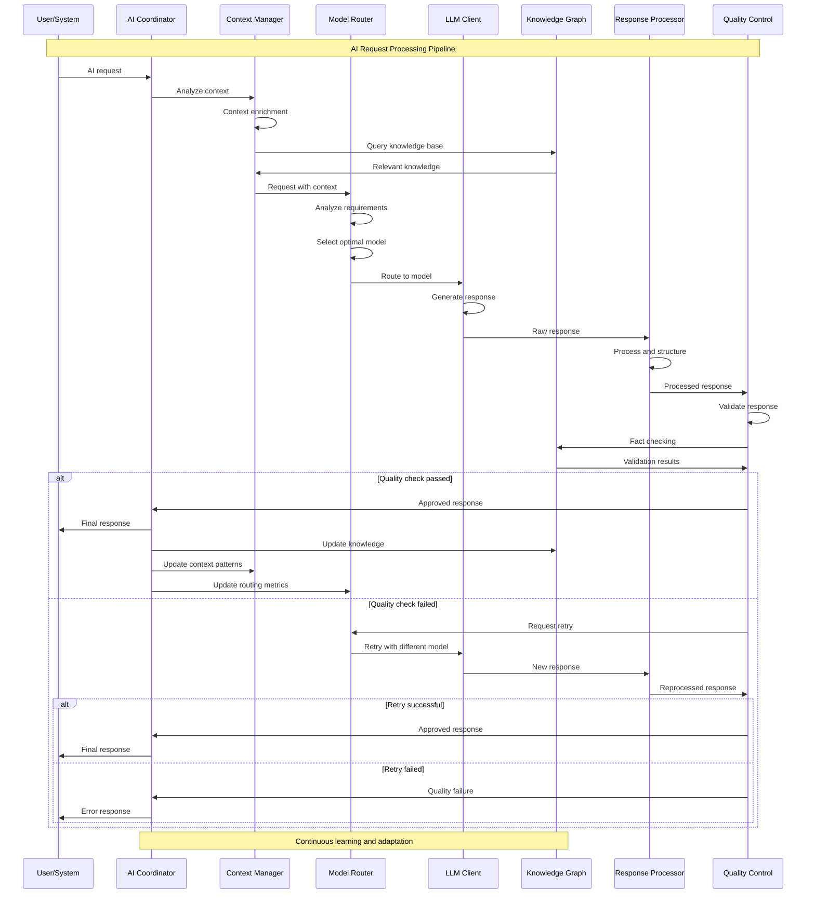
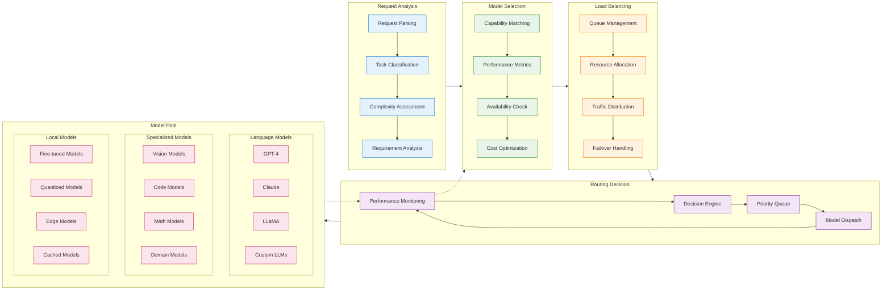
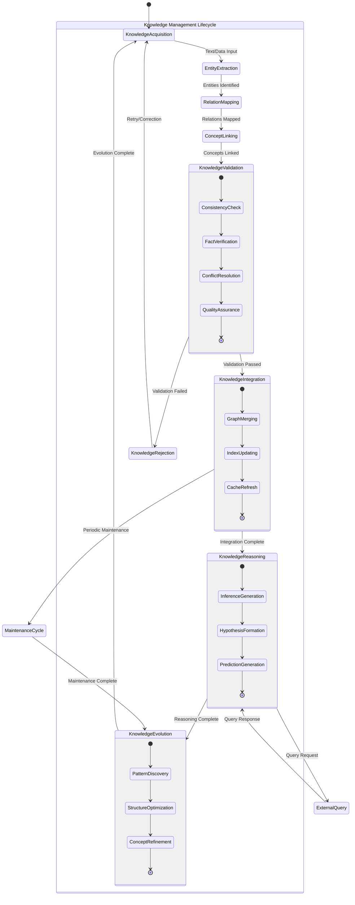
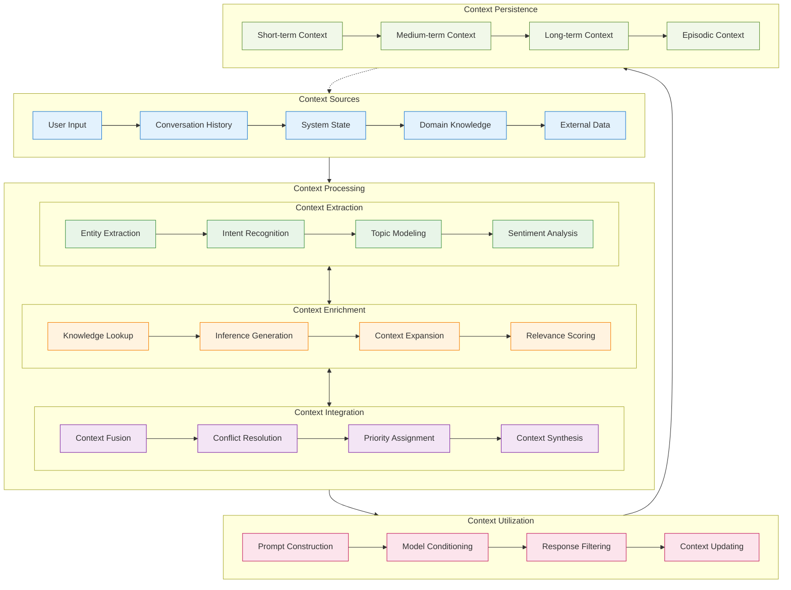

# AI System Architecture - Detailed Mermaid Analysis

This document provides comprehensive architectural analysis of the AI System within the Marduk cognitive framework, illustrating intelligence coordination patterns, model integration flows, and neural-symbolic reasoning mechanisms through detailed Mermaid diagrams.

## AI System Core Architecture

```mermaid
graph TB
    %% AI system components
    subgraph AI_CORE["AI System Core"]
        direction TB
        
        subgraph COORDINATOR["AI Coordinator"]
            COORD_DISPATCH[Request Dispatch]
            COORD_ROUTE[Model Routing]
            COORD_MERGE[Response Merging]
            COORD_OPTIMIZE[Performance Optimization]
            
            COORD_DISPATCH --> COORD_ROUTE
            COORD_ROUTE --> COORD_MERGE
            COORD_MERGE --> COORD_OPTIMIZE
            COORD_OPTIMIZE --> COORD_DISPATCH
        end
        
        subgraph LLM_CLIENTS["LLM Clients"]
            LLM_OPENAI[OpenAI Client]
            LLM_ANTHROPIC[Anthropic Client]
            LLM_LOCAL[Local Models]
            LLM_CUSTOM[Custom Models]
            
            LLM_OPENAI --> LLM_ANTHROPIC
            LLM_ANTHROPIC --> LLM_LOCAL
            LLM_LOCAL --> LLM_CUSTOM
        end
        
        subgraph MODEL_ROUTER["Model Router"]
            ROUTER_SELECT[Model Selection]
            ROUTER_BALANCE[Load Balancing]
            ROUTER_FALLBACK[Fallback Handling]
            ROUTER_CACHE[Response Caching]
            
            ROUTER_SELECT --> ROUTER_BALANCE
            ROUTER_BALANCE --> ROUTER_FALLBACK
            ROUTER_FALLBACK --> ROUTER_CACHE
        end
        
        subgraph KNOWLEDGE_GRAPH["Knowledge Graph"]
            KG_ENTITIES[Entity Management]
            KG_RELATIONS[Relationship Mapping]
            KG_INFERENCE[Inference Engine]
            KG_EVOLUTION[Graph Evolution]
            
            KG_ENTITIES --> KG_RELATIONS
            KG_RELATIONS --> KG_INFERENCE
            KG_INFERENCE --> KG_EVOLUTION
            KG_EVOLUTION --> KG_ENTITIES
        end
    end
    
    %% Integration layer
    subgraph INTEGRATION4["AI Integration Layer"]
        CONTEXT_MGR[Context Manager]
        PROMPT_ENGINE[Prompt Engineering]
        RESPONSE_PROC[Response Processing]
        QUALITY_CTRL[Quality Control]
        
        CONTEXT_MGR --> PROMPT_ENGINE
        PROMPT_ENGINE --> RESPONSE_PROC
        RESPONSE_PROC --> QUALITY_CTRL
        QUALITY_CTRL --> CONTEXT_MGR
    end
    
    %% Specialized modules
    subgraph SPECIALIZED["Specialized AI Modules"]
        NLP[Natural Language Processing]
        VISION[Computer Vision]
        REASONING[Symbolic Reasoning]
        PLANNING3[AI Planning]
        
        NLP --> VISION
        VISION --> REASONING
        REASONING --> PLANNING3
    end
    
    %% Inter-component connections
    COORDINATOR <--> INTEGRATION4
    LLM_CLIENTS <--> INTEGRATION4
    MODEL_ROUTER <--> INTEGRATION4
    KNOWLEDGE_GRAPH <--> INTEGRATION4
    
    INTEGRATION4 <--> SPECIALIZED
    
    %% External interfaces
    AI_CORE --> EXT_APIS[External AI APIs]
    AI_CORE --> EXT_MODELS[External Models]
    
    %% Styling
    classDef coordinator fill:#e3f2fd,stroke:#1976d2
    classDef clients fill:#e8f5e8,stroke:#388e3c
    classDef router fill:#fff3e0,stroke:#f57c00
    classDef knowledge fill:#f3e5f5,stroke:#7b1fa2
    classDef integration fill:#fce4ec,stroke:#c2185b
    classDef specialized fill:#f1f8e9,stroke:#558b2f
    
    class COORD_DISPATCH,COORD_ROUTE,COORD_MERGE,COORD_OPTIMIZE coordinator
    class LLM_OPENAI,LLM_ANTHROPIC,LLM_LOCAL,LLM_CUSTOM clients
    class ROUTER_SELECT,ROUTER_BALANCE,ROUTER_FALLBACK,ROUTER_CACHE router
    class KG_ENTITIES,KG_RELATIONS,KG_INFERENCE,KG_EVOLUTION knowledge
    class CONTEXT_MGR,PROMPT_ENGINE,RESPONSE_PROC,QUALITY_CTRL integration
    class NLP,VISION,REASONING,PLANNING3 specialized
```

## AI Request Processing Flow

## Neural-Symbolic Integration Architecture

```mermaid
graph TB
    %% Neural components
    subgraph NEURAL2["Neural Processing Layer"]
        direction TB
        
        subgraph EMBEDDINGS2["Vector Embeddings"]
            WORD_EMB[Word Embeddings]
            SENT_EMB[Sentence Embeddings]
            DOC_EMB[Document Embeddings]
            CONCEPT_EMB[Concept Embeddings]
            
            WORD_EMB --> SENT_EMB
            SENT_EMB --> DOC_EMB
            DOC_EMB --> CONCEPT_EMB
        end
        
        subgraph NEURAL_NETS["Neural Networks"]
            TRANSFORMER[Transformer Models]
            CNN[Convolutional Networks]
            RNN[Recurrent Networks]
            GNN[Graph Neural Networks]
            
            TRANSFORMER --> CNN
            CNN --> RNN
            RNN --> GNN
        end
    end
    
    %% Symbolic components
    subgraph SYMBOLIC2["Symbolic Processing Layer"]
        direction TB
        
        subgraph LOGIC_SYS["Logic Systems"]
            PREDICATE[Predicate Logic]
            TEMPORAL[Temporal Logic]
            MODAL[Modal Logic]
            FUZZY[Fuzzy Logic]
            
            PREDICATE --> TEMPORAL
            TEMPORAL --> MODAL
            MODAL --> FUZZY
        end
        
        subgraph KNOWLEDGE_REP["Knowledge Representation"]
            ONTOLOGY2[Ontologies]
            FRAMES[Frame Systems]
            RULES2[Rule Systems]
            CONSTRAINTS[Constraint Systems]
            
            ONTOLOGY2 --> FRAMES
            FRAMES --> RULES2
            RULES2 --> CONSTRAINTS
        end
    end
    
    %% Integration mechanisms
    subgraph NEURO_SYMBOLIC["Neuro-Symbolic Integration"]
        direction TB
        
        subgraph TRANSLATION["Translation Mechanisms"]
            N2S_TRANS[Neural-to-Symbolic]
            S2N_TRANS[Symbolic-to-Neural]
            HYBRID_REP[Hybrid Representations]
            BIDIRECTIONAL[Bidirectional Mapping]
            
            N2S_TRANS --> S2N_TRANS
            S2N_TRANS --> HYBRID_REP
            HYBRID_REP --> BIDIRECTIONAL
            BIDIRECTIONAL --> N2S_TRANS
        end
        
        subgraph REASONING2["Hybrid Reasoning"]
            NEURAL_REASON[Neural Reasoning]
            SYMBOLIC_REASON[Symbolic Reasoning]
            COMBINED_REASON[Combined Reasoning]
            META_REASON[Meta-Reasoning]
            
            NEURAL_REASON --> SYMBOLIC_REASON
            SYMBOLIC_REASON --> COMBINED_REASON
            COMBINED_REASON --> META_REASON
            META_REASON --> NEURAL_REASON
        end
    end
    
    %% Cross-layer connections
    NEURAL2 <--> NEURO_SYMBOLIC
    SYMBOLIC2 <--> NEURO_SYMBOLIC
    
    %% Specific mappings
    EMBEDDINGS2 <-.-> KNOWLEDGE_REP
    NEURAL_NETS <-.-> LOGIC_SYS
    
    %% External interfaces
    NEURO_SYMBOLIC --> EXT_REASON[External Reasoning Systems]
    NEURO_SYMBOLIC --> EXT_KNOWLEDGE[External Knowledge Bases]
    
    %% Styling
    classDef neural fill:#e3f2fd,stroke:#1976d2
    classDef symbolic fill:#e8f5e8,stroke:#388e3c
    classDef integration fill:#fff3e0,stroke:#f57c00
    classDef translation fill:#f3e5f5,stroke:#7b1fa2
    classDef reasoning fill:#fce4ec,stroke:#c2185b
    
    class WORD_EMB,SENT_EMB,DOC_EMB,CONCEPT_EMB,TRANSFORMER,CNN,RNN,GNN neural
    class PREDICATE,TEMPORAL,MODAL,FUZZY,ONTOLOGY2,FRAMES,RULES2,CONSTRAINTS symbolic
    class N2S_TRANS,S2N_TRANS,HYBRID_REP,BIDIRECTIONAL translation
    class NEURAL_REASON,SYMBOLIC_REASON,COMBINED_REASON,META_REASON reasoning
```

## Model Coordination and Routing

## Knowledge Graph Integration

## Context Management Architecture

## AI Performance Optimization

```mermaid
graph LR
    %% Performance metrics
    subgraph METRICS2["Performance Metrics"]
        LATENCY2[Response Latency]
        THROUGHPUT2[Request Throughput]
        ACCURACY2[Response Accuracy]
        QUALITY2[Output Quality]
        COST2[Operational Cost]
        
        LATENCY2 --> THROUGHPUT2
        THROUGHPUT2 --> ACCURACY2
        ACCURACY2 --> QUALITY2
        QUALITY2 --> COST2
    end
    
    %% Optimization strategies
    subgraph OPTIMIZATION2["Optimization Strategies"]
        direction TB
        
        subgraph CACHING["Caching Strategies"]
            RESPONSE_CACHE[Response Caching]
            EMBEDDINGS_CACHE[Embeddings Cache]
            COMPUTATION_CACHE[Computation Cache]
            SEMANTIC_CACHE[Semantic Cache]
            
            RESPONSE_CACHE --> EMBEDDINGS_CACHE
            EMBEDDINGS_CACHE --> COMPUTATION_CACHE
            COMPUTATION_CACHE --> SEMANTIC_CACHE
        end
        
        subgraph BATCHING["Batching Strategies"]
            REQUEST_BATCHING[Request Batching]
            INFERENCE_BATCHING[Inference Batching]
            PARALLEL_PROCESSING[Parallel Processing]
            PIPELINE_OPTIMIZATION[Pipeline Optimization]
            
            REQUEST_BATCHING --> INFERENCE_BATCHING
            INFERENCE_BATCHING --> PARALLEL_PROCESSING
            PARALLEL_PROCESSING --> PIPELINE_OPTIMIZATION
        end
        
        subgraph MODEL_OPTIMIZATION["Model Optimization"]
            QUANTIZATION[Model Quantization]
            PRUNING2[Model Pruning]
            DISTILLATION[Knowledge Distillation]
            SPECIALIZATION[Model Specialization]
            
            QUANTIZATION --> PRUNING2
            PRUNING2 --> DISTILLATION
            DISTILLATION --> SPECIALIZATION
        end
    end
    
    %% Adaptive mechanisms
    subgraph ADAPTIVE2["Adaptive Optimization"]
        LEARNING_OPTIMIZER[Learning Optimizer]
        DYNAMIC_ROUTING[Dynamic Routing]
        AUTO_SCALING[Auto Scaling]
        PREDICTIVE_LOADING[Predictive Loading]
        
        LEARNING_OPTIMIZER --> DYNAMIC_ROUTING
        DYNAMIC_ROUTING --> AUTO_SCALING
        AUTO_SCALING --> PREDICTIVE_LOADING
        PREDICTIVE_LOADING --> LEARNING_OPTIMIZER
    end
    
    %% Feedback and control
    subgraph CONTROL["Control Systems"]
        MONITORING4[Performance Monitoring]
        ANALYSIS3[Bottleneck Analysis]
        DECISION3[Optimization Decision]
        IMPLEMENTATION2[Strategy Implementation]
        
        MONITORING4 --> ANALYSIS3
        ANALYSIS3 --> DECISION3
        DECISION3 --> IMPLEMENTATION2
        IMPLEMENTATION2 --> MONITORING4
    end
    
    %% Process flow
    METRICS2 --> OPTIMIZATION2
    OPTIMIZATION2 --> ADAPTIVE2
    ADAPTIVE2 --> CONTROL
    CONTROL -.-> METRICS2
    
    %% Cross-optimization interactions
    CACHING <--> BATCHING
    BATCHING <--> MODEL_OPTIMIZATION
    
    %% Styling
    classDef metrics fill:#e3f2fd,stroke:#1976d2
    classDef caching fill:#e8f5e8,stroke:#388e3c
    classDef batching fill:#fff3e0,stroke:#f57c00
    classDef modelopt fill:#f3e5f5,stroke:#7b1fa2
    classDef adaptive fill:#fce4ec,stroke:#c2185b
    classDef control fill:#f1f8e9,stroke:#558b2f
    
    class LATENCY2,THROUGHPUT2,ACCURACY2,QUALITY2,COST2 metrics
    class RESPONSE_CACHE,EMBEDDINGS_CACHE,COMPUTATION_CACHE,SEMANTIC_CACHE caching
    class REQUEST_BATCHING,INFERENCE_BATCHING,PARALLEL_PROCESSING,PIPELINE_OPTIMIZATION batching
    class QUANTIZATION,PRUNING2,DISTILLATION,SPECIALIZATION modelopt
    class LEARNING_OPTIMIZER,DYNAMIC_ROUTING,AUTO_SCALING,PREDICTIVE_LOADING adaptive
    class MONITORING4,ANALYSIS3,DECISION3,IMPLEMENTATION2 control
```

---

**AI System Cognitive Insights**:

The AI System represents the neural-symbolic integration core of the Marduk framework, demonstrating emergent intelligence through the synergistic combination of multiple AI paradigms. The system transcends traditional boundaries between symbolic reasoning and neural processing.

Key emergent patterns include:
- **Meta-Cognitive Model Selection**: The system learns which models work best for specific types of problems
- **Contextual Intelligence Amplification**: Context awareness dramatically improves response quality and relevance
- **Hybrid Reasoning Emergence**: Neural and symbolic processing combine to create reasoning capabilities beyond either approach alone
- **Adaptive Performance Optimization**: The system continuously optimizes its own performance through recursive analysis

The integration with memory and task systems creates a cognitive amplification effect where the AI's intelligence becomes increasingly context-aware, goal-oriented, and self-improving, embodying the recursive intelligence and neural-symbolic integration principles of the MORK architecture.