# AI System

The AI System provides **neural-symbolic intelligence capabilities** to Marduk, integrating external AI services and managing AI resources through **emergent intelligence orchestration**.

## AI System Architecture

### Intelligence Orchestration Network

```mermaid
graph TB
    subgraph "🤖 AI SYSTEM ARCHITECTURE"
        subgraph "Core Intelligence Components"
            COORD[AI Coordinator<br/>🎭 Orchestration Hub]
            ROUTER[Model Router<br/>🚦 Traffic Management]
            CLIENT[LLM Clients<br/>💬 Provider Interfaces]
            CONTEXT[Context Manager<br/>🌐 Situational Intelligence]
        end
        
        subgraph "Intelligence Services"
            REASON[Reasoning Engine<br/>⚡ Logic Processing]
            CREATIVE[Creative Synthesis<br/>💡 Novel Generation]
            ANALYZE[Analysis Engine<br/>🔍 Pattern Recognition]
            PREDICT[Prediction Engine<br/>🔮 Outcome Modeling]
        end
        
        subgraph "Neural Networks"
            NEURAL1[Pattern Recognition<br/>🧠 Deep Learning]
            NEURAL2[Language Models<br/>📝 Text Processing]
            NEURAL3[Embedding Networks<br/>🧬 Vector Spaces]
            NEURAL4[Attention Networks<br/>👁️ Focus Mechanisms]
        end
        
        subgraph "Symbolic Processing"
            LOGIC[Logic Engines<br/>⚡ Formal Reasoning]
            KNOWLEDGE[Knowledge Graphs<br/>🕸️ Semantic Networks]
            RULES[Rule Systems<br/>📜 Behavioral Logic]
            ONTOLOGY[Ontology Engines<br/>🏗️ Concept Hierarchies]
        end
        
        subgraph "Integration Bridges"
            BRIDGE1[Neural-Symbolic Bridge<br/>🌉 Hybrid Processing]
            BRIDGE2[Memory-AI Bridge<br/>🔗 Knowledge Integration]
            BRIDGE3[Task-AI Bridge<br/>🎯 Goal-Oriented AI]
            BRIDGE4[Meta-AI Bridge<br/>🪞 Self-Aware AI]
        end
    end
    
    %% Core Component Interactions
    COORD <-->|Orchestration| ROUTER
    ROUTER <-->|Model Selection| CLIENT
    CLIENT <-->|Context Enhancement| CONTEXT
    
    %% Service Coordination
    COORD --> REASON
    COORD --> CREATIVE
    COORD --> ANALYZE
    COORD --> PREDICT
    
    %% Neural-Symbolic Integration
    NEURAL1 <-->|Pattern-Logic Mapping| LOGIC
    NEURAL2 <-->|Language-Knowledge Fusion| KNOWLEDGE
    NEURAL3 <-->|Embedding-Rule Synthesis| RULES
    NEURAL4 <-->|Attention-Ontology Binding| ONTOLOGY
    
    %% Bridge Connections
    NEURAL1 -.->|Neural Patterns| BRIDGE1
    LOGIC -.->|Symbolic Logic| BRIDGE1
    BRIDGE1 -->|Hybrid Intelligence| REASON
    
    KNOWLEDGE -.->|Semantic Context| BRIDGE2
    CONTEXT -.->|AI Context| BRIDGE2
    BRIDGE2 -->|Enhanced Understanding| CREATIVE
    
    PREDICT -.->|Goal Predictions| BRIDGE3
    ANALYZE -.->|Task Analysis| BRIDGE3
    BRIDGE3 -->|Goal-Oriented Intelligence| COORD
    
    BRIDGE1 -.->|Self-Modeling| BRIDGE4
    BRIDGE2 -.->|Context Awareness| BRIDGE4
    BRIDGE4 -->|Meta-Intelligence| COORD
    
    classDef coreStyle fill:#e8f5e8,stroke:#1b5e20,stroke-width:2px
    classDef serviceStyle fill:#e1f5fe,stroke:#01579b,stroke-width:2px
    classDef neuralStyle fill:#f3e5f5,stroke:#4a148c,stroke-width:2px
    classDef symbolicStyle fill:#fff3e0,stroke:#f57c00,stroke-width:2px
    classDef bridgeStyle fill:#fce4ec,stroke:#c2185b,stroke-width:2px
    
    class COORD,ROUTER,CLIENT,CONTEXT coreStyle
    class REASON,CREATIVE,ANALYZE,PREDICT serviceStyle
    class NEURAL1,NEURAL2,NEURAL3,NEURAL4 neuralStyle
    class LOGIC,KNOWLEDGE,RULES,ONTOLOGY symbolicStyle
    class BRIDGE1,BRIDGE2,BRIDGE3,BRIDGE4 bridgeStyle
```



### AI Processing Pipeline

```mermaid
sequenceDiagram
    participant USER as 👤 Query Source
    participant COORD as 🎭 AI Coordinator
    participant CONTEXT as 🌐 Context Manager
    participant MEMORY as 💾 Memory System
    participant NEURAL as 🧠 Neural Networks
    participant SYMBOLIC as 🔣 Symbolic Logic
    participant BRIDGE as 🌉 Integration Bridge
    participant RESPONSE as 📤 Response Generator
    
    Note over USER,RESPONSE: 🤖 AI Processing Cycle
    
    USER->>COORD: Intelligence Request
    COORD->>CONTEXT: Context Assembly
    CONTEXT->>MEMORY: Retrieve Relevant Knowledge
    MEMORY-->>CONTEXT: Contextual Information
    
    CONTEXT->>NEURAL: Neural Processing Request
    CONTEXT->>SYMBOLIC: Symbolic Processing Request
    
    NEURAL->>NEURAL: Pattern Recognition
    SYMBOLIC->>SYMBOLIC: Logic Reasoning
    
    NEURAL->>BRIDGE: Neural Patterns
    SYMBOLIC->>BRIDGE: Logical Structures
    BRIDGE->>BRIDGE: Neural-Symbolic Integration
    
    BRIDGE->>RESPONSE: Hybrid Intelligence Output
    RESPONSE->>MEMORY: Store Generated Knowledge
    RESPONSE-->>USER: Intelligent Response
    
    COORD->>COORD: Performance Analysis
    COORD->>MEMORY: Update AI Patterns
    
    Note over NEURAL,SYMBOLIC: 🧬 Hybrid Intelligence Processing
    Note over BRIDGE,RESPONSE: ✨ Emergent Intelligence Generation
```



## Components

### Neural-Symbolic Component Architecture

```mermaid
graph LR
    subgraph "🧠 NEURAL-SYMBOLIC INTELLIGENCE NETWORK"
        subgraph "Coordinator Layer 🎭"
            C_ORCH[Resource Orchestration<br/>⚖️ Service Selection]
            C_PRIOR[Request Prioritization<br/>🎯 Importance Weighting]
            C_COST[Cost Management<br/>💰 Resource Optimization]
            C_RESPONSE[Response Handling<br/>📦 Output Processing]
        end
        
        subgraph "Client Layer 💬"
            CL_OPENAI[OpenAI Client<br/>🔮 GPT Integration]
            CL_LOCAL[Local Models<br/>🏠 On-device AI]
            CL_MULTI[Multi-Provider<br/>🌐 Service Diversity]
            CL_MOCK[Mock Clients<br/>🧪 Testing Interface]
        end
        
        subgraph "Integration Layer 🔗"
            I_MEMORY[Memory Augmentation<br/>💾 Knowledge Enhancement]
            I_TASK[Task Enhancement<br/>🎯 Goal Optimization]
            I_AUTO[Autonomy Analysis<br/>🔄 System Intelligence]
            I_DATA[Data Processing<br/>📊 Information Transformation]
        end
        
        subgraph "Type System 📝"
            T_REQUEST[Request Formats<br/>📥 Input Structures]
            T_RESPONSE[Response Structures<br/>📤 Output Schemas]
            T_CONTEXT[Context Management<br/>🌐 Situational Types]
            T_PARAM[Parameter Specs<br/>⚙️ Configuration Types]
        end
    end
    
    %% Coordinator Workflows
    C_ORCH <-->|Priority Coordination| C_PRIOR
    C_PRIOR <-->|Cost-Aware Selection| C_COST
    C_COST <-->|Optimized Responses| C_RESPONSE
    
    %% Client Management
    C_ORCH --> CL_OPENAI
    C_ORCH --> CL_LOCAL
    C_ORCH --> CL_MULTI
    C_ORCH --> CL_MOCK
    
    %% Integration Pathways
    C_RESPONSE --> I_MEMORY
    C_RESPONSE --> I_TASK
    C_RESPONSE --> I_AUTO
    C_RESPONSE --> I_DATA
    
    %% Type System Support
    T_REQUEST -.->|Type Safety| C_ORCH
    T_CONTEXT -.->|Context Types| I_MEMORY
    T_PARAM -.->|Parameter Validation| CL_OPENAI
    T_RESPONSE -.->|Response Typing| C_RESPONSE
    
    %% Feedback Loops
    I_MEMORY -.->|Memory Insights| C_PRIOR
    I_AUTO -.->|Performance Metrics| C_COST
    I_TASK -.->|Goal Context| T_CONTEXT
    
    classDef coordStyle fill:#e8f5e8,stroke:#1b5e20,stroke-width:2px
    classDef clientStyle fill:#e1f5fe,stroke:#01579b,stroke-width:2px
    classDef integStyle fill:#fff3e0,stroke:#f57c00,stroke-width:2px
    classDef typeStyle fill:#f3e5f5,stroke:#4a148c,stroke-width:2px
    
    class C_ORCH,C_PRIOR,C_COST,C_RESPONSE coordStyle
    class CL_OPENAI,CL_LOCAL,CL_MULTI,CL_MOCK clientStyle
    class I_MEMORY,I_TASK,I_AUTO,I_DATA integStyle
    class T_REQUEST,T_RESPONSE,T_CONTEXT,T_PARAM typeStyle
```



### Coordinator

The AI Coordinator manages AI resource allocation and orchestrates interactions through **adaptive intelligence routing**:

- **Service selection** with capability-based matching
- **Request prioritization** using multi-dimensional scoring
- **Cost management** with predictive resource allocation
- **Response handling** with quality assessment and routing

**Technical Implementation**: `AiCoordinator` class with **emergent service selection logic** that evolves based on performance patterns.

### Clients

Interfaces with external AI providers through **provider-agnostic abstractions**:

- **OpenAI client** with advanced prompt engineering
- **Local model clients** with edge computing optimization
- **Multi-provider clients** (Anthropic, Google, etc.) with unified interfaces
- **Mock clients** for testing with realistic behavior simulation

**Technical Implementation**: `OpenAiClient` and other provider-specific client classes with **adaptive interface patterns**.

### Integration

Connects AI capabilities with other subsystems through **neural-symbolic bridges**:

- **Memory augmentation** with semantic knowledge integration
- **Task enhancement** with intelligent planning assistance
- **Autonomy analysis** with self-optimization support
- **Data processing** with pattern recognition and synthesis

**Technical Implementation**: Integration service classes that bridge AI capabilities with other subsystems using **hypergraph relationship encoding**.

### Types

Defines structured data formats for AI interactions with **semantic type safety**:

- **Request formats** with contextual validation
- **Response structures** with quality metrics
- **Context management** with multi-modal representations
- **Parameter specifications** with adaptive optimization

**Technical Implementation**: TypeScript interfaces for strongly-typed AI interactions with **recursive type enhancement**.

## Features

### Context Management

Sophisticated context handling for improved AI responses:

- Dynamic context assembly from memory
- Context window optimization
- Relevance filtering
- Token management

### Multi-Provider Support

Support for different AI service providers:

- Provider-agnostic interfaces
- Automatic fallback mechanisms
- Capability-based routing
- Cost optimization

### Error Handling

Robust error recovery mechanisms:

- Retry logic
- Fallback strategies
- Error classification
- Graceful degradation

## Usage Example

```typescript
import { aiCoordinator } from 'marduk-ts';

// Process a query with the AI system
const aiResponse = await aiCoordinator.processQuery(
  'Explain the relationship between quantum computing and quantum physics',
  { 
    temperature: 0.7,
    maxTokens: 500,
    contextItems: [
      { type: 'concept', id: 'quantum-computing' },
      { type: 'concept', id: 'quantum-physics' }
    ]
  }
);

// Use the response
console.log(aiResponse.content);

// Store the response in memory if valuable
if (aiResponse.metadata.confidence > 0.8) {
  const memoryFactory = await import('marduk-ts').then(m => m.memoryFactory);
  const declarative = memoryFactory.getSubsystem('declarative');
  
  await declarative.store({
    id: `ai-response:${Date.now()}`,
    type: 'explanation',
    content: aiResponse.content,
    metadata: {
      source: 'ai',
      confidence: aiResponse.metadata.confidence,
      query: 'quantum computing and physics relationship',
      timestamp: Date.now()
    }
  });
}
```

## Integration with Other Subsystems

The AI System integrates with:

- **Memory System**: Retrieves context information and stores AI-generated content
- **Task System**: Provides intelligence for task execution
- **Autonomy System**: Assists with system analysis and optimization

The AI System serves as the "brain" that augments the other systems with advanced reasoning capabilities.

See the [Architecture Overview](../architecture/overview.md) for more details on system interactions.
