# Autonomy System

The Autonomy System enables Marduk to analyze and improve its own operations, creating a **self-optimizing cognitive architecture** through **recursive meta-cognition** and **emergent system evolution**.

## Autonomy System Architecture

### Self-Optimization Network

```mermaid
graph TB
    subgraph "🔄 AUTONOMY SYSTEM ARCHITECTURE"
        subgraph "Analysis Layer 🔍"
            CODE_ANAL[Code Analyzer<br/>📋 Pattern Detection]
            PERF_ANAL[Performance Analyzer<br/>📊 Metrics Analysis]
            PATTERN_ANAL[Pattern Analyzer<br/>🔍 Behavior Recognition]
            META_ANAL[Meta-Analyzer<br/>🪞 Self-Analysis]
        end
        
        subgraph "Optimization Engine 📈"
            CODE_OPT[Code Optimizer<br/>⚙️ Implementation Enhancement]
            RESOURCE_OPT[Resource Optimizer<br/>⚡ Efficiency Maximization]
            STRATEGY_OPT[Strategy Optimizer<br/>🎯 Approach Refinement]
            META_OPT[Meta-Optimizer<br/>🧬 System Evolution]
        end
        
        subgraph "Monitoring System 📊"
            HEALTH_MON[Health Monitor<br/>💓 System Vitals]
            RESOURCE_MON[Resource Monitor<br/>📈 Usage Tracking]
            ERROR_MON[Error Monitor<br/>🚨 Anomaly Detection]
            PROGRESS_MON[Progress Monitor<br/>📊 Development Tracking]
        end
        
        subgraph "Regulation Layer 💓"
            HEARTBEAT[Heartbeat Regulator<br/>💓 System Continuity]
            RECOVERY[Recovery Engine<br/>🛠️ Error Recovery]
            CONFIG[Configuration Manager<br/>⚙️ Settings Optimization]
            FAILSAFE[Failsafe Controller<br/>🛡️ Safety Mechanisms]
        end
        
        subgraph "Meta-Cognitive Layer 🧠"
            REFLECT[Reflection Engine<br/>🪞 Self-Awareness]
            LEARN[Learning Engine<br/>📚 Experience Integration]
            EVOLVE[Evolution Engine<br/>🧬 System Transformation]
            TRANSCEND[Transcendence Module<br/>⭐ Emergence Catalyst]
        end
    end
    
    %% Analysis Flow
    CODE_ANAL <-->|Performance Context| PERF_ANAL
    PERF_ANAL <-->|Pattern Context| PATTERN_ANAL
    PATTERN_ANAL <-->|Meta Context| META_ANAL
    
    %% Optimization Flow
    CODE_ANAL --> CODE_OPT
    PERF_ANAL --> RESOURCE_OPT
    PATTERN_ANAL --> STRATEGY_OPT
    META_ANAL --> META_OPT
    
    %% Monitoring Integration
    CODE_OPT --> HEALTH_MON
    RESOURCE_OPT --> RESOURCE_MON
    STRATEGY_OPT --> ERROR_MON
    META_OPT --> PROGRESS_MON
    
    %% Regulation Control
    HEALTH_MON --> HEARTBEAT
    RESOURCE_MON --> RECOVERY
    ERROR_MON --> CONFIG
    PROGRESS_MON --> FAILSAFE
    
    %% Meta-Cognitive Processing
    META_ANAL --> REFLECT
    META_OPT --> LEARN
    PROGRESS_MON --> EVOLVE
    FAILSAFE --> TRANSCEND
    
    %% Recursive Enhancement Loops
    REFLECT -.->|Enhanced Analysis| CODE_ANAL
    LEARN -.->|Improved Optimization| CODE_OPT
    EVOLVE -.->|Advanced Monitoring| HEALTH_MON
    TRANSCEND -.->|Transcendent Regulation| HEARTBEAT
    
    classDef analysisStyle fill:#e3f2fd,stroke:#0277bd,stroke-width:2px
    classDef optimizeStyle fill:#e8f5e8,stroke:#2e7d32,stroke-width:2px
    classDef monitorStyle fill:#fff3e0,stroke:#f57c00,stroke-width:2px
    classDef regulateStyle fill:#fce4ec,stroke:#c2185b,stroke-width:2px
    classDef metaStyle fill:#f3e5f5,stroke:#7b1fa2,stroke-width:2px
    
    class CODE_ANAL,PERF_ANAL,PATTERN_ANAL,META_ANAL analysisStyle
    class CODE_OPT,RESOURCE_OPT,STRATEGY_OPT,META_OPT optimizeStyle
    class HEALTH_MON,RESOURCE_MON,ERROR_MON,PROGRESS_MON monitorStyle
    class HEARTBEAT,RECOVERY,CONFIG,FAILSAFE regulateStyle
    class REFLECT,LEARN,EVOLVE,TRANSCEND metaStyle
```



### Recursive Self-Improvement Cycle

```mermaid
sequenceDiagram
    participant SYSTEM as 🧠 System Operations
    participant MONITOR as 📊 Monitoring Layer
    participant ANALYZE as 🔍 Analysis Engine
    participant OPTIMIZE as 📈 Optimization Engine
    participant EVOLVE as 🧬 Evolution Engine
    participant META as 🪞 Meta-Cognition
    participant IMPLEMENT as ⚙️ Implementation Layer
    
    Note over SYSTEM,IMPLEMENT: 🔄 Recursive Self-Improvement Cycle
    
    SYSTEM->>MONITOR: Operational Data
    MONITOR->>ANALYZE: Performance Metrics
    ANALYZE->>ANALYZE: Pattern Detection
    
    ANALYZE->>OPTIMIZE: Improvement Opportunities
    OPTIMIZE->>OPTIMIZE: Strategy Generation
    OPTIMIZE->>EVOLVE: Enhancement Plans
    
    EVOLVE->>META: System Evolution Patterns
    META->>META: Meta-Cognitive Analysis
    META->>ANALYZE: Enhanced Analysis Capabilities
    
    EVOLVE->>IMPLEMENT: System Modifications
    IMPLEMENT->>SYSTEM: Enhanced Operations
    
    SYSTEM->>META: Self-Awareness Data
    META->>OPTIMIZE: Meta-Optimization Insights
    
    Note over ANALYZE,EVOLVE: 🧠 Emergent Intelligence Loop
    Note over META,IMPLEMENT: ⭐ Transcendent Enhancement
```



## Components

### Emergent Autonomy Architecture

```mermaid
stateDiagram-v2
    [*] --> SystemAnalysis: Initialization
    
    SystemAnalysis --> CodeAnalysis: Code Examination
    SystemAnalysis --> PerformanceAnalysis: Metrics Collection
    SystemAnalysis --> PatternAnalysis: Behavior Study
    
    CodeAnalysis --> InefficencyDetection: Code Review
    PerformanceAnalysis --> BottleneckIdentification: Performance Review
    PatternAnalysis --> AnomalyDetection: Pattern Review
    
    InefficencyDetection --> CodeOptimization: Improvement Planning
    BottleneckIdentification --> ResourceOptimization: Resource Planning
    AnomalyDetection --> StrategyOptimization: Strategy Planning
    
    CodeOptimization --> ImplementationPhase: Code Enhancement
    ResourceOptimization --> ImplementationPhase: Resource Enhancement
    StrategyOptimization --> ImplementationPhase: Strategy Enhancement
    
    ImplementationPhase --> MonitoringPhase: Change Deployment
    MonitoringPhase --> HealthCheck: System Validation
    HealthCheck --> PerformanceValidation: Health Assessment
    PerformanceValidation --> ResultAnalysis: Performance Assessment
    
    ResultAnalysis --> SuccessPath: Improvement Confirmed
    ResultAnalysis --> FailurePath: Improvement Failed
    
    SuccessPath --> MetaLearning: Pattern Storage
    FailurePath --> ErrorRecovery: Rollback Procedures
    
    MetaLearning --> SystemEvolution: Knowledge Integration
    ErrorRecovery --> SystemAnalysis: Recovery Analysis
    
    SystemEvolution --> TranscendentOptimization: Higher-Order Enhancement
    TranscendentOptimization --> SystemAnalysis: Enhanced Capabilities
    
    note right of SystemAnalysis: 🔍 Multi-dimensional\nsystem examination
    note right of MetaLearning: 🧠 Learning from\noptimization patterns
    note right of TranscendentOptimization: ⭐ Beyond current\ncapability boundaries
```



### Analysis

The Analysis component examines system performance and patterns through **multi-dimensional cognitive assessment**:

- **Code analysis** with semantic pattern recognition
- **Performance profiling** with predictive bottleneck detection
- **Pattern detection** with emergent behavior identification
- **Inefficiency identification** with recursive optimization opportunities

**Technical Implementation**: `CodeAnalyzer` and pattern detection classes with **hypergraph analysis encoding**.

### Optimizer

The Optimizer implements improvements to system operations through **adaptive enhancement strategies**:

- **Code optimization** with intelligent refactoring algorithms
- **Memory reorganization** with semantic-aware restructuring
- **Task reallocation** with dynamic load balancing
- **Resource optimization** with predictive allocation models

**Technical Implementation**: `CodeOptimizer` and other optimization classes with **emergent optimization patterns**.

### Monitor

The Monitor tracks system health and metrics through **continuous cognitive surveillance**:

- **Resource usage** with predictive trend analysis
- **Error rates** with pattern-based anomaly detection
- **Performance metrics** with multi-scale temporal analysis
- **Operational statistics** with emergent insight generation

**Technical Implementation**: `AutonomyMonitor` class with **adaptive metric collection** and real-time analysis.

### Heartbeat

The Heartbeat maintains essential operations and failsafes through **autonomous system regulation**:

- **System continuity** with self-healing mechanisms
- **Error recovery** with intelligent rollback strategies
- **Self-restart capabilities** with state preservation
- **Configuration maintenance** with adaptive parameter optimization

**Technical Implementation**: `HeartbeatRegulator` class with **recursive failsafe mechanisms** and emergency protocols.

## Features

### Self-Analysis

Continuous monitoring and analysis of system performance:

- Performance bottleneck detection
- Memory access pattern analysis
- Resource utilization tracking
- Error pattern identification

### Code Optimization

Automatic detection and optimization of inefficient patterns:

- Code refactoring suggestions
- Memory usage improvements
- Algorithm optimization
- Resource allocation adjustments

### Health Regulation

Self-healing capabilities with heartbeat monitoring:

- Error recovery mechanisms
- System restart procedures
- Configuration repair
- State restoration

### Resource Management

Intelligent allocation and optimization of system resources:

- Memory allocation optimization
- AI token usage management
- CPU/processing optimization
- Storage optimization

## Usage Example

```typescript
import { 
  AutonomyCoordinator, 
  AutonomyScheduler,
  HeartbeatRegulator 
} from 'marduk-ts';

// Initialize autonomy components
const coordinator = new AutonomyCoordinator();
const scheduler = new AutonomyScheduler();
const heartbeat = new HeartbeatRegulator(coordinator);

// Start autonomy system
scheduler.start();
heartbeat.start();

// Manually trigger analysis and optimization
const patterns = await coordinator.analyze();
console.log('Detected patterns:', patterns);

const result = await coordinator.rewrite();
console.log('Optimization results:', result.metrics);

// Stop autonomy system
scheduler.stop();
heartbeat.stop();
```

## Integration with Other Subsystems

The Autonomy System integrates with:

- **Memory System**: Analyzes and optimizes memory operations
- **Task System**: Monitors and improves task execution
- **AI System**: Uses AI capabilities for analysis and applies optimizations to AI usage

The Autonomy System acts as a meta-layer that observes and improves the entire Marduk architecture.

See the [Architecture Overview](../architecture/overview.md) for more details on system interactions.
