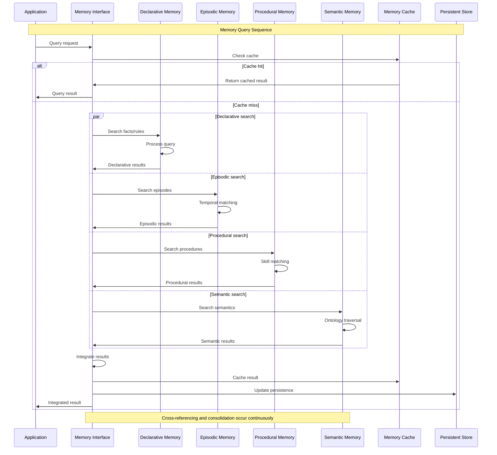
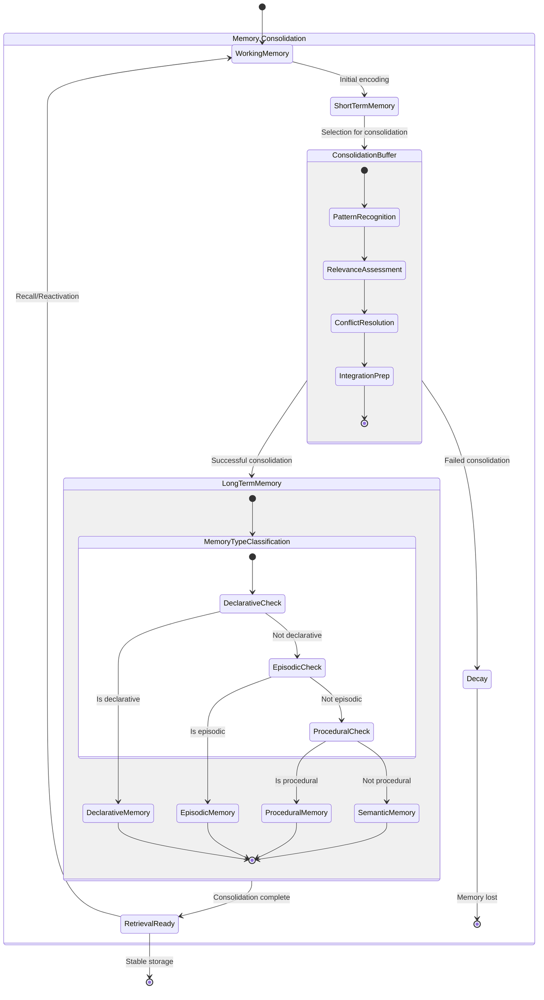
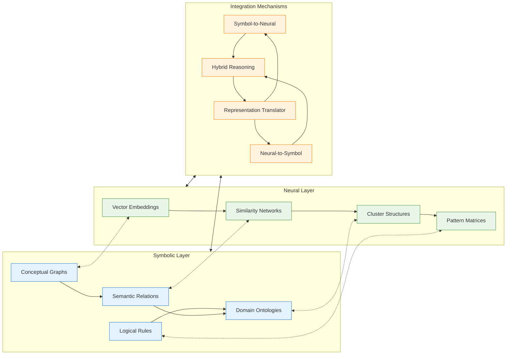

# Memory System Architecture - Detailed Mermaid Analysis

This document provides detailed architectural analysis of the Memory System within the Marduk cognitive framework, using Mermaid diagrams to illustrate memory subsystem interactions, data flows, and neural-symbolic integration patterns.

## Memory Subsystem Architecture

```mermaid
graph TB
    %% Memory subsystems
    subgraph MS["Memory System Core"]
        direction TB
        
        subgraph DM_SUB["Declarative Memory"]
            DM_FACTS[Facts & Knowledge]
            DM_RULES[Rules & Constraints]
            DM_CONCEPTS[Concept Networks]
            DM_REL[Relationships]
            
            DM_FACTS --> DM_CONCEPTS
            DM_RULES --> DM_REL
            DM_CONCEPTS --> DM_REL
        end
        
        subgraph EM_SUB["Episodic Memory"]
            EM_EVENTS[Event Sequences]
            EM_CONTEXT[Contextual Data]
            EM_TEMPORAL[Temporal Links]
            EM_SPATIAL[Spatial Data]
            
            EM_EVENTS --> EM_TEMPORAL
            EM_CONTEXT --> EM_SPATIAL
            EM_TEMPORAL --> EM_SPATIAL
        end
        
        subgraph PM_SUB["Procedural Memory"]
            PM_SKILLS[Skills & Procedures]
            PM_HABITS[Behavioral Patterns]
            PM_MOTOR[Motor Programs]
            PM_COGNITIVE[Cognitive Routines]
            
            PM_SKILLS --> PM_MOTOR
            PM_HABITS --> PM_COGNITIVE
            PM_MOTOR --> PM_COGNITIVE
        end
        
        subgraph SM_SUB["Semantic Memory"]
            SM_ONTOLOGY[Domain Ontologies]
            SM_TAXONOMY[Taxonomic Relations]
            SM_ASSOCIATIONS[Associative Networks]
            SM_CATEGORIES[Category Structures]
            
            SM_ONTOLOGY --> SM_TAXONOMY
            SM_TAXONOMY --> SM_CATEGORIES
            SM_ASSOCIATIONS --> SM_CATEGORIES
        end
    end
    
    %% Integration mechanisms
    subgraph INTEGRATION["Memory Integration Layer"]
        MI[Memory Integrator]
        CR[Cross-Reference Engine]
        PS[Pattern Synthesizer]
        CM[Consolidation Manager]
        
        MI --> CR
        CR --> PS
        PS --> CM
        CM --> MI
    end
    
    %% Memory operations
    subgraph OPS["Memory Operations"]
        STORE[Storage Engine]
        RETRIEVE[Retrieval Engine]
        UPDATE[Update Engine]
        OPTIMIZE[Optimization Engine]
        
        STORE --> RETRIEVE
        RETRIEVE --> UPDATE
        UPDATE --> OPTIMIZE
        OPTIMIZE --> STORE
    end
    
    %% Inter-subsystem connections
    DM_SUB <--> INTEGRATION
    EM_SUB <--> INTEGRATION
    PM_SUB <--> INTEGRATION
    SM_SUB <--> INTEGRATION
    
    INTEGRATION <--> OPS
    
    %% External interfaces
    MS --> EXT_QUERY[External Queries]
    MS --> EXT_STORAGE[External Storage]
    
    %% Styling
    classDef declarative fill:#e3f2fd,stroke:#1976d2
    classDef episodic fill:#e8f5e8,stroke:#388e3c
    classDef procedural fill:#fff3e0,stroke:#f57c00
    classDef semantic fill:#f3e5f5,stroke:#7b1fa2
    classDef integration fill:#fce4ec,stroke:#c2185b
    classDef operations fill:#f1f8e9,stroke:#558b2f
    
    class DM_FACTS,DM_RULES,DM_CONCEPTS,DM_REL declarative
    class EM_EVENTS,EM_CONTEXT,EM_TEMPORAL,EM_SPATIAL episodic
    class PM_SKILLS,PM_HABITS,PM_MOTOR,PM_COGNITIVE procedural
    class SM_ONTOLOGY,SM_TAXONOMY,SM_ASSOCIATIONS,SM_CATEGORIES semantic
    class MI,CR,PS,CM integration
    class STORE,RETRIEVE,UPDATE,OPTIMIZE operations
```



## Memory Access Patterns



## Memory Consolidation Process



## Neural-Symbolic Integration in Memory



## Memory Optimization Pathways

```mermaid
graph TD
    %% Analysis phase
    subgraph ANALYSIS["Memory Analysis"]
        USAGE[Usage Analytics]
        ACCESS[Access Patterns]
        CONFLICTS[Conflict Detection]
        REDUNDANCY[Redundancy Analysis]
        
        USAGE --> ACCESS
        ACCESS --> CONFLICTS
        CONFLICTS --> REDUNDANCY
    end
    
    %% Optimization strategies
    subgraph STRATEGIES["Optimization Strategies"]
        COMPRESS[Compression]
        REORG[Reorganization]
        PRUNE[Pruning]
        DISTRIBUTE[Distribution]
        
        COMPRESS --> REORG
        REORG --> PRUNE
        PRUNE --> DISTRIBUTE
    end
    
    %% Implementation
    subgraph IMPLEMENTATION["Implementation"]
        BACKUP[Create Backup]
        APPLY[Apply Changes]
        VALIDATE[Validate Results]
        ROLLBACK[Rollback if Needed]
        
        BACKUP --> APPLY
        APPLY --> VALIDATE
        VALIDATE --> ROLLBACK
    end
    
    %% Monitoring
    subgraph MONITORING["Continuous Monitoring"]
        PERFORMANCE[Performance Metrics]
        INTEGRITY[Data Integrity]
        EFFICIENCY[Access Efficiency]
        FEEDBACK[Feedback Loop]
        
        PERFORMANCE --> INTEGRITY
        INTEGRITY --> EFFICIENCY
        EFFICIENCY --> FEEDBACK
        FEEDBACK --> PERFORMANCE
    end
    
    %% Process flow
    ANALYSIS --> STRATEGIES
    STRATEGIES --> IMPLEMENTATION
    IMPLEMENTATION --> MONITORING
    MONITORING -.-> ANALYSIS
    
    %% Error handling
    IMPLEMENTATION -.-> ANALYSIS : Validation failed
    
    %% Styling
    classDef analysis fill:#e3f2fd,stroke:#1976d2
    classDef strategy fill:#e8f5e8,stroke:#388e3c
    classDef impl fill:#fff3e0,stroke:#f57c00
    classDef monitor fill:#f3e5f5,stroke:#7b1fa2
    
    class USAGE,ACCESS,CONFLICTS,REDUNDANCY analysis
    class COMPRESS,REORG,PRUNE,DISTRIBUTE strategy
    class BACKUP,APPLY,VALIDATE,ROLLBACK impl
    class PERFORMANCE,INTEGRITY,EFFICIENCY,FEEDBACK monitor
```

## Adaptive Memory Architecture

```mermaid
graph TB
    %% Adaptive mechanisms
    subgraph ADAPTIVE["Adaptive Memory Mechanisms"]
        direction TB
        
        subgraph LEARNING["Learning Adaptation"]
            REINFORCE[Reinforcement Learning]
            TRANSFER[Transfer Learning]
            META[Meta-Learning]
            
            REINFORCE --> TRANSFER
            TRANSFER --> META
            META --> REINFORCE
        end
        
        subgraph STRUCTURE["Structural Adaptation"]
            GROWTH[Network Growth]
            PRUNING[Connection Pruning]
            RECONFIG[Reconfiguration]
            
            GROWTH --> PRUNING
            PRUNING --> RECONFIG
            RECONFIG --> GROWTH
        end
        
        subgraph CONTENT["Content Adaptation"]
            RELEVANCE[Relevance Weighting]
            FRESHNESS[Freshness Decay]
            PRIORITY[Priority Adjustment]
            
            RELEVANCE --> FRESHNESS
            FRESHNESS --> PRIORITY
            PRIORITY --> RELEVANCE
        end
    end
    
    %% Context awareness
    subgraph CONTEXT["Context Awareness"]
        TASK_CTX[Task Context]
        DOMAIN_CTX[Domain Context]
        TEMPORAL_CTX[Temporal Context]
        USER_CTX[User Context]
        
        TASK_CTX --> DOMAIN_CTX
        DOMAIN_CTX --> TEMPORAL_CTX
        TEMPORAL_CTX --> USER_CTX
        USER_CTX --> TASK_CTX
    end
    
    %% Feedback integration
    subgraph FEEDBACK2["Feedback Integration"]
        PERFORMANCE2[Performance Feedback]
        USER_FB[User Feedback]
        SYSTEM_FB[System Feedback]
        OUTCOME_FB[Outcome Feedback]
        
        PERFORMANCE2 --> USER_FB
        USER_FB --> SYSTEM_FB
        SYSTEM_FB --> OUTCOME_FB
        OUTCOME_FB --> PERFORMANCE2
    end
    
    %% Connections
    ADAPTIVE <--> CONTEXT
    CONTEXT <--> FEEDBACK2
    FEEDBACK2 <--> ADAPTIVE
    
    %% External influences
    EXT_ENV[External Environment] -.-> CONTEXT
    EXT_GOALS[External Goals] -.-> ADAPTIVE
    EXT_CONSTRAINTS[External Constraints] -.-> FEEDBACK2
    
    %% Styling
    classDef learning fill:#e3f2fd,stroke:#1976d2
    classDef structure fill:#e8f5e8,stroke:#388e3c
    classDef content fill:#fff3e0,stroke:#f57c00
    classDef context fill:#f3e5f5,stroke:#7b1fa2
    classDef feedback fill:#fce4ec,stroke:#c2185b
    
    class REINFORCE,TRANSFER,META learning
    class GROWTH,PRUNING,RECONFIG structure
    class RELEVANCE,FRESHNESS,PRIORITY content
    class TASK_CTX,DOMAIN_CTX,TEMPORAL_CTX,USER_CTX context
    class PERFORMANCE2,USER_FB,SYSTEM_FB,OUTCOME_FB feedback
```



---

**Memory System Cognitive Insights**:

The Memory System exhibits emergent cognitive properties through the recursive interaction of its subsystems. The neural-symbolic integration enables both rapid pattern matching (neural) and precise logical reasoning (symbolic), creating a hybrid cognitive architecture that transcends traditional AI limitations.

Key emergent patterns include:
- **Associative Cascades**: Memories trigger related memories across subsystems
- **Contextual Binding**: Episodic contexts enhance declarative recall
- **Procedural Transfer**: Skills learned in one domain transfer to related domains
- **Semantic Abstraction**: Concrete experiences generate abstract concepts

The adaptive mechanisms ensure the memory system continuously optimizes its structure and content based on usage patterns, performance feedback, and changing environmental demands, embodying the recursive intelligence principle of the MORK architecture.