# Memory System

The Memory System forms the cognitive foundation of Marduk, providing sophisticated storage, retrieval, and analysis capabilities across multiple memory types through **hypergraph-encoded cognitive networks**.

## Memory System Architecture

### Multi-Modal Memory Network

```mermaid
graph TB
    subgraph "💾 MEMORY SYSTEM ARCHITECTURE"
        subgraph "Memory Subsystems"
            DEC[Declarative Memory<br/>📋 Facts & Explicit Knowledge]
            EPI[Episodic Memory<br/>🎬 Events & Experiences]
            PROC[Procedural Memory<br/>⚙️ Skills & Methods]
            SEM[Semantic Memory<br/>🔗 Concepts & Relationships]
        end
        
        subgraph "Memory Operations"
            STORE[Storage Engine<br/>💾 Data Persistence]
            RETR[Retrieval Engine<br/>🔍 Query Processing]
            ANAL[Analysis Engine<br/>📊 Pattern Detection]
            OPT[Optimization Engine<br/>📈 Performance Enhancement]
        end
        
        subgraph "Cognitive Functions"
            ASSOC[Association Engine<br/>🔗 Relationship Building]
            PATTERN[Pattern Recognition<br/>🔍 Trend Detection]
            COMPRESS[Compression Engine<br/>🗜️ Efficiency Optimization]
            EVOLVE[Evolution Engine<br/>🧬 Adaptive Learning]
        end
        
        subgraph "Integration Layer"
            CONTEXT[Context Manager<br/>🌐 Situational Memory]
            BRIDGE[Memory Bridge<br/>🌉 Cross-System Interface]
            META[Meta-Memory<br/>🪞 Memory About Memory]
            SYNC[Synchronization<br/>🔄 Consistency Management]
        end
    end
    
    %% Memory Subsystem Interactions
    DEC <-->|Factual Context| EPI
    EPI <-->|Temporal Sequences| PROC
    PROC <-->|Method Semantics| SEM
    SEM <-->|Conceptual Facts| DEC
    
    %% Operation Flows
    STORE --> DEC
    STORE --> EPI
    STORE --> PROC
    STORE --> SEM
    
    DEC --> RETR
    EPI --> RETR
    PROC --> RETR
    SEM --> RETR
    
    %% Cognitive Processing
    RETR --> ASSOC
    ASSOC --> PATTERN
    PATTERN --> COMPRESS
    COMPRESS --> EVOLVE
    
    %% Analysis and Optimization
    ANAL --> PATTERN
    OPT --> COMPRESS
    EVOLVE -.->|Enhanced Storage| STORE
    
    %% Integration Functions
    CONTEXT <-->|Contextual Access| RETR
    BRIDGE <-->|System Interface| STORE
    META <-->|Self-Awareness| ANAL
    SYNC <-->|Consistency| OPT
    
    classDef memoryStyle fill:#e1f5fe,stroke:#01579b,stroke-width:2px
    classDef operationStyle fill:#e8f5e8,stroke:#1b5e20,stroke-width:2px
    classDef cognitiveStyle fill:#fff3e0,stroke:#f57c00,stroke-width:2px
    classDef integrationStyle fill:#f3e5f5,stroke:#4a148c,stroke-width:2px
    
    class DEC,EPI,PROC,SEM memoryStyle
    class STORE,RETR,ANAL,OPT operationStyle
    class ASSOC,PATTERN,COMPRESS,EVOLVE cognitiveStyle
    class CONTEXT,BRIDGE,META,SYNC integrationStyle
```



### Memory Consolidation Process

```mermaid
sequenceDiagram
    participant INPUT as 📥 Information Input
    participant WORKING as 🧠 Working Memory
    participant ENCODE as 🔐 Encoding Engine
    participant DEC as 📋 Declarative Memory
    participant EPI as 🎬 Episodic Memory
    participant PROC as ⚙️ Procedural Memory
    participant SEM as 🔗 Semantic Memory
    participant CONSOL as 🧬 Consolidation Engine
    participant META as 🪞 Meta-Memory
    
    Note over INPUT,META: 🔄 Memory Consolidation Cycle
    
    INPUT->>WORKING: Raw Information
    WORKING->>ENCODE: Preliminary Processing
    ENCODE->>ENCODE: Multi-modal Encoding
    
    alt Factual Information
        ENCODE->>DEC: Store Facts
        DEC->>SEM: Extract Concepts
    else Experiential Information
        ENCODE->>EPI: Store Experience
        EPI->>PROC: Extract Procedures
    else Procedural Information
        ENCODE->>PROC: Store Methods
        PROC->>DEC: Document Facts
    else Conceptual Information
        ENCODE->>SEM: Store Concepts
        SEM->>EPI: Create Associations
    end
    
    DEC->>CONSOL: Factual Patterns
    EPI->>CONSOL: Temporal Patterns
    PROC->>CONSOL: Procedural Patterns
    SEM->>CONSOL: Semantic Patterns
    
    CONSOL->>CONSOL: Cross-Modal Integration
    CONSOL->>META: Store Consolidation Patterns
    
    META->>META: Meta-Learning
    META-->>ENCODE: Enhanced Encoding Strategies
    
    Note over DEC,SEM: 🧠 Cross-Memory Integration
    Note over CONSOL,META: 📈 Recursive Enhancement
```



## Memory Types

### Hypergraph Memory Architecture

```mermaid
graph LR
    subgraph "🧠 INTEGRATED MEMORY NETWORK"
        subgraph "Declarative Memory 📋"
            D_FACTS[Factual Knowledge<br/>📚 Explicit Information]
            D_RULES[Rules & Constraints<br/>⚖️ Behavioral Guidelines]
            D_CONFIG[Configuration Data<br/>⚚ System Settings]
            D_HIST[Historical Records<br/>📜 Archived Information]
        end
        
        subgraph "Episodic Memory 🎬"
            E_EVENTS[System Events<br/>⚡ Action Sequences]
            E_INTERACT[Interaction Logs<br/>💬 Communication History]
            E_TEMPORAL[Temporal Sequences<br/>⏰ Time-ordered Data]
            E_CONTEXT[Contextual Episodes<br/>🌐 Situational Memory]
        end
        
        subgraph "Procedural Memory ⚙️"
            P_ALGO[Algorithms<br/>🔢 Computational Methods]
            P_WORKFLOW[Workflows<br/>🔄 Process Definitions]
            P_SKILLS[Learned Skills<br/>🎯 Behavioral Patterns]
            P_METHODS[Method Library<br/>🧰 Tool Collections]
        end
        
        subgraph "Semantic Memory 🔗"
            S_CONCEPTS[Concept Definitions<br/>💡 Abstract Ideas]
            S_RELATIONS[Relationship Maps<br/>🕸️ Connection Networks]
            S_TAXONOMY[Taxonomies<br/>🏗️ Hierarchical Structures]
            S_MEANING[Meaning Networks<br/>🌐 Semantic Webs]
        end
    end
    
    %% Cross-Memory Relationships
    D_FACTS <-->|Factual Grounding| S_CONCEPTS
    D_RULES <-->|Rule-Based Relations| S_RELATIONS
    E_EVENTS <-->|Event Concepts| S_CONCEPTS
    E_TEMPORAL <-->|Temporal Relations| S_RELATIONS
    P_ALGO <-->|Algorithmic Concepts| S_CONCEPTS
    P_WORKFLOW <-->|Process Relations| S_RELATIONS
    
    %% Inter-Memory Dynamics
    D_FACTS -.->|Experience Context| E_EVENTS
    E_EVENTS -.->|Procedural Learning| P_SKILLS
    P_SKILLS -.->|Semantic Understanding| S_MEANING
    S_MEANING -.->|Conceptual Facts| D_FACTS
    
    %% Emergent Memory Patterns
    D_CONFIG -.->|Configuration Events| E_CONTEXT
    E_INTERACT -.->|Interaction Patterns| P_METHODS
    P_WORKFLOW -.->|Process Taxonomy| S_TAXONOMY
    S_TAXONOMY -.->|Taxonomic Rules| D_RULES
    
    classDef declarativeStyle fill:#e3f2fd,stroke:#0277bd,stroke-width:2px
    classDef episodicStyle fill:#e8f5e8,stroke:#2e7d32,stroke-width:2px
    classDef proceduralStyle fill:#fff3e0,stroke:#f57c00,stroke-width:2px
    classDef semanticStyle fill:#fce4ec,stroke:#c2185b,stroke-width:2px
    
    class D_FACTS,D_RULES,D_CONFIG,D_HIST declarativeStyle
    class E_EVENTS,E_INTERACT,E_TEMPORAL,E_CONTEXT episodicStyle
    class P_ALGO,P_WORKFLOW,P_SKILLS,P_METHODS proceduralStyle
    class S_CONCEPTS,S_RELATIONS,S_TAXONOMY,S_MEANING semanticStyle
```



### Declarative Memory

Declarative memory stores explicit facts and knowledge - information that can be consciously recalled and articulated. This includes:

- **Historical data** with temporal indexing
- **Configuration settings** with versioning
- **Environmental facts** with contextual binding
- **Explicit rules and constraints** with logical validation

**Technical Implementation**: `DeclarativeMemory` class that implements the `MemorySubsystem` interface with **hypergraph fact encoding**.

### Episodic Memory

Episodic memory records events, experiences, and temporal sequences with **narrative coherence**. This includes:

- **System events** with causal relationships
- **Interaction histories** with contextual embedding
- **Temporal data** with multi-scale time representation
- **Sequences of operations** with emergent pattern detection

**Technical Implementation**: `EpisodicMemory` class with specialized indexing for temporal queries and **recursive experience encoding**.

### Procedural Memory

Procedural memory contains methods, workflows, and action sequences - information about how to perform tasks with **adaptive execution**. This includes:

- **Algorithms** with performance optimization
- **Workflows** with dynamic adaptation
- **Methods** with contextual specialization
- **Programmatic recipes** with emergent composition

**Technical Implementation**: `ProceduralMemory` class with execution capabilities and **self-modifying procedures**.

### Semantic Memory

Semantic memory maintains concepts, meanings, and relationships - the network of understanding that connects other memory types through **neural-symbolic integration**. This includes:

- **Concept definitions** with multi-modal grounding
- **Relationship mappings** with strength weighting
- **Taxonomies** with dynamic hierarchies
- **Meaning networks** with emergent semantics

**Technical Implementation**: `SemanticMemory` class with graph relationship capabilities and **hypergraph semantic encoding**.

## Features

### Emergent Memory Capabilities

```mermaid
stateDiagram-v2
    [*] --> MemoryIngest: Information Input
    
    MemoryIngest --> PatternAnalysis: Raw Data Processing
    PatternAnalysis --> AssociationFormation: Pattern Detection
    AssociationFormation --> ConceptEmergence: Relationship Building
    
    ConceptEmergence --> SemanticIntegration: Concept Validation
    SemanticIntegration --> MemoryConsolidation: Knowledge Integration
    MemoryConsolidation --> AdaptiveOptimization: Storage Optimization
    
    AdaptiveOptimization --> PerformanceMonitoring: Efficiency Tracking
    PerformanceMonitoring --> SelfModification: Enhancement Detection
    SelfModification --> MetaLearning: System Evolution
    
    MetaLearning --> MemoryIngest: Enhanced Processing
    
    PatternAnalysis --> FrequencyTracking: Usage Analysis
    FrequencyTracking --> PriorityAssignment: Importance Weighting
    PriorityAssignment --> ResourceAllocation: Storage Management
    
    ConceptEmergence --> CreativeAssociation: Novel Connections
    CreativeAssociation --> InsightGeneration: Emergent Understanding
    InsightGeneration --> KnowledgeSynthesis: Transcendent Learning
    
    note right of PatternAnalysis: 🔍 Automatic detection of\nfrequency, temporal, and\nsemantic patterns
    note right of ConceptEmergence: 💡 Emergent concepts from\ncross-modal integration
    note right of MetaLearning: 🧠 Memory learning about\nits own patterns
```



### Pattern Analysis

The memory system automatically detects patterns in stored information through **hypergraph pattern encoding**, identifying:

- **Frequently accessed items** with adaptive caching
- **Related concepts** with multi-dimensional similarity
- **Temporal patterns** with recursive sequence detection
- **Usage clusters** with emergent categorization
- **Cross-modal patterns** spanning multiple memory types
- **Meta-patterns** in the pattern detection process itself

### Self-Optimization

Memory automatically optimizes itself through **recursive enhancement loops**:

- **Compression of repetitive information** with semantic preservation
- **Prioritization of high-value data** based on usage and relevance
- **Pruning of low-relevance items** with intelligent archival
- **Reorganization for efficient access** with dynamic indexing
- **Adaptive storage strategies** based on access patterns
- **Emergent optimization algorithms** that evolve over time

### Persistence

Memory can be saved and restored with **fault-tolerant mechanisms**:

- **Configurable storage locations** with automatic failover
- **Automatic backups** with incremental and differential strategies
- **Multiple persistence strategies** for different data types
- **Import/export capabilities** with semantic validation
- **Version control** for memory evolution tracking
- **Distributed synchronization** across system instances

## Usage Example

```typescript
import { memoryFactory } from 'marduk-ts';

// Get the semantic memory subsystem
const semantic = memoryFactory.getSubsystem('semantic');

// Store a concept
await semantic.store({
  id: 'concept:quantum-computing',
  type: 'concept',
  content: {
    name: 'Quantum Computing',
    description: 'Computing using quantum-mechanical phenomena',
    relationships: [
      {
        type: 'is_related_to',
        target: 'Quantum Physics',
        strength: 0.9
      }
    ]
  },
  metadata: {
    confidence: 0.95,
    lastAccessed: Date.now(),
    tags: ['quantum', 'computing', 'physics'],
    category: ['technology', 'science']
  }
});

// Query memory
const results = await semantic.query({
  type: 'concept',
  term: 'quantum',
  filters: { confidence: { min: 0.7 } }
});
```

## Integration with Other Subsystems

The Memory System integrates with:

- **Task System**: Provides context and information for task execution
- **AI System**: Stores and retrieves AI-generated content
- **Autonomy System**: Subject to analysis and optimization by autonomy processes

See the [Architecture Overview](../architecture/overview.md) for more details on system interactions.
