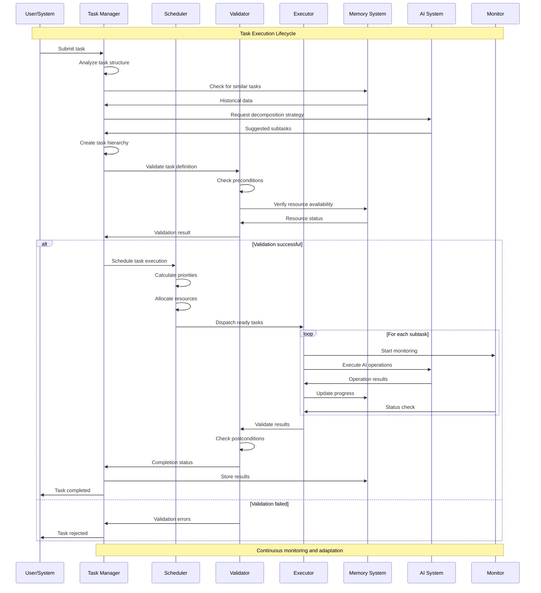
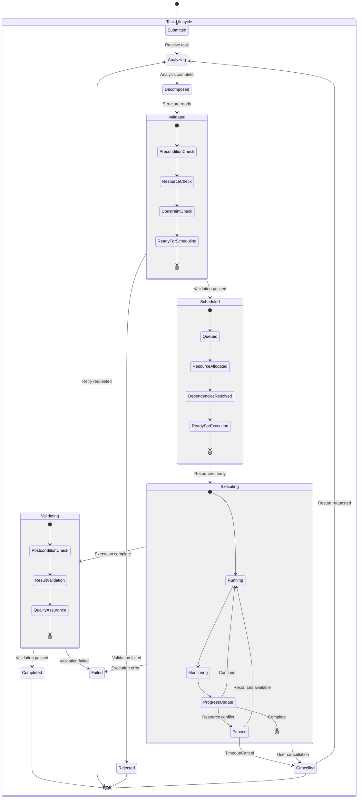
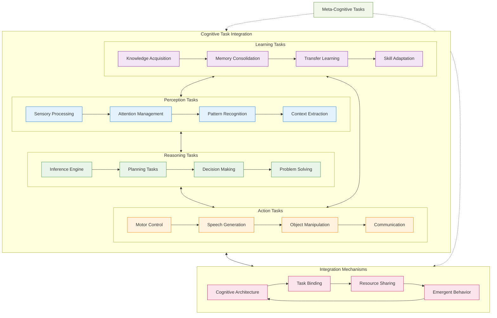

# Task System Architecture - Detailed Mermaid Analysis

This document provides comprehensive architectural analysis of the Task System within the Marduk cognitive framework, illustrating task orchestration patterns, execution flows, and coordination mechanisms through detailed Mermaid diagrams.

## Task System Core Architecture

```mermaid
graph TB
    %% Task system components
    subgraph TS_CORE["Task System Core"]
        direction TB
        
        subgraph TM_SUB["Task Manager"]
            TM_DECOMP[Task Decomposition]
            TM_SCHED[Task Scheduling]
            TM_COORD[Task Coordination]
            TM_TRACK[Progress Tracking]
            
            TM_DECOMP --> TM_SCHED
            TM_SCHED --> TM_COORD
            TM_COORD --> TM_TRACK
            TM_TRACK --> TM_DECOMP
        end
        
        subgraph SCHEDULER["Scheduler Engine"]
            SCH_PRIORITY[Priority Queue]
            SCH_RESOURCE[Resource Allocation]
            SCH_TIMELINE[Timeline Management]
            SCH_CONFLICT[Conflict Resolution]
            
            SCH_PRIORITY --> SCH_RESOURCE
            SCH_RESOURCE --> SCH_TIMELINE
            SCH_TIMELINE --> SCH_CONFLICT
            SCH_CONFLICT --> SCH_PRIORITY
        end
        
        subgraph EXECUTOR["Task Executor"]
            EXE_DISPATCH[Task Dispatch]
            EXE_PARALLEL[Parallel Execution]
            EXE_SEQUENCE[Sequential Execution]
            EXE_MONITOR[Execution Monitor]
            
            EXE_DISPATCH --> EXE_PARALLEL
            EXE_DISPATCH --> EXE_SEQUENCE
            EXE_PARALLEL --> EXE_MONITOR
            EXE_SEQUENCE --> EXE_MONITOR
        end
        
        subgraph VALIDATOR["Task Validator"]
            VAL_PRECOND[Precondition Check]
            VAL_POSTCOND[Postcondition Verify]
            VAL_CONSTRAINT[Constraint Validation]
            VAL_RESULT[Result Verification]
            
            VAL_PRECOND --> VAL_POSTCOND
            VAL_POSTCOND --> VAL_CONSTRAINT
            VAL_CONSTRAINT --> VAL_RESULT
        end
    end
    
    %% Coordination layer
    subgraph COORDINATION["Task Coordination Layer"]
        ORCHESTRATOR[Task Orchestrator]
        DEPENDENCY[Dependency Manager]
        SYNC[Synchronization Engine]
        COMM[Communication Hub]
        
        ORCHESTRATOR --> DEPENDENCY
        DEPENDENCY --> SYNC
        SYNC --> COMM
        COMM --> ORCHESTRATOR
    end
    
    %% Task types
    subgraph TASK_TYPES["Task Types"]
        SIMPLE[Simple Tasks]
        COMPOSITE[Composite Tasks]
        ASYNC[Async Tasks]
        DEFERRED[Deferred Tasks]
        
        SIMPLE --> COMPOSITE
        COMPOSITE --> ASYNC
        ASYNC --> DEFERRED
    end
    
    %% Inter-component connections
    TM_SUB <--> COORDINATION
    SCHEDULER <--> COORDINATION
    EXECUTOR <--> COORDINATION
    VALIDATOR <--> COORDINATION
    
    COORDINATION <--> TASK_TYPES
    
    %% External interfaces
    TS_CORE --> EXT_TASKS[External Task Sources]
    TS_CORE --> EXT_RESOURCES[External Resources]
    
    %% Styling
    classDef manager fill:#e3f2fd,stroke:#1976d2
    classDef scheduler fill:#e8f5e8,stroke:#388e3c
    classDef executor fill:#fff3e0,stroke:#f57c00
    classDef validator fill:#f3e5f5,stroke:#7b1fa2
    classDef coordination fill:#fce4ec,stroke:#c2185b
    classDef tasks fill:#f1f8e9,stroke:#558b2f
    
    class TM_DECOMP,TM_SCHED,TM_COORD,TM_TRACK manager
    class SCH_PRIORITY,SCH_RESOURCE,SCH_TIMELINE,SCH_CONFLICT scheduler
    class EXE_DISPATCH,EXE_PARALLEL,EXE_SEQUENCE,EXE_MONITOR executor
    class VAL_PRECOND,VAL_POSTCOND,VAL_CONSTRAINT,VAL_RESULT validator
    class ORCHESTRATOR,DEPENDENCY,SYNC,COMM coordination
    class SIMPLE,COMPOSITE,ASYNC,DEFERRED tasks
```

## Task Execution Flow

## Task State Management

## Task Orchestration Patterns

```mermaid
graph LR
    %% Orchestration strategies
    subgraph PATTERNS["Orchestration Patterns"]
        direction TB
        
        subgraph SEQUENTIAL["Sequential Pattern"]
            SEQ_T1[Task 1]
            SEQ_T2[Task 2]
            SEQ_T3[Task 3]
            SEQ_T4[Task 4]
            
            SEQ_T1 --> SEQ_T2
            SEQ_T2 --> SEQ_T3
            SEQ_T3 --> SEQ_T4
        end
        
        subgraph PARALLEL["Parallel Pattern"]
            PAR_T1[Task A]
            PAR_T2[Task B]
            PAR_T3[Task C]
            PAR_SYNC[Sync Point]
            
            PAR_T1 --> PAR_SYNC
            PAR_T2 --> PAR_SYNC
            PAR_T3 --> PAR_SYNC
        end
        
        subgraph PIPELINE["Pipeline Pattern"]
            PIPE_T1[Stage 1]
            PIPE_T2[Stage 2]
            PIPE_T3[Stage 3]
            PIPE_FLOW[Data Flow]
            
            PIPE_T1 --> PIPE_FLOW
            PIPE_FLOW --> PIPE_T2
            PIPE_T2 --> PIPE_FLOW
            PIPE_FLOW --> PIPE_T3
        end
        
        subgraph CONDITIONAL["Conditional Pattern"]
            COND_DECISION{Decision}
            COND_A[Path A]
            COND_B[Path B]
            COND_MERGE[Merge]
            
            COND_DECISION --> COND_A
            COND_DECISION --> COND_B
            COND_A --> COND_MERGE
            COND_B --> COND_MERGE
        end
    end
    
    %% Pattern selection
    subgraph SELECTION["Pattern Selection"]
        ANALYZER[Task Analyzer]
        OPTIMIZER[Pattern Optimizer]
        SELECTOR[Pattern Selector]
        ADAPTER[Pattern Adapter]
        
        ANALYZER --> OPTIMIZER
        OPTIMIZER --> SELECTOR
        SELECTOR --> ADAPTER
    end
    
    %% Dynamic adaptation
    subgraph ADAPTATION["Dynamic Adaptation"]
        MONITOR2[Pattern Monitor]
        FEEDBACK3[Performance Feedback]
        RECONFIG2[Reconfiguration]
        LEARNING2[Pattern Learning]
        
        MONITOR2 --> FEEDBACK3
        FEEDBACK3 --> RECONFIG2
        RECONFIG2 --> LEARNING2
        LEARNING2 --> MONITOR2
    end
    
    %% Connections
    PATTERNS --> SELECTION
    SELECTION --> ADAPTATION
    ADAPTATION -.-> PATTERNS
    
    %% Styling
    classDef sequential fill:#e3f2fd,stroke:#1976d2
    classDef parallel fill:#e8f5e8,stroke:#388e3c
    classDef pipeline fill:#fff3e0,stroke:#f57c00
    classDef conditional fill:#f3e5f5,stroke:#7b1fa2
    classDef selection fill:#fce4ec,stroke:#c2185b
    classDef adaptation fill:#f1f8e9,stroke:#558b2f
    
    class SEQ_T1,SEQ_T2,SEQ_T3,SEQ_T4 sequential
    class PAR_T1,PAR_T2,PAR_T3,PAR_SYNC parallel
    class PIPE_T1,PIPE_T2,PIPE_T3,PIPE_FLOW pipeline
    class COND_DECISION,COND_A,COND_B,COND_MERGE conditional
    class ANALYZER,OPTIMIZER,SELECTOR,ADAPTER selection
    class MONITOR2,FEEDBACK3,RECONFIG2,LEARNING2 adaptation
```

## Dependency Management Architecture

```mermaid
graph TD
    %% Dependency types
    subgraph DEPENDENCIES["Task Dependencies"]
        direction TB
        
        subgraph DATA_DEP["Data Dependencies"]
            DD_INPUT[Input Dependencies]
            DD_OUTPUT[Output Dependencies]
            DD_SHARED[Shared Resources]
            DD_STATE[State Dependencies]
            
            DD_INPUT --> DD_OUTPUT
            DD_OUTPUT --> DD_SHARED
            DD_SHARED --> DD_STATE
        end
        
        subgraph TEMPORAL_DEP["Temporal Dependencies"]
            TD_BEFORE[Before Constraints]
            TD_AFTER[After Constraints]
            TD_DURING[Concurrent Constraints]
            TD_DEADLINE[Deadline Constraints]
            
            TD_BEFORE --> TD_AFTER
            TD_AFTER --> TD_DURING
            TD_DURING --> TD_DEADLINE
        end
        
        subgraph RESOURCE_DEP["Resource Dependencies"]
            RD_EXCLUSIVE[Exclusive Access]
            RD_SHARED[Shared Access]
            RD_CAPACITY[Capacity Limits]
            RD_LOCATION[Location Requirements]
            
            RD_EXCLUSIVE --> RD_SHARED
            RD_SHARED --> RD_CAPACITY
            RD_CAPACITY --> RD_LOCATION
        end
    end
    
    %% Dependency resolution
    subgraph RESOLUTION["Dependency Resolution"]
        DEP_GRAPH[Dependency Graph]
        CYCLE_DETECT[Cycle Detection]
        TOPO_SORT[Topological Sort]
        DEADLOCK_RESOLVE[Deadlock Resolution]
        
        DEP_GRAPH --> CYCLE_DETECT
        CYCLE_DETECT --> TOPO_SORT
        TOPO_SORT --> DEADLOCK_RESOLVE
    end
    
    %% Dynamic management
    subgraph DYNAMIC["Dynamic Management"]
        RUNTIME_CHECK[Runtime Checking]
        VIOLATION_DETECT[Violation Detection]
        RECOVERY[Recovery Actions]
        ADAPTATION2[Adaptation Strategies]
        
        RUNTIME_CHECK --> VIOLATION_DETECT
        VIOLATION_DETECT --> RECOVERY
        RECOVERY --> ADAPTATION2
        ADAPTATION2 --> RUNTIME_CHECK
    end
    
    %% Connections
    DEPENDENCIES --> RESOLUTION
    RESOLUTION --> DYNAMIC
    DYNAMIC -.-> DEPENDENCIES
    
    %% External coordination
    EXT_SCHEDULER[External Scheduler] <--> RESOLUTION
    EXT_RESOURCES[External Resources] <--> DEPENDENCIES
    
    %% Styling
    classDef data fill:#e3f2fd,stroke:#1976d2
    classDef temporal fill:#e8f5e8,stroke:#388e3c
    classDef resource fill:#fff3e0,stroke:#f57c00
    classDef resolution fill:#f3e5f5,stroke:#7b1fa2
    classDef dynamic fill:#fce4ec,stroke:#c2185b
    
    class DD_INPUT,DD_OUTPUT,DD_SHARED,DD_STATE data
    class TD_BEFORE,TD_AFTER,TD_DURING,TD_DEADLINE temporal
    class RD_EXCLUSIVE,RD_SHARED,RD_CAPACITY,RD_LOCATION resource
    class DEP_GRAPH,CYCLE_DETECT,TOPO_SORT,DEADLOCK_RESOLVE resolution
    class RUNTIME_CHECK,VIOLATION_DETECT,RECOVERY,ADAPTATION2 dynamic
```

## Cognitive Task Integration

## Adaptive Task Optimization

```mermaid
graph LR
    %% Optimization dimensions
    subgraph OPTIMIZATION["Task Optimization Dimensions"]
        direction TB
        
        subgraph PERFORMANCE["Performance Optimization"]
            SPEED[Execution Speed]
            THROUGHPUT[Task Throughput]
            LATENCY[Response Latency]
            EFFICIENCY[Resource Efficiency]
            
            SPEED --> THROUGHPUT
            THROUGHPUT --> LATENCY
            LATENCY --> EFFICIENCY
        end
        
        subgraph QUALITY["Quality Optimization"]
            ACCURACY[Result Accuracy]
            RELIABILITY[Task Reliability]
            ROBUSTNESS[Error Robustness]
            CONSISTENCY[Output Consistency]
            
            ACCURACY --> RELIABILITY
            RELIABILITY --> ROBUSTNESS
            ROBUSTNESS --> CONSISTENCY
        end
        
        subgraph ADAPTABILITY["Adaptability Optimization"]
            FLEXIBILITY[Task Flexibility]
            SCALABILITY[System Scalability]
            PORTABILITY[Context Portability]
            EXTENSIBILITY[Feature Extensibility]
            
            FLEXIBILITY --> SCALABILITY
            SCALABILITY --> PORTABILITY
            PORTABILITY --> EXTENSIBILITY
        end
    end
    
    %% Optimization strategies
    subgraph STRATEGIES2["Optimization Strategies"]
        GENETIC[Genetic Algorithms]
        REINFORCEMENT[Reinforcement Learning]
        HEURISTIC[Heuristic Search]
        MACHINE_LEARN[Machine Learning]
        
        GENETIC --> REINFORCEMENT
        REINFORCEMENT --> HEURISTIC
        HEURISTIC --> MACHINE_LEARN
        MACHINE_LEARN --> GENETIC
    end
    
    %% Feedback mechanisms
    subgraph FEEDBACK4["Feedback Mechanisms"]
        METRICS[Performance Metrics]
        ANALYSIS2[Result Analysis]
        COMPARISON[Baseline Comparison]
        LEARNING3[Strategy Learning]
        
        METRICS --> ANALYSIS2
        ANALYSIS2 --> COMPARISON
        COMPARISON --> LEARNING3
        LEARNING3 --> METRICS
    end
    
    %% Connections
    OPTIMIZATION --> STRATEGIES2
    STRATEGIES2 --> FEEDBACK4
    FEEDBACK4 -.-> OPTIMIZATION
    
    %% External influences
    USER_PREF[User Preferences] -.-> OPTIMIZATION
    SYSTEM_CONSTRAINTS[System Constraints] -.-> STRATEGIES2
    DOMAIN_KNOWLEDGE[Domain Knowledge] -.-> FEEDBACK4
    
    %% Styling
    classDef performance fill:#e3f2fd,stroke:#1976d2
    classDef quality fill:#e8f5e8,stroke:#388e3c
    classDef adaptability fill:#fff3e0,stroke:#f57c00
    classDef strategies fill:#f3e5f5,stroke:#7b1fa2
    classDef feedback fill:#fce4ec,stroke:#c2185b
    
    class SPEED,THROUGHPUT,LATENCY,EFFICIENCY performance
    class ACCURACY,RELIABILITY,ROBUSTNESS,CONSISTENCY quality
    class FLEXIBILITY,SCALABILITY,PORTABILITY,EXTENSIBILITY adaptability
    class GENETIC,REINFORCEMENT,HEURISTIC,MACHINE_LEARN strategies
    class METRICS,ANALYSIS2,COMPARISON,LEARNING3 feedback
```

---

**Task System Cognitive Insights**:

The Task System demonstrates emergent cognitive properties through sophisticated orchestration of interdependent computational processes. The recursive task decomposition and dynamic adaptation mechanisms enable the system to handle complex, multi-layered problems with human-like flexibility.

Key emergent patterns include:
- **Hierarchical Problem Solving**: Complex tasks automatically decompose into manageable subtasks
- **Adaptive Resource Allocation**: Dynamic reallocation based on changing priorities and constraints
- **Pattern-Based Optimization**: Learning from execution patterns to improve future task handling
- **Emergent Coordination**: Spontaneous cooperation between independent task components

The integration with memory and AI systems creates a synergistic cognitive architecture where task execution becomes increasingly intelligent and context-aware, embodying the recursive intelligence and task orchestration principles of the MORK framework.