# Task System

The Task System manages the planning, prioritization, and execution of operations within Marduk, acting as the "action center" of the cognitive architecture.

## Task System Architecture

### Component Interaction Network

```mermaid
graph TB
    subgraph "🎯 TASK SYSTEM ARCHITECTURE"
        subgraph "Core Components"
            SCHED[Task Scheduler<br/>⏰ Priority & Timing Management]
            MGR[Task Manager<br/>🎮 Lifecycle Orchestration]
            VALID[Task Validator<br/>✅ Safety & Compliance]
            HAND[Task Handlers<br/>🔧 Specialized Execution]
        end
        
        subgraph "Task Types"
            STD[Standard Tasks<br/>⚡ Immediate Execution]
            DEF[Deferred Tasks<br/>⏳ Conditional Execution]
            REC[Recurring Tasks<br/>🔄 Scheduled Repetition]
            COMP[Composite Tasks<br/>🧩 Multi-step Operations]
        end
        
        subgraph "Execution Engine"
            QUEUE[Task Queue<br/>📋 Priority-Ordered Tasks]
            EXEC[Execution Engine<br/>⚙️ Task Processor]
            MON[Execution Monitor<br/>📊 Progress Tracking]
            RESULT[Result Collector<br/>📦 Outcome Aggregation]
        end
        
        subgraph "Integration Points"
            MEM_INT[Memory Interface<br/>💾 Context Access]
            AI_INT[AI Interface<br/>🤖 Intelligence Support]
            AUTO_INT[Autonomy Interface<br/>🔄 Performance Feedback]
        end
    end
    
    %% Component Interactions
    SCHED <-->|Priority Coordination| MGR
    MGR <-->|Validation Requests| VALID
    VALID <-->|Approved Tasks| HAND
    
    %% Task Type Management
    STD --> QUEUE
    DEF --> QUEUE
    REC --> QUEUE
    COMP --> QUEUE
    
    %% Execution Flow
    QUEUE --> EXEC
    EXEC --> MON
    MON --> RESULT
    RESULT -.->|Feedback| SCHED
    
    %% System Integration
    MGR <-->|Context Queries| MEM_INT
    EXEC <-->|AI Enhancement| AI_INT
    MON <-->|Performance Data| AUTO_INT
    
    %% Adaptive Loops
    AUTO_INT -.->|Optimization| SCHED
    MEM_INT -.->|Learning Context| VALID
    AI_INT -.->|Intelligence Enhancement| HAND
    
    classDef coreStyle fill:#f3e5f5,stroke:#4a148c,stroke-width:2px
    classDef typeStyle fill:#e8f5e8,stroke:#1b5e20,stroke-width:2px
    classDef execStyle fill:#fff3e0,stroke:#f57c00,stroke-width:2px
    classDef integStyle fill:#e1f5fe,stroke:#01579b,stroke-width:2px
    
    class SCHED,MGR,VALID,HAND coreStyle
    class STD,DEF,REC,COMP typeStyle
    class QUEUE,EXEC,MON,RESULT execStyle
    class MEM_INT,AI_INT,AUTO_INT integStyle
```



### Task Lifecycle Management

```mermaid
stateDiagram-v2
    [*] --> TaskCreation: New Task Request
    
    TaskCreation --> ValidationPhase: Task Definition
    ValidationPhase --> TaskRejected: Validation Failed
    ValidationPhase --> TaskQueued: Validation Passed
    
    TaskRejected --> [*]: Task Discarded
    
    TaskQueued --> AwaitingPrerequisites: Has Dependencies
    TaskQueued --> ReadyForExecution: No Dependencies
    
    AwaitingPrerequisites --> ReadyForExecution: Prerequisites Met
    AwaitingPrerequisites --> TaskTimeout: Prerequisites Not Met
    
    ReadyForExecution --> ExecutionStarted: Scheduler Dispatch
    
    ExecutionStarted --> ExecutionInProgress: Task Running
    ExecutionInProgress --> ExecutionPaused: Resource Contention
    ExecutionInProgress --> ExecutionCompleted: Successful Completion
    ExecutionInProgress --> ExecutionFailed: Error Encountered
    
    ExecutionPaused --> ExecutionInProgress: Resources Available
    ExecutionPaused --> TaskTimeout: Timeout Reached
    
    ExecutionCompleted --> ResultProcessing: Success Path
    ExecutionFailed --> ErrorHandling: Failure Path
    TaskTimeout --> ErrorHandling: Timeout Path
    
    ResultProcessing --> TaskArchived: Results Stored
    ErrorHandling --> TaskRetry: Retry Possible
    ErrorHandling --> TaskArchived: No Retry
    
    TaskRetry --> TaskQueued: Retry Attempt
    TaskArchived --> [*]: Task Complete
    
    note right of ValidationPhase: 🛡️ Safety & compliance\nchecks performed
    note right of ExecutionInProgress: ⚙️ Real-time monitoring\nand adaptation
    note right of ResultProcessing: 📊 Learning from\nexecution outcomes
```



## Components

### Scheduler

The Scheduler determines what tasks should be executed and when, based on:

- Priority levels
- Dependencies
- Resource availability
- Time constraints

**Technical Implementation**: `TaskScheduler` class with prioritization algorithms.

### Manager

The Task Manager tracks the execution state of tasks and handles resource allocation:

- Task creation and validation
- Execution tracking
- Resource management
- Result collection

**Technical Implementation**: `TaskManager` class implementing the task lifecycle.

### Validator

The Validator ensures tasks are well-formed and ready for execution:

- Structure validation
- Prerequisite checking
- Permission verification
- Resource availability confirmation

**Technical Implementation**: `TaskValidator` class with rule-based validation.

### Handlers

Specialized processors for different task types:

- Standard task handlers
- Deferred task handlers
- Recurring task handlers
- Conditional task handlers

**Technical Implementation**: `DeferredTaskHandler` and other specialized handler classes.

## Task Types

Marduk supports several task types:

- **Standard Tasks**: Simple, immediate execution tasks
- **Deferred Tasks**: Tasks that execute when prerequisites are met
- **Recurring Tasks**: Tasks that execute on a schedule
- **Composite Tasks**: Tasks composed of subtasks

## Usage Example

```typescript
import { TaskManager, DeferredTaskHandler } from 'marduk-ts';

const taskManager = new TaskManager();
const deferredHandler = new DeferredTaskHandler();

// Create and add a standard task
const analysisTask = taskManager.createTask('Analyze system performance', {
  priority: 2,
  target: 'performance-analyzer'
});

// Create a task with prerequisites
const optimizationTask = taskManager.createTask('Apply optimization patterns', {
  priority: 3,
  condition: {
    type: 'deferred',
    prerequisite: 'analysis-completed'
  }
});

// Add the deferred task to the handler
deferredHandler.addDeferredTask(optimizationTask);

// When prerequisite is met
const memoryState = { completedTopics: ['analysis-completed'] };
const activatedTasks = deferredHandler.activateTasks(memoryState);
activatedTasks.forEach(task => taskManager.addTask(task));

// Get prioritized tasks and execute them
const prioritizedTasks = taskManager.prioritizeTasks();
```

## Integration with Other Subsystems

### Cross-System Task Orchestration

```mermaid
sequenceDiagram
    participant USER as 👤 User/Environment
    participant TASK as 🎯 Task System
    participant MEM as 💾 Memory System
    participant AI as 🤖 AI System
    participant AUTO as 🔄 Autonomy System
    participant EXEC as ⚡ Execution Layer
    
    Note over USER,EXEC: 🔄 Integrated Task Execution Cycle
    
    USER->>TASK: Task Request
    TASK->>TASK: Task Analysis & Decomposition
    
    TASK->>MEM: Query Context & Prerequisites
    MEM-->>TASK: Relevant Knowledge & Experience
    
    TASK->>AI: Request Strategy Enhancement
    AI->>MEM: Query Knowledge Graphs
    MEM-->>AI: Semantic Relationships
    AI-->>TASK: Enhanced Execution Strategy
    
    TASK->>AUTO: Request Performance Optimization
    AUTO-->>TASK: Optimization Recommendations
    
    TASK->>EXEC: Execute Optimized Task Plan
    EXEC->>EXEC: Task Implementation
    EXEC-->>TASK: Progress Updates
    
    TASK->>MEM: Store Execution Experience
    TASK->>AUTO: Report Performance Metrics
    
    AUTO->>AUTO: Analyze Performance Patterns
    AUTO-->>TASK: Future Optimization Insights
    
    TASK-->>USER: Task Completion & Results
    
    Note over MEM,AI: 🧠 Knowledge-Intelligence Synergy
    Note over TASK,AUTO: 📈 Continuous Improvement Loop
```



### Adaptive Task Planning

```mermaid
graph LR
    subgraph "🧠 ADAPTIVE TASK PLANNING NETWORK"
        subgraph "Planning Intelligence"
            GOAL[Goal Analysis<br/>🎯 Objective Decomposition]
            CONTEXT[Context Assessment<br/>🌐 Situational Awareness]
            RESOURCE[Resource Evaluation<br/>⚡ Capability Analysis]
            STRATEGY[Strategy Formation<br/>📝 Plan Generation]
        end
        
        subgraph "Dynamic Adaptation"
            MONITOR[Execution Monitoring<br/>📊 Real-time Tracking]
            FEEDBACK[Feedback Processing<br/>🔄 Performance Analysis]
            ADJUST[Plan Adjustment<br/>🔧 Dynamic Modification]
            LEARN[Learning Engine<br/>📚 Pattern Extraction]
        end
        
        subgraph "Optimization Engine"
            PREDICT[Outcome Prediction<br/>🔮 Success Modeling]
            OPTIMIZE[Resource Optimization<br/>⚖️ Efficiency Maximization]
            EVOLVE[Strategy Evolution<br/>🧬 Plan Enhancement]
            META[Meta-Planning<br/>🪞 Planning About Planning]
        end
    end
    
    %% Planning Flow
    GOAL --> CONTEXT
    CONTEXT --> RESOURCE
    RESOURCE --> STRATEGY
    
    %% Execution Adaptation
    STRATEGY --> MONITOR
    MONITOR --> FEEDBACK
    FEEDBACK --> ADJUST
    ADJUST -.->|Plan Updates| STRATEGY
    
    %% Learning Loop
    FEEDBACK --> LEARN
    LEARN --> PREDICT
    PREDICT --> OPTIMIZE
    OPTIMIZE --> EVOLVE
    EVOLVE -.->|Enhanced Strategies| STRATEGY
    
    %% Meta-Cognitive Enhancement
    EVOLVE --> META
    META -.->|Meta-Insights| GOAL
    META -.->|Planning Optimization| CONTEXT
    
    classDef planStyle fill:#f3e5f5,stroke:#4a148c,stroke-width:2px
    classDef adaptStyle fill:#e8f5e8,stroke:#1b5e20,stroke-width:2px
    classDef optimizeStyle fill:#fff3e0,stroke:#f57c00,stroke-width:2px
    
    class GOAL,CONTEXT,RESOURCE,STRATEGY planStyle
    class MONITOR,FEEDBACK,ADJUST,LEARN adaptStyle
    class PREDICT,OPTIMIZE,EVOLVE,META optimizeStyle
```



The Task System integrates with:

- **Memory System**: Retrieves context information and stores results
- **AI System**: Uses AI capabilities to enhance task execution
- **Autonomy System**: Subject to optimization and monitoring

Tasks often operate on memory, invoke AI operations, or trigger autonomy processes, creating a tightly interconnected system of operations that exhibit **emergent intelligence** through:

1. **Contextual Task Adaptation** - Tasks modify based on environmental context
2. **Intelligent Resource Allocation** - AI-guided optimization of computational resources  
3. **Recursive Task Improvement** - Tasks learn from their own execution patterns
4. **Meta-Task Generation** - The system creates tasks to improve its own task management

See the [Architecture Overview](../architecture/overview.md) for more details on system interactions.
